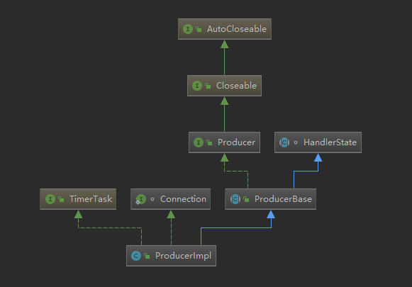
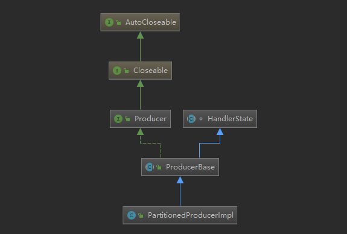
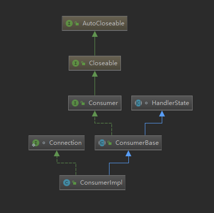
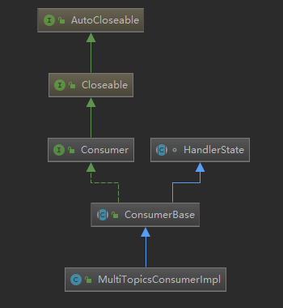
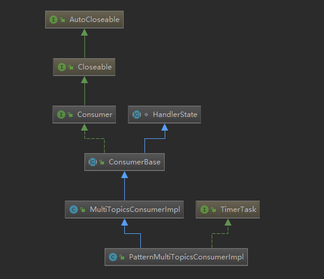

# Pulsar Client 源码解析

说明：

1. 源码版本采用的是 2.3.1 。
2. 中英文对照表如下：

英文|中文（或作用）
:--:|---:
Client|客户端
Producer|生产者
Consumer|消费者
Topic|主题
Schema|架构（结构化类型）
Broker|消息代理服务器
Partition|分区
DLQ|死信队列

## 1. Producer 使用简单例子

以下是 Producer 最简单的发送消息例子，源码解析就按照这个顺序抽丝剥茧，步步深入。

```java
// 创建一个Pulsar客户端，直接指定Pulsar Broker的IP地址和端口
PulsarClient client = PulsarClient.builder().serviceUrl("pulsar://localhost:6650").build();

//创建一个生产者，并指定Topic为persistent://my-tenant/my-ns/my-topic，消息格式为字节数组
Producer<byte[]> producer = client.newProducer().topic("persistent://my-tenant/my-ns/my-topic").create();

//发送消息
for (int i = 0; i < 10; i++) {
    producer.send("my-message".getBytes());
}

//关闭客户端
client.close();
```

## 2. Pulsar Client 接口

PulsarClient 是 Pulsar 的Java专用客户端，定义了客户端所有操作，如下：

```java
// 默认构造器模式实现，用于新建给定配置的Pulsar实例
public static ClientBuilder builder() {
    return DefaultImplementation.newClientBuilder();
}

//创建生产者构造器，其用于创建给定配置的生产者，默认生产数据类型为字节数组
ProducerBuilder<byte[]> newProducer();

//同上，这里强生产数据泛型，并可指定系统序列化方式
<T> ProducerBuilder<T> newProducer(Schema<T> schema);

//创建消费者构造器，其用于创建给定配置订阅特定Topic的消费者，默认消费数据类型为字节数组
ConsumerBuilder<byte[]> newConsumer();

//同上，这里强调消费数据泛型，并可指定系统反序列化方式
<T> ConsumerBuilder<T> newConsumer(Schema<T> schema);

//创建读取者构造器，其用于创建给定配置读取特定Topic的读取者，默认读取数据类型为字节数组（它与消费者的区别在于，它不需要向broker发送Ack消息）
ReaderBuilder<byte[]> newReader();

//同上，这里强调读取数据为泛型，并可指定系统反序列化方式
<T> ReaderBuilder<T> newReader(Schema<T> schema);

//更新客户端服务URL
void updateServiceUrl(String serviceUrl) throws PulsarClientException;

//获取指定Topic的分区信息
CompletableFuture<List<String>> getPartitionsForTopic(String topic);

//和平关闭PulsarClient，释放所有资源
void close() throws PulsarClientException;

//异步，同上
CompletableFuture<Void> closeAsync();

//立即关闭客户端，不管资源是否被释放
void shutdown() throws PulsarClientException;
```

## 3. Pulsar Client 配置项

```java
//broker或discovery-service或pulsar-proxy地址
private String serviceUrl;
//这里可以根据实际需求，动态提供serviceUrl
@JsonIgnore
private ServiceUrlProvider serviceUrlProvider;
//认证接口，默认是禁用的
@JsonIgnore
private Authentication authentication = new AuthenticationDisabled();
//操作超时时间
private long operationTimeoutMs = 30000;
//状态收集时间间隔
private long statsIntervalSeconds = 60;
//生产者网络IO线程数
private int numIoThreads = 1;
//消费者订阅线程数
private int numListenerThreads = 1;
//每个broker（与客户端）连接数
private int connectionsPerBroker = 1;
//是否延迟发送（Nagle算法，不延迟，意味着立即发送）
private boolean useTcpNoDelay = true;
//是否用TLS
private boolean useTls = false;
//TLS受信任证书路径
private String tlsTrustCertsFilePath = "";
//TLS是否允许不安全连接
private boolean tlsAllowInsecureConnection = false;
//TLS是否启用主机名校验
private boolean tlsHostnameVerificationEnable = false;
//Lookup请求并发数
private int concurrentLookupRequest = 5000;
//最大Lookup请求数
private int maxLookupRequest = 50000;
//每个连接最大拒绝请求数（？是不是每个连接最大请求数超过N时，则拒绝发送）
private int maxNumberOfRejectedRequestPerConnection = 50;
//保活间隔时间
private int keepAliveIntervalSeconds = 30;
//连接超时时间
private int connectionTimeoutMs = 10000;
```

## 4. PulsarClient 的实现

### 1.PulsarClientImpl 的属性

PulsarClientImpl 是个有状态的管理类，主要功能如下:

 1. 实现PulsarClient接口
 2. 管理生产者、消费者的生命周期
 3. 提供一些公共服务，如LookupService

```java
//客户端配置数据
private final ClientConfigurationData conf;
//查找服务
private LookupService lookup;
//连接池
private final ConnectionPool cnxPool;
//定时器
private final Timer timer;
//线程池提供者
private final ExecutorProvider externalExecutorProvider;
//客户端状态
private AtomicReference<State> state = new AtomicReference<>();
//生产者对象池
private final IdentityHashMap<ProducerBase<?>, Boolean> producers;
//消费者对象池
private final IdentityHashMap<ConsumerBase<?>, Boolean> consumers;
//生产者ID、消费者ID、请求ID生成器
private final AtomicLong producerIdGenerator = new AtomicLong();
private final AtomicLong consumerIdGenerator = new AtomicLong();
private final AtomicLong requestIdGenerator = new AtomicLong();
private final EventLoopGroup eventLoopGroup;
```

### 2. PulsarClientImpl 的构造方法

```java
//构造方法1 根据配置创建EventLoopGroup
public PulsarClientImpl(ClientConfigurationData conf) throws PulsarClientException {
    this(conf, getEventLoopGroup(conf));
}

//构造方法2 根据配置创建连接池
public PulsarClientImpl(ClientConfigurationData conf, EventLoopGroup eventLoopGroup) throws PulsarClientException {
    this(conf, eventLoopGroup, new ConnectionPool(conf, eventLoopGroup));
}

public PulsarClientImpl(ClientConfigurationData conf, EventLoopGroup eventLoopGroup, ConnectionPool cnxPool)
        throws PulsarClientException {
    //配置、serverUrl、eventLoopGroup均不能为空
    if (conf == null || isBlank(conf.getServiceUrl()) || eventLoopGroup == null) {
        throw new PulsarClientException.InvalidConfigurationException("Invalid client configuration");
    }
    this.eventLoopGroup = eventLoopGroup;
    this.conf = conf;
    //启动认证方法
    conf.getAuthentication().start();
    this.cnxPool = cnxPool;
    externalExecutorProvider = new ExecutorProvider(conf.getNumListenerThreads(), getThreadFactory("pulsar-external-listener"));
    //根据协议选择使用哪种方式提供查找服务
    if (conf.getServiceUrl().startsWith("http")) {
        lookup = new HttpLookupService(conf, eventLoopGroup);
    } else {
        lookup = new BinaryProtoLookupService(this, conf.getServiceUrl(), conf.isUseTls(), externalExecutorProvider.getExecutor());
    }
    //定时器
    timer = new HashedWheelTimer(getThreadFactory("pulsar-timer"), 1, TimeUnit.MILLISECONDS);
    producers = Maps.newIdentityHashMap();
    consumers = Maps.newIdentityHashMap();
    //设置状态为打开
    state.set(State.Open);
}
```

这里就有两个重要的组件，ConntionPool 和 LookupService ，下面我们来简单的解析下。

### 3. Pulsar Client 接口方法实现

实现 Pulsar Client 接口，有2个关键组件，如下：

#### 1.ConntionPool 连接池

这里只描述下属性，具体使用方法将会在 Pulsar Producer 章节分析

```java
/**
 * 主要是管理客户端与broker或proxy的连接
 * */
//核心容器，用于存客户端与broker或proxy的连接
protected final ConcurrentHashMap<InetSocketAddress, ConcurrentMap<Integer, CompletableFuture<ClientCnx>>> pool;
private final Bootstrap bootstrap;
private final EventLoopGroup eventLoopGroup;
//每个主机最大连接
private final int maxConnectionsPerHosts;
//域名解析器
protected final DnsNameResolver dnsResolver;

//就一个核心方法，原型如下：
public CompletableFuture<ClientCnx> getConnection(InetSocketAddress logicalAddress,
            InetSocketAddress physicalAddress);
```

#### 2. LookupService 服务

查找服务有两个协议实现，一个是Http协议实现，一个是native(TCP)协议实现

主要有如下功能:

```java
/**
 * 查找服务
 */
public interface LookupService extends AutoCloseable {
//用于动态更新serviceUrl
void updateServiceUrl(String serviceUrl) throws PulsarClientException;
//根据Topic来获取活的broker地址
public CompletableFuture<Pair<InetSocketAddress, InetSocketAddress>> getBroker(TopicName topicName);
//根据Topic获取Topic分区信息
public CompletableFuture<PartitionedTopicMetadata> getPartitionedTopicMetadata(TopicName topicName);
//根据Topic获取Schema信息
public CompletableFuture<Optional<SchemaInfo>> getSchema(TopicName topicName);
//获取serviceUrl
public String getServiceUrl();
//获取Namespace下所有的topic
public CompletableFuture<List<String>> getTopicsUnderNamespace(NamespaceName namespace, Mode mode);
}
```

#### 3. 实现 Pulsar Client 接口方法

这里的生产者、消费者、读取者创建构造者实例方法签名都是一样的，分为两类：

1. 默认Schema为BYTES。

2. 自定义Schema，创建者指定Schema。

然后构造者都有一个默认实现方法**xx create() throws PulsarClientException**，分别来创建生产者、消费者、读取者实例，并完成实例的初始化，而此方法最终调用的为**createXXAsync**系列方法。下面，将讲解核心方法的实现。

#### 1. 创建生产者

```java
// 1. 创建生产者构造者实例（PulsarClientImpl类）。
@Override
public ProducerBuilder<byte[]> newProducer() {
    return new ProducerBuilderImpl<>(this, Schema.BYTES);
}
// 2. 切换 ProducerBuilderImpl<T> 类，构造方法
public ProducerBuilderImpl(PulsarClientImpl client, Schema<T> schema) {
        this(client, new ProducerConfigurationData(), schema);
}

// 3. 切换 ProducerBuilderImpl<T> 类，同步创建一个生产者
@Override
public Producer<T> create() throws PulsarClientException {
    try {
        return createAsync().get();
    } catch (ExecutionException e) {
        Throwable t = e.getCause();
        if (t instanceof PulsarClientException) {
            throw (PulsarClientException) t;
        } else {
            throw new PulsarClientException(t);
        }
    } catch (InterruptedException e) {
        Thread.currentThread().interrupt();
        throw new PulsarClientException(e);
    }
}

@Override
public CompletableFuture<Producer<T>> createAsync() {
    if (conf.getTopicName() == null) {
        return FutureUtil
                .failedFuture(new IllegalArgumentException("Topic name must be set on the producer builder"));
    }

    try {
        //设置消息路由模式，有3种
        //默认为轮询
        setMessageRoutingMode();
    } catch(PulsarClientException pce) {
        return FutureUtil.failedFuture(pce);
    }

    return interceptorList == null || interceptorList.size() == 0 ?
            client.createProducerAsync(conf, schema, null) :
            client.createProducerAsync(conf, schema, new ProducerInterceptors<>(interceptorList));
}

// 4. 切换到 PulsarClientImpl 类 ，异步创建生产者实例。

public <T> CompletableFuture<Producer<T>> createProducerAsync(ProducerConfigurationData conf, Schema<T> schema,
          ProducerInterceptors<T> interceptors) {
    //配置为空
    if (conf == null) {
        return FutureUtil.failedFuture(
            new PulsarClientException.InvalidConfigurationException("Producer configuration undefined"));
    }
    //如果Schema为自动消费者Schema实例，由于这里是生产者，故抛异常
    if (schema instanceof AutoConsumeSchema) {
        return FutureUtil.failedFuture(
            new PulsarClientException.InvalidConfigurationException("AutoConsumeSchema is only used by consumers to detect schemas automatically"));
    }
    //Pulsar 客户端是否初始化完成，如果状态不是Open，则抛异常：客户端已关闭。
    if (state.get() != State.Open) {
        return FutureUtil.failedFuture(new PulsarClientException.AlreadyClosedException("Client already closed : state = " + state.get()));
    }

    String topic = conf.getTopicName();
    //对Topic进行格式校验
    if (!TopicName.isValid(topic)) {
        return FutureUtil.failedFuture(
            new PulsarClientException.InvalidTopicNameException("Invalid topic name: '" + topic + "'"));
    }
    //自动获取Schema
    if (schema instanceof AutoProduceBytesSchema) {
        AutoProduceBytesSchema autoProduceBytesSchema = (AutoProduceBytesSchema) schema;
        //这里就是查找服务，通过Topic查询注册的Schema，如果没注册，则默认Schema.BYTES
        return lookup.getSchema(TopicName.get(conf.getTopicName()))
                .thenCompose(schemaInfoOptional -> {
                    if (schemaInfoOptional.isPresent()) {
                        autoProduceBytesSchema.setSchema(Schema.getSchema(schemaInfoOptional.get()));
                    } else {
                        autoProduceBytesSchema.setSchema(Schema.BYTES);
                    }
                    return createProducerAsync(topic, conf, schema, interceptors);
                });
    } else {
        return createProducerAsync(topic, conf, schema, interceptors);
    }

}

private <T> CompletableFuture<Producer<T>> createProducerAsync(String topic,
                                                            ProducerConfigurationData conf,
                                                            Schema<T> schema,
                                                            ProducerInterceptors<T> interceptors) {
CompletableFuture<Producer<T>> producerCreatedFuture = new CompletableFuture<>();
    //通过查找服务获取Topic元数据，这里主要是确定Topic是否分区，以此来确定用哪个底层生产者实例
    getPartitionedTopicMetadata(topic).thenAccept(metadata -> {
        if (log.isDebugEnabled()) {
            log.debug("[{}] Received topic metadata. partitions: {}", topic, metadata.partitions);
        }

        ProducerBase<T> producer;
        if (metadata.partitions > 1) {
            producer = new PartitionedProducerImpl<>(PulsarClientImpl.this, topic, conf, metadata.partitions,
                    producerCreatedFuture, schema, interceptors);
        } else {
            producer = new ProducerImpl<>(PulsarClientImpl.this, topic, conf, producerCreatedFuture, -1, schema, interceptors);
        }

        synchronized (producers) {
            producers.put(producer, Boolean.TRUE);
        }
    }).exceptionally(ex -> {
        log.warn("[{}] Failed to get partitioned topic metadata: {}", topic, ex.getMessage());
        producerCreatedFuture.completeExceptionally(ex);
        return null;
    });

    return producerCreatedFuture;
}
```

到此，创建生产者实例就结束了，接下来章节会详细描述，生产者怎么实现的。接下来，看看消费者的创建。

#### 2. 创建消费者（订阅）

```java

// 1. 消费者构造者实例（PulsarClientImpl 类）。
@Override
public ConsumerBuilder<byte[]> newConsumer() {
    return new ConsumerBuilderImpl<>(this, Schema.BYTES);
}

// ConsumerBuilderImpl 构造方法
public ConsumerBuilderImpl(PulsarClientImpl client, Schema<T> schema) {
    this(client, new ConsumerConfigurationData<T>(), schema);
}

// 2. 消费者开始订阅 ConsumerBuilderImpl
// 这里实际上，调用的是异步订阅方法
@Override
public Consumer<T> subscribe() throws PulsarClientException {
    try {
        return subscribeAsync().get();
    } catch (ExecutionException e) {
        Throwable t = e.getCause();
        if (t instanceof PulsarClientException) {
            throw (PulsarClientException) t;
        } else {
            throw new PulsarClientException(t);
        }
    } catch (InterruptedException e) {
        Thread.currentThread().interrupt();
        throw new PulsarClientException(e);
    }
}

@Override
public CompletableFuture<Consumer<T>> subscribeAsync() {
    //检查 Topic 是否有效
    if (conf.getTopicNames().isEmpty() && conf.getTopicsPattern() == null) {
        return FutureUtil
                .failedFuture(new InvalidConfigurationException("Topic name must be set on the consumer builder"));
    }
    //检查订阅名不能为空
    if (StringUtils.isBlank(conf.getSubscriptionName())) {
        return FutureUtil.failedFuture(
                new InvalidConfigurationException("Subscription name must be set on the consumer builder"));
    }
    //检查是否有拦截器
    return interceptorList == null || interceptorList.size() == 0 ?
            client.subscribeAsync(conf, schema, null) :
            client.subscribeAsync(conf, schema, new ConsumerInterceptors<>(interceptorList));
}

// 这里切换到 PulsarClientImpl 类，实现订阅前置检查，实际功能委托给 消费者实现类
public <T> CompletableFuture<Consumer<T>> subscribeAsync(ConsumerConfigurationData<T> conf, Schema<T> schema, ConsumerInterceptors<T> interceptors) {
    // 检查 Client 状态是否打开
    if (state.get() != State.Open) {
        return FutureUtil.failedFuture(new PulsarClientException.AlreadyClosedException("Client already closed"));
    }
    // 配置不能为空
    if (conf == null) {
        return FutureUtil.failedFuture(
                new PulsarClientException.InvalidConfigurationException("Consumer configuration undefined"));
    }
    //检查 Topic 是否合法
    if (!conf.getTopicNames().stream().allMatch(TopicName::isValid)) {
        return FutureUtil.failedFuture(new PulsarClientException.InvalidTopicNameException("Invalid topic name"));
    }
  
    //订阅名不能为空
    if (isBlank(conf.getSubscriptionName())) {
        return FutureUtil
                .failedFuture(new PulsarClientException.InvalidConfigurationException("Empty subscription name"));
    }

    //读取压缩特性仅仅被用订阅持久化 Topic，并且订阅类型为独占或故障转移模式
    if (conf.isReadCompacted() && (!conf.getTopicNames().stream()
            .allMatch(topic -> TopicName.get(topic).getDomain() == TopicDomain.persistent)
            || (conf.getSubscriptionType() != SubscriptionType.Exclusive
                    && conf.getSubscriptionType() != SubscriptionType.Failover))) {
        return FutureUtil.failedFuture(new PulsarClientException.InvalidConfigurationException(
                "Read compacted can only be used with exclusive of failover persistent subscriptions"));
    }

    // 事件监听器只允许在故障转移订阅模式下
    if (conf.getConsumerEventListener() != null && conf.getSubscriptionType() != SubscriptionType.Failover) {
        return FutureUtil.failedFuture(new PulsarClientException.InvalidConfigurationException(
                "Active consumer listener is only supported for failover subscription"));
    }

    //   如果已经设置了 正则表达式订阅 Topic，就不能指定具体的 Topic
    if (conf.getTopicsPattern() != null) {
        if (!conf.getTopicNames().isEmpty()){
            return FutureUtil
                .failedFuture(new IllegalArgumentException("Topic names list must be null when use topicsPattern"));
        }
        //正则表达式订阅
        return patternTopicSubscribeAsync(conf, schema, interceptors);
    } else if (conf.getTopicNames().size() == 1) {
        //单 Topic 订阅
        return singleTopicSubscribeAsync(conf, schema, interceptors);
    } else {
        //多 Topic 订阅
        return multiTopicSubscribeAsync(conf, schema, interceptors);
    }
}

//单 Topic 订阅
private <T> CompletableFuture<Consumer<T>> singleTopicSubscribeAsync(ConsumerConfigurationData<T> conf, Schema<T> schema, ConsumerInterceptors<T> interceptors) {
    // 如果 schema 是 AutoConsumeSchema 的实例，尝试自动获取 Schema 类型
    if (schema instanceof AutoConsumeSchema) {
        AutoConsumeSchema autoConsumeSchema = (AutoConsumeSchema) schema;
        return lookup.getSchema(TopicName.get(conf.getSingleTopic()))
                .thenCompose(schemaInfoOptional -> {
                    //目前只支持SchemaType.AVRO
                    if (schemaInfoOptional.isPresent() && schemaInfoOptional.get().getType() == SchemaType.AVRO) {
                        GenericSchema genericSchema = GenericSchema.of(schemaInfoOptional.get());
                        log.info("Auto detected schema for topic {} : {}",
                            conf.getSingleTopic(), new String(schemaInfoOptional.get().getSchema(), UTF_8));
                        autoConsumeSchema.setSchema(genericSchema);
                        return doSingleTopicSubscribeAsync(conf, schema, interceptors);
                    } else {
                        return FutureUtil.failedFuture(
                            new PulsarClientException.LookupException("Currently schema detection only works for topics with avro schemas"));
                    }
                });
    } else {
        return doSingleTopicSubscribeAsync(conf, schema, interceptors);
    }
}

private <T> CompletableFuture<Consumer<T>> doSingleTopicSubscribeAsync(ConsumerConfigurationData<T> conf, Schema<T> schema, ConsumerInterceptors<T> interceptors) {
    //查看是否已有订阅存在（基于订阅名和自订阅类型为共享模式）
    Optional<ConsumerBase<T>> subscriber = subscriptionExist(conf);
    if (subscriber.isPresent()) {
        return CompletableFuture.completedFuture(subscriber.get());
    }

    CompletableFuture<Consumer<T>> consumerSubscribedFuture = new CompletableFuture<>();

    String topic = conf.getSingleTopic();

    getPartitionedTopicMetadata(topic).thenAccept(metadata -> {
        if (log.isDebugEnabled()) {
            log.debug("[{}] Received topic metadata. partitions: {}", topic, metadata.partitions);
        }

        ConsumerBase<T> consumer;
        // 从执行器列表中获取下一个单线程版执行器
        ExecutorService listenerThread = externalExecutorProvider.getExecutor();
        if (metadata.partitions > 1) {
            //这里注意，多分区 Topic 也对应着多 Topic 消费者实现
            consumer = MultiTopicsConsumerImpl.createPartitionedConsumer(PulsarClientImpl.this, conf,
                listenerThread, consumerSubscribedFuture, metadata.partitions, schema, interceptors);
        } else {
            //单 Topic 消费者实现
            consumer = ConsumerImpl(PulsarClientImpl.this, topic, conf, listenerThread, -1,consumerSubscribedFuture, SubscriptionMode.Durable, null, schema, interceptors);
        }

        synchronized (consumers) {
            consumers.put(consumer, Boolean.TRUE);
        }
    }).exceptionally(ex -> {
        log.warn("[{}] Failed to get partitioned topic metadata", topic, ex);
        consumerSubscribedFuture.completeExceptionally(ex);
        return null;
    });

    return consumerSubscribedFuture;
}

// 多 Topic 订阅，这里是真正的多 Topic 订阅，但可能其中0或多个 Topic 是多分区
private <T> CompletableFuture<Consumer<T>> multiTopicSubscribeAsync(ConsumerConfigurationData<T> conf, Schema<T> schema, ConsumerInterceptors<T> interceptors) {
    Optional<ConsumerBase<T>> subscriber = subscriptionExist(conf);
    if (subscriber.isPresent()) {
        return CompletableFuture.completedFuture(subscriber.get());
    }

    CompletableFuture<Consumer<T>> consumerSubscribedFuture = new CompletableFuture<>();

    ConsumerBase<T> consumer = new MultiTopicsConsumerImpl<>(PulsarClientImpl.this, conf,
            externalExecutorProvider.getExecutor(), consumerSubscribedFuture, schema, interceptors);

    synchronized (consumers) {
        consumers.put(consumer, Boolean.TRUE);
    }

    return consumerSubscribedFuture;
}

//Topic 正则表达式订阅
private <T> CompletableFuture<Consumer<T>> patternTopicSubscribeAsync(ConsumerConfigurationData<T> conf,
        Schema<T> schema, ConsumerInterceptors<T> interceptors) {
    String regex = conf.getTopicsPattern().pattern();
    Mode subscriptionMode = convertRegexSubscriptionMode(conf.getRegexSubscriptionMode());
    TopicName destination = TopicName.get(regex);
    //有正则表达式解析出 Namespace ，例如：persistent://public/default/.*
    NamespaceName namespaceName = destination.getNamespaceObject();
    //检查是否已存在相同的订阅
    Optional<ConsumerBase<T>> subscriber = subscriptionExist(conf);
    if (subscriber.isPresent()) {
        return CompletableFuture.completedFuture(subscriber.get());
    }

    CompletableFuture<Consumer<T>> consumerSubscribedFuture = new CompletableFuture<>();
    //根据 Namespace 和 订阅模式来查找所有符合条件的 Topic
    lookup.getTopicsUnderNamespace(namespaceName, subscriptionMode)
        .thenAccept(topics -> {
            if (log.isDebugEnabled()) {
                log.debug("Get topics under namespace {}, topics.size: {}", namespaceName.toString(), topics.size());
                topics.forEach(topicName ->
                    log.debug("Get topics under namespace {}, topic: {}", namespaceName.toString(), topicName));
            }
            //这里进行正则表达式过滤
            List<String> topicsList = topicsPatternFilter(topics, conf.getTopicsPattern());
            //配置好新的 Topic
            conf.getTopicNames().addAll(topicsList);
            ConsumerBase<T> consumer = new PatternMultiTopicsConsumerImpl<T>(conf.getTopicsPattern(),
                PulsarClientImpl.this,
                conf,
                externalExecutorProvider.getExecutor(),
                consumerSubscribedFuture,
                schema, subscriptionMode, interceptors);

            synchronized (consumers) {
                consumers.put(consumer, Boolean.TRUE);
            }
        })
        .exceptionally(ex -> {
            log.warn("[{}] Failed to get topics under namespace", namespaceName);
            consumerSubscribedFuture.completeExceptionally(ex);
            return null;
        });

    return consumerSubscribedFuture;
}

// 从原Topic列表中匹配 ‘Topic正则表达式’，结果返回仅仅是 Topic 名，无分区部分
public static List<String> topicsPatternFilter(List<String> original, Pattern topicsPattern) {
    final Pattern shortenedTopicsPattern = topicsPattern.toString().contains("://")
        ? Pattern.compile(topicsPattern.toString().split("\\:\\/\\/")[1]) : topicsPattern;

    return original.stream()
        .map(TopicName::get)
        .map(TopicName::toString)
        .filter(topic -> shortenedTopicsPattern.matcher(topic.split("\\:\\/\\/")[1]).matches())
        .collect(Collectors.toList());
}

```

到此，创建消费者实例就结束了，已经引出了4个不同的消费者实现，接下来章节会详细描述，消费者怎么实现的。另外，这里附录 PulsarClientImpl的一些方法实现。

#### 创建读取者

```java
@Override
public <T> ProducerBuilder<T> newProducer(Schema<T> schema) {
    return new ProducerBuilderImpl<>(this, schema);
}

@Override
public <T> ConsumerBuilder<T> newConsumer(Schema<T> schema) {
    return new ConsumerBuilderImpl<>(this, schema);
}

@Override
public ReaderBuilder<byte[]> newReader() {
    return new ReaderBuilderImpl<>(this, Schema.BYTES);
}

@Override
public <T> ReaderBuilder<T> newReader(Schema<T> schema) {
    return new ReaderBuilderImpl<>(this, schema);
}

@Override
public synchronized void updateServiceUrl(String serviceUrl) throws PulsarClientException {
    log.info("Updating service URL to {}", serviceUrl);
    //设置配置文件新的serviceUrl
    conf.setServiceUrl(serviceUrl);
    // 更新本地serviceUrl的配置
    lookup.updateServiceUrl(serviceUrl);
    //由于服务地址变更，关闭所有与broker或proxy连接
    cnxPool.closeAllConnections();
}

@Override
public CompletableFuture<List<String>> getPartitionsForTopic(String topic) {
    //获取Topic的元数据，返回Topic Partition 信息
    return getPartitionedTopicMetadata(topic).thenApply(metadata -> {
        if (metadata.partitions > 1) {
            TopicName topicName = TopicName.get(topic);
            List<String> partitions = new ArrayList<>(metadata.partitions);
            for (int i = 0; i < metadata.partitions; i++) {
                partitions.add(topicName.getPartition(i).toString());
            }
            return partitions;
        } else {
            return Collections.singletonList(topic);
        }
    });
}
```

### 3. Pulsar Client 的关闭

关闭 Pulsar Client 分为2个步骤：

1. 设置客户端为**State.Closing**状态，并依次异步关闭生产者和消费者。
2. Step 1 正常执行完后，关闭 客户端 本身的资源，成功后设置**State.Closed**状态。

#### 1. 优雅的关闭

```java

//同步关闭，实际上就是调用异步关闭方法，等待完成
@Override
public void close() throws PulsarClientException {
    try {
        closeAsync().get();
    } catch (ExecutionException e) {
        Throwable t = e.getCause();
        if (t instanceof PulsarClientException) {
            throw (PulsarClientException) t;
        } else {
            throw new PulsarClientException(t);
        }
    } catch (InterruptedException e) {
        throw new PulsarClientException(e);
    }
}

//异步关闭
@Override
public CompletableFuture<Void> closeAsync() {
    log.info("Client closing. URL: {}", lookup.getServiceUrl());
    //校验状态，如果不是Open状态，抛异常
    if (!state.compareAndSet(State.Open, State.Closing)) {
        return FutureUtil.failedFuture(new PulsarClientException.AlreadyClosedException("Client already closed"));
    }

    final CompletableFuture<Void> closeFuture = new CompletableFuture<>();
    List<CompletableFuture<Void>> futures = Lists.newArrayList();
    //依次（异步）关闭生产者
    synchronized (producers) {
        //拷贝新的列表，因为关闭时将触发从map移除元素，使迭代器失效
        List<ProducerBase<?>> producersToClose = Lists.newArrayList(producers.keySet());
        producersToClose.forEach(p -> futures.add(p.closeAsync()));
    }

    synchronized (consumers) {
        List<ConsumerBase<?>> consumersToClose = Lists.newArrayList(consumers.keySet());
        consumersToClose.forEach(c -> futures.add(c.closeAsync()));
    }

    //等待所有的生产者消费者正常关闭，这样就优雅的关闭客户端了
    FutureUtil.waitForAll(futures).thenRun(() -> {
        try {
            shutdown();
            closeFuture.complete(null);
            state.set(State.Closed);
        } catch (PulsarClientException e) {
            closeFuture.completeExceptionally(e);
        }
    }).exceptionally(exception -> {
        closeFuture.completeExceptionally(exception);
        return null;
    });

    return closeFuture;
}

@Override
public void shutdown() throws PulsarClientException {
    try {
        //关闭查找
        lookup.close();
        //关闭连接池
        cnxPool.close();
        //定时器关闭
        timer.stop();
        //额外执行线程池关闭
        externalExecutorProvider.shutdownNow();
        //认证服务关闭
        conf.getAuthentication().close();
    } catch (Throwable t) {
        log.warn("Failed to shutdown Pulsar client", t);
        throw new PulsarClientException(t);
    }
}
```

## 5. Pulsar Producer 的配置项

```java
//创建生产者实例
Producer<T> create() throws PulsarClientException;
//异步创建生产者实例
CompletableFuture<Producer<T>> createAsync();
//从给定config读取配置
ProducerBuilder<T> loadConf(Map<String, Object> config);
//克隆当前的生产者构造器
ProducerBuilder<T> clone();
//设置生产者发消息的Topic
ProducerBuilder<T> topic(String topicName);
//设置生产者名称
ProducerBuilder<T> producerName(String producerName);
//设置发送消息超时时间
ProducerBuilder<T> sendTimeout(int sendTimeout, TimeUnit unit);
//设置最大正处理消息数
ProducerBuilder<T> maxPendingMessages(int maxPendingMessages);
//设置分区总正处理消息数（实际上，对于分区Topic，每个分区最大正处理消息数为min(maxPendingMessages,maxPendingMessagesAcrossPartitions/partitionNum)）
ProducerBuilder<T> maxPendingMessagesAcrossPartitions(int maxPendingMessagesAcrossPartitions);
//如果启用，队列满了阻塞（生产者发消息）
ProducerBuilder<T> blockIfQueueFull(boolean blockIfQueueFull);
//设置(分区生产者)消息路由模式
ProducerBuilder<T> messageRoutingMode(MessageRoutingMode messageRoutingMode);
//设置发送消息时，选择分区的哈希计算函数
ProducerBuilder<T> hashingScheme(HashingScheme hashingScheme);
//设置压缩类型
ProducerBuilder<T> compressionType(CompressionType compressionType);
//设置自定义消息路由策略
ProducerBuilder<T> messageRouter(MessageRouter messageRouter);
//是否启用自动批量（发送消息）模式
ProducerBuilder<T> enableBatching(boolean enableBatching);
//设置加密消息的密钥读取器
ProducerBuilder<T> cryptoKeyReader(CryptoKeyReader cryptoKeyReader);
//增加公共加密key，用于生产者加密数据的key
ProducerBuilder<T> addEncryptionKey(String key);
//设置加密失败时的动作
ProducerBuilder<T> cryptoFailureAction(ProducerCryptoFailureAction action);
//设置批量消息发送最大延迟
ProducerBuilder<T> batchingMaxPublishDelay(long batchDelay, TimeUnit timeUnit);
//设置批量消息最大消息数
ProducerBuilder<T> batchingMaxMessages(int batchMessagesMaxMessagesPerBatch);
//设置生产者消息初始序列id
ProducerBuilder<T> initialSequenceId(long initialSequenceId);
//设置生产者的key-value属性
ProducerBuilder<T> property(String key, String value);
//同上
ProducerBuilder<T> properties(Map<String, String> properties);
//设置生产者拦截器
ProducerBuilder<T> intercept(ProducerInterceptor<T> ... interceptors);
//如果启用，分区生产者将在运行时自动发现新增分区。 这仅适用于Partitioned Topics。
ProducerBuilder<T> autoUpdatePartitions(boolean autoUpdate);
```

## 6. Pulsar Producer 接口

```java
//获取Topic
String getTopic();
//获取生产者名称
String getProducerName();
//发送消息
MessageId send(T message) throws PulsarClientException;
//异步发送消息
CompletableFuture<MessageId> sendAsync(T message);
//刷新客户端的消息缓存并阻塞，直到所有消息成功保存。
void flush() throws PulsarClientException;
//异步刷新，功能同上
CompletableFuture<Void> flushAsync();
//创建一个新消息构造器
TypedMessageBuilder<T> newMessage();
//获取生产者最后一个序列ID
long getLastSequenceId();
//获取消费者状态
ProducerStats getStats();
//关闭生产者并且释放所有分配资源
void close() throws PulsarClientException;
//异步关闭，功能同上
CompletableFuture<Void> closeAsync();
//判断生产者是否已连接上broker
boolean isConnected();
```

## 7. Pulsar Producer 的实现

生产者根据无分区和分区的 Topic 分为两个实现：ProducerImpl 和 PartitionedProducerImpl 。

### 1. 无分区 Producer 实现，类继承如图



* HandleState 抽象类，用于管理生产者状态，并且持有Topic和PulsarClient实例
* ProducerBase 抽象类，实现部分 Producer 接口，生产者拦截器调用，抽象出 Producer 公共实现，绝大部分实现都放在更具体的实现类中。
* ProducerImpl 无分区 Producer 实现类，主要实现消息发送，加密，批量消息发送等。

#### 1. ProducerImpl 的属性

```java
//生产者ID，用于标识单个连接
private final long producerId;
//消息ID生成器
private volatile long msgIdGenerator;
//待处理消息队列
private final BlockingQueue<OpSendMsg> pendingMessages;
//待处理回调队列
private final BlockingQueue<OpSendMsg> pendingCallbacks;
//信号量，用于控制发送消息频率
private final Semaphore semaphore;
//发送超时定时器
private volatile Timeout sendTimeout = null;
//批量发送超时定时器
private volatile Timeout batchMessageAndSendTimeout = null;
//创建生产者超时时间
private long createProducerTimeout;
//每次批量最大消息数
private final int maxNumMessagesInBatch;
//批量消息容器
private final BatchMessageContainer batchMessageContainer;
//最新消息发送（状态）标记
private CompletableFuture<MessageId> lastSendFuture = CompletableFuture.completedFuture(null);
// 全局唯一生产者名称
private String producerName;
//连接ID
private String connectionId;
private String connectedSince;
//分区索引（ID）
private final int partitionIndex;
//生产者状态记录器
private final ProducerStatsRecorder stats;
//消息压缩类型
private final CompressionCodec compressor;
//最后一个发送消息ID
private volatile long lastSequenceIdPublished;
//消息加密器
private MessageCrypto msgCrypto = null;
//KEY生成任务
private ScheduledFuture<?> keyGeneratorTask = null;
//元数据容器
private final Map<String, String> metadata;
//
private Optional<byte[]> schemaVersion = Optional.empty();
//连接句柄
private final ConnectionHandler connectionHandler;
//原子字段更新器，消息ID
private static final AtomicLongFieldUpdater<ProducerImpl> msgIdGeneratorUpdater = AtomicLongFieldUpdater.newUpdater(ProducerImpl.class, "msgIdGenerator");
```

#### 2. 构造方法（实例化过程）

构造过程也是**与服务器建立连接**的过程。

```java

public ProducerImpl(PulsarClientImpl client, String topic, ProducerConfigurationData conf,
                CompletableFuture<Producer<T>> producerCreatedFuture, int partitionIndex, Schema<T> schema,
                ProducerInterceptors<T> interceptors) {
    //这里producerCratedFuture，用于实现异步创建
    super(client, topic, conf, producerCreatedFuture, schema, interceptors);
    this.producerId = client.newProducerId();
    this.producerName = conf.getProducerName();
    this.partitionIndex = partitionIndex;
    //初始化数组阻塞队列，这里有限制深度
    this.pendingMessages = Queues.newArrayBlockingQueue(conf.getMaxPendingMessages());
    //同上
    this.pendingCallbacks = Queues.newArrayBlockingQueue(conf.getMaxPendingMessages());
    //新建信号量，限制信号量大小，并且是公平的（意味着排队）
    this.semaphore = new Semaphore(conf.getMaxPendingMessages(), true);
    //选择压缩方法
    this.compressor = CompressionCodecProvider.getCompressionCodec(conf.getCompressionType());
    //初始化最后发送序列ID和消息ID
    if (conf.getInitialSequenceId() != null) {
        long initialSequenceId = conf.getInitialSequenceId();
        this.lastSequenceIdPublished = initialSequenceId;
        this.msgIdGenerator = initialSequenceId + 1;
    } else {
        this.lastSequenceIdPublished = -1;
        this.msgIdGenerator = 0;
    }
    //如果开启消息加密，则加载加密方法和密钥加载器
    if (conf.isEncryptionEnabled()) {
        String logCtx = "[" + topic + "] [" + producerName + "] [" + producerId + "]";
        this.msgCrypto = new MessageCrypto(logCtx, true);

        // Regenerate data key cipher at fixed interval
        keyGeneratorTask = client.eventLoopGroup().scheduleWithFixedDelay(() -> {
            try {
                msgCrypto.addPublicKeyCipher(conf.getEncryptionKeys(), conf.getCryptoKeyReader());
            } catch (CryptoException e) {
                if (!producerCreatedFuture.isDone()) {
                    log.warn("[{}] [{}] [{}] Failed to add public key cipher.", topic, producerName, producerId);
                    producerCreatedFuture.completeExceptionally(e);
                }
            }
        }, 0L, 4L, TimeUnit.HOURS);
    }

    //如果设置发消息超时时间，则初始化消息发送超时任务
    if (conf.getSendTimeoutMs() > 0) {
        sendTimeout = client.timer().newTimeout(this, conf.getSendTimeoutMs(), TimeUnit.MILLISECONDS);
    }
    //创建生产者超时时间
    this.createProducerTimeout = System.currentTimeMillis() + client.getConfiguration().getOperationTimeoutMs();
    //是否启用批量消息特性
    if (conf.isBatchingEnabled()) {
        this.maxNumMessagesInBatch = conf.getBatchingMaxMessages();
        this.batchMessageContainer = new BatchMessageContainer(maxNumMessagesInBatch,
                CompressionCodecProvider.convertToWireProtocol(conf.getCompressionType()), topic, producerName);
    } else {
        this.maxNumMessagesInBatch = 1;
        this.batchMessageContainer = null;
    }
    //初始化生产者状态记录器
    if (client.getConfiguration().getStatsIntervalSeconds() > 0) {
        stats = new ProducerStatsRecorderImpl(client, conf, this);
    } else {
        stats = ProducerStatsDisabled.INSTANCE;
    }

    if (conf.getProperties().isEmpty()) {
        metadata = Collections.emptyMap();
    } else {
        metadata = Collections.unmodifiableMap(new HashMap<>(conf.getProperties()));
    }
    //创建连接处理器
    this.connectionHandler = new ConnectionHandler(this,
        new Backoff(100, TimeUnit.MILLISECONDS, 60, TimeUnit.SECONDS, Math.max(100, conf.getSendTimeoutMs() - 100), TimeUnit.MILLISECONDS),
        this);
    //开始连接broker
    grabCnx();
}
```

ConnectionHandler类，具体如下：

```java
//用于原子更新ClientCnx
private static final AtomicReferenceFieldUpdater<ConnectionHandler, ClientCnx> CLIENT_CNX_UPDATER =
            AtomicReferenceFieldUpdater.newUpdater(ConnectionHandler.class, ClientCnx.class, "clientCnx");
//封装底层的客户端控制上下文，是实际的处理网络连接的
@SuppressWarnings("unused")
private volatile ClientCnx clientCnx = null;
//客户端句柄状态
protected final HandlerState state;
//用于自动重连的时间组件
protected final Backoff backoff;
//connection 用于回调
interface Connection {
    void connectionFailed(PulsarClientException exception);
    void connectionOpened(ClientCnx cnx);
}

protected Connection connection;
```

开始连接 broker ，grabCnx方法实际上调用的是ConnectionHandle的grabCnx方法，如下：

```java
protected void grabCnx() {
    //如果ClientCnx不为空，则直接返回，因为已经设置过了，这时候就忽略重连请求
    if (CLIENT_CNX_UPDATER.get(this) != null) {
        log.warn("[{}] [{}] Client cnx already set, ignoring reconnection request", state.topic, state.getHandlerName());
        return;
    }
    //判定下是否能重连，只有Uninitialized、Connecting、Ready才能重连
    if (!isValidStateForReconnection()) {
        // Ignore connection closed when we are shutting down
        log.info("[{}] [{}] Ignoring reconnection request (state: {})", state.topic, state.getHandlerName(), state.getState());
        return;
    }

    //这时候，客户端开始获取连接 ， 如果连接发送异常，则延后重连
    try {
        state.client.getConnection(state.topic)
                .thenAccept(cnx -> connection.connectionOpened(cnx)) //
                .exceptionally(this::handleConnectionError);
    } catch (Throwable t) {
        log.warn("[{}] [{}] Exception thrown while getting connection: ", state.topic, state.getHandlerName(), t);
        reconnectLater(t);
    }
}
```

连接主方法，调用的是PulsarClientImpl类的 getConnection 方法：

```java
protected CompletableFuture<ClientCnx> getConnection(final String topic) {
        //解析Topic
        TopicName topicName = TopicName.get(topic);
        //从查找服务里读取存活的broker 地址，异步返回 ClientCnx ，根据成功与失败回调 Connection 接口中2个方法。
        return lookup.getBroker(topicName)
                .thenCompose(pair -> cnxPool.getConnection(pair.getLeft(), pair.getRight()));
}
```

通过查找服务中 getBroker 方法获取存活的 broker 地址，有两种实现，一个是 Http 协议实现，一个是 Native（TCP）实现，这里只取一个实现分析，TCP实现的：BinaryProtoLookupService 类，如下：

```java

public CompletableFuture<Pair<InetSocketAddress, InetSocketAddress>> getBroker(TopicName topicName) {
    //域名解析到对应的IP地址信息
    return findBroker(serviceNameResolver.resolveHost(), false, topicName);
}

private CompletableFuture<Pair<InetSocketAddress, InetSocketAddress>> findBroker(InetSocketAddress socketAddress,
        boolean authoritative, TopicName topicName) {
    CompletableFuture<Pair<InetSocketAddress, InetSocketAddress>> addressFuture = new CompletableFuture<>();
    //连接池连接目标IP地址
    client.getCnxPool().getConnection(socketAddress).thenAccept(clientCnx -> {
        long requestId = client.newRequestId();
        //连接成功，发送 Lookup 命令
        ByteBuf request = Commands.newLookup(topicName.toString(), authoritative, requestId);
        clientCnx.newLookup(request, requestId).thenAccept(lookupDataResult -> {
            //成功返回
            URI uri = null;
            try {
                // (1) 通过查找应答数据，连接Url
                if (useTls) {
                    uri = new URI(lookupDataResult.brokerUrlTls);
                } else {
                    String serviceUrl = lookupDataResult.brokerUrl;
                    uri = new URI(serviceUrl);
                }

                InetSocketAddress responseBrokerAddress = InetSocketAddress.createUnresolved(uri.getHost(), uri.getPort());

                // (2) 如果查找应答命令需要重定向，则重定向新地址，继续查找 broker 地址
                if (lookupDataResult.redirect) {
                    findBroker(responseBrokerAddress, lookupDataResult.authoritative, topicName)
                            .thenAccept(addressPair -> {
                                addressFuture.complete(addressPair);
                            }).exceptionally((lookupException) -> {
                                // lookup failed
                                log.warn("[{}] lookup failed : {}", topicName.toString(),
                                        lookupException.getMessage(), lookupException);
                                addressFuture.completeExceptionally(lookupException);
                                return null;
                            });
                } else {
                    // (3) 查看是否通过 proxy 连接
                    if (lookupDataResult.proxyThroughServiceUrl) {
                        // 通过 proxy 连接
                        addressFuture.complete(Pair.of(responseBrokerAddress, socketAddress));
                    } else {
                        // 正常情况直连 broker
                        addressFuture.complete(Pair.of(responseBrokerAddress, responseBrokerAddress));
                    }
                }

            } catch (Exception parseUrlException) {
                // url解析失败异常
                log.warn("[{}] invalid url {} : {}", topicName.toString(), uri, parseUrlException.getMessage(),
                        parseUrlException);
                addressFuture.completeExceptionally(parseUrlException);
            }
        }).exceptionally((sendException) -> {
            // 查找命令请求失败
            log.warn("[{}] failed to send lookup request : {}", topicName.toString(), sendException.getMessage());
            if (log.isDebugEnabled()) {
                log.warn("[{}] Lookup response exception: {}", topicName.toString(), sendException);
            }

            addressFuture.completeExceptionally(sendException);
            return null;
        });
    }).exceptionally(connectionException -> {
        //连接失败
        addressFuture.completeExceptionally(connectionException);
        return null;
    });
    return addressFuture;
}

```

上面获取到连接地址后，调用ConnectionPool中的 getConnection 方法获取连接，如下：

```java
//连接池容器的定义
protected final ConcurrentHashMap<InetSocketAddress, ConcurrentMap<Integer, CompletableFuture<ClientCnx>>> pool;


 /*从连接池获取连接,这连接可能是从连接池里获取，或者是直接创建
 关于两个地址的原因，当没有代理层时，2个地址是相同的，其实第一个地址作为broker 的标记，第二个地址去连接，当有代理层时，两个地址不一样的，实际上，连接池使用logicalAddress作为决定是否重用特定连接。*/
 public CompletableFuture<ClientCnx> getConnection(InetSocketAddress logicalAddress,
        InetSocketAddress physicalAddress) {
    //如果每个主机最大连接数为0，则禁用连接池，直接创建连接
    if (maxConnectionsPerHosts == 0) {
        // Disable pooling
        return createConnection(logicalAddress, physicalAddress, -1);
    }
    //如果不为0，则产生一个随机数，maxConnectionsPerHosts取余，生成一个randomKey
    final int randomKey = signSafeMod(random.nextInt(), maxConnectionsPerHosts);
    //连接池里如果logicalAddress作为key，没有对应的value，则创建新ConcurrentMap<Integer, CompletableFuture<ClientCnx>对象，如果randomKey作为key，没有对应的value，则使用createConnection(logicalAddress, physicalAddress, randomKey)方法创建一个CompletableFuture<ClientCnx>
    return pool.computeIfAbsent(logicalAddress, a -> new ConcurrentHashMap<>()) //
            .computeIfAbsent(randomKey, k -> createConnection(logicalAddress, physicalAddress, randomKey));
}
```

好了，到达这里，才真正触及到连接 broker 的核心方法以及子方法（也是在ConnectionPool类里），如下：

```java
private CompletableFuture<ClientCnx> createConnection(InetSocketAddress logicalAddress, InetSocketAddress physicalAddress, int connectionKey) {

    if (log.isDebugEnabled()) {
        log.debug("Connection for {} not found in cache", logicalAddress);
    }

    final CompletableFuture<ClientCnx> cnxFuture = new CompletableFuture<ClientCnx>();

    // DNS解析主机名，返回IP数组，以此连接IP，只要一连接成功就返回，否则继续重试下一IP，如果所有IP重试完，还是没连接上，则抛异常
    createConnection(physicalAddress).thenAccept(channel -> {
        log.info("[{}] Connected to server", channel);

        channel.closeFuture().addListener(v -> {
            // 如果连接关闭，则清理垃圾（主要是从ConnectionPool里移除对应的对象）
            if (log.isDebugEnabled()) {
                log.debug("Removing closed connection from pool: {}", v);
            }
            cleanupConnection(logicalAddress, connectionKey, cnxFuture);
        });

        // 这里已经连接上broker，但是需要等待直到连接握手完成
        final ClientCnx cnx = (ClientCnx) channel.pipeline().get("handler");
        if (!channel.isActive() || cnx == null) {
            if (log.isDebugEnabled()) {
                log.debug("[{}] Connection was already closed by the time we got notified", channel);
            }
            cnxFuture.completeExceptionally(new ChannelException("Connection already closed"));
            return;
        }

        if (!logicalAddress.equals(physicalAddress)) {
            //当正在通过代理连接时，需要在ClientCnx对象中设置目标broker，这为了在发送CommandConnect命令时指定目标broker。在阶段发生在CliectCnx.connectActive()里，在完成本方法调用后，将会立即调用CliectCnx.connectActive()
            cnx.setTargetBroker(logicalAddress);
        }

        //保存远程主机名，主要在处理握手包时，TLS校验主机名是否正确
        cnx.setRemoteHostName(physicalAddress.getHostName());
        //这里就是等待与broker握手完成
        cnx.connectionFuture().thenRun(() -> {
            if (log.isDebugEnabled()) {
                log.debug("[{}] Connection handshake completed", cnx.channel());
            }
            cnxFuture.complete(cnx);
        }).exceptionally(exception -> {
            log.warn("[{}] Connection handshake failed: {}", cnx.channel(), exception.getMessage());
            cnxFuture.completeExceptionally(exception);
            cleanupConnection(logicalAddress, connectionKey, cnxFuture);
            cnx.ctx().close();
            return null;
        });
    }).exceptionally(exception -> {
        eventLoopGroup.execute(() -> {
            log.warn("Failed to open connection to {} : {}", physicalAddress, exception.getMessage());
            cleanupConnection(logicalAddress, connectionKey, cnxFuture);
            cnxFuture.completeExceptionally(new PulsarClientException(exception));
        });
        return null;
    });

    return cnxFuture;
}

private CompletableFuture<Channel> createConnection(InetSocketAddress unresolvedAddress) {
    String hostname = unresolvedAddress.getHostString();
    int port = unresolvedAddress.getPort();

    // DNS解析出IP列表--> 以此尝试连接IP，只要有成功的就返回
    return resolveName(hostname)
            .thenCompose(inetAddresses -> connectToResolvedAddresses(inetAddresses.iterator(), port));
}

//DNS解析IP列表
CompletableFuture<List<InetAddress>> resolveName(String hostname) {
    CompletableFuture<List<InetAddress>> future = new CompletableFuture<>();
    dnsResolver.resolveAll(hostname).addListener((Future<List<InetAddress>> resolveFuture) -> {
        if (resolveFuture.isSuccess()) {
            future.complete(resolveFuture.get());
        } else {
            future.completeExceptionally(resolveFuture.cause());
        }
    });
    return future;
}

//连接解析出的IP
private CompletableFuture<Channel> connectToResolvedAddresses(Iterator<InetAddress> unresolvedAddresses, int port) {
    CompletableFuture<Channel> future = new CompletableFuture<>();

    connectToAddress(unresolvedAddresses.next(), port).thenAccept(channel -> {
        // 这里成功连接到服务器上
        future.complete(channel);
    }).exceptionally(exception -> {
        //连接异常，切换尝试切换下一IP
        //判定迭代器是否还有IP地址
        if (unresolvedAddresses.hasNext()) {
            // 如果有，则继续尝试连接新的IP地址，递归调用
            connectToResolvedAddresses(unresolvedAddresses, port).thenAccept(channel -> {
                future.complete(channel);
            }).exceptionally(ex -> {
                // 这里已经解除递归调用
                future.completeExceptionally(ex);
                return null;
            });
        } else {
            // 这里表示没有IP地址了，这返回连接抛出的异常
            future.completeExceptionally(exception);
        }
        return null;
    });

    return future;
}

//业务最底层调用，连接远程主机，当然，在建立连接过程中，将会触发通道激活方法
private CompletableFuture<Channel> connectToAddress(InetAddress ipAddress, int port{
    CompletableFuture<Channel> future = new CompletableFuture<>();
    bootstrap.connect(ipAddress, port).addListener((ChannelFuture channelFuture) -> {
        if (channelFuture.isSuccess()) {
            future.complete(channelFuture.channel());
        } else {
            future.completeExceptionally(channelFuture.cause());
        }
    });

    return future;
}


与 broker 连接中，通道将激活，客户端将触发握手命令，如下：

```java
 @Override
public void channelActive(ChannelHandlerContext ctx) throws Exception {
    //如果设置保活间隔时间，这里将启动保活任务。
    super.channelActive(ctx);
    //前面说了，客户端可能直连broker，也可能通过代理连接broker。
    //如果proxyToTargetBrokerAddress为空，则直连broker，否则就通过代理连接broker
    if (proxyToTargetBrokerAddress == null) {
        if (log.isDebugEnabled()) {
            log.debug("{} Connected to broker", ctx.channel());
        }
    } else {
        log.info("{} Connected through proxy to target broker at {}", ctx.channel(), proxyToTargetBrokerAddress);
    }
    // 发送连接命令，此命令两个主要功能
    //1。 拿到broker协议版本 2 。当通过代理连接broker时，提供目标 broker 地址
    ctx.writeAndFlush(newConnectCommand())
            .addListener(future -> {
                if (future.isSuccess()) {
                    if (log.isDebugEnabled()) {
                        log.debug("Complete: {}", future.isSuccess());
                    }
                    state = State.SentConnectFrame;
                } else {
                    log.warn("Error during handshake", future.cause());
                    ctx.close();
                }
            });
}
```

处理已连接应答，意味着完成连接建立，如下

```java
protected void handleConnected(CommandConnected connected) {

    //启用TLS 主机名验证 ，如果验证失败，则关闭连接
    if (isTlsHostnameVerificationEnable && remoteHostName != null && !verifyTlsHostName(remoteHostName, ctx)) {
        log.warn("[{}] Failed to verify hostname of {}", ctx.channel(), remoteHostName);
        ctx.close();
        return;
    }

    checkArgument(state == State.SentConnectFrame);

    if (log.isDebugEnabled()) {
        log.debug("{} Connection is ready", ctx.channel());
    }
    // 设置远程服务器（broker）协议版本，并设置连接完成标志，意味着完成连接
    remoteEndpointProtocolVersion = connected.getProtocolVersion();
    connectionFuture.complete(null);
    state = State.Ready;
}
```

//如果连接成功，则执行 Connection 接口中的 connectionOpened 方法，如下：

```java
@Override
public void connectionOpened(final ClientCnx cnx) {
    // 在 CliectCnx 注册生产者之前设置 ClientCnx 引用，是为了创建生产者之前释放 cnx 对象，
    // 生成一个新的 cnx 对象
    connectionHandler.setClientCnx(cnx);
    // 向 ClientCnx 注册 生产者对象
    cnx.registerProducer(producerId, this);

    log.info("[{}] [{}] Creating producer on cnx {}", topic, producerName, cnx.ctx().channel());

    long requestId = client.newRequestId();

    SchemaInfo schemaInfo = null;
    if (schema != null) {
        if (schema.getSchemaInfo() != null) {
            if (schema.getSchemaInfo().getType() == SchemaType.JSON) {
                // 为了向后兼容目的，JSONSchema最初基于JSON模式标准为pojo生成了一个模式，但现在已经对每个模式进行了标准化（处理）以生成基于Avro的模式
                if (Commands.peerSupportJsonSchemaAvroFormat(cnx.getRemoteEndpointProtocolVersion())) {
                    schemaInfo = schema.getSchemaInfo();
                } else if (schema instanceof JSONSchema){
                    JSONSchema jsonSchema = (JSONSchema) schema;
                    schemaInfo = jsonSchema.getBackwardsCompatibleJsonSchemaInfo();
                } else {
                    schemaInfo = schema.getSchemaInfo();
                }
            } else if (schema.getSchemaInfo().getType() == SchemaType.BYTES) {
                // Schema.BYTES 时不需要设置schemaInfo
                schemaInfo = null;
            } else {
                schemaInfo = schema.getSchemaInfo();
            }
        }
    }

    //向 broker 注册生产者
    cnx.sendRequestWithId(
            Commands.newProducer(topic, producerId, requestId, producerName, conf.isEncryptionEnabled(), metadata,
                    schemaInfo),
            requestId).thenAccept(response -> {
                // 这里表示注册成功
                String producerName = response.getProducerName();
                long lastSequenceId = response.getLastSequenceId();
                schemaVersion = Optional.ofNullable(response.getSchemaVersion());

                // 重新连接到 broker ，并且 清空发送的消息。重新发送正处理的消息，设置 cnx 对象，有新消息将立即发送。
                synchronized (ProducerImpl.this) {
                    if (getState() == State.Closing || getState() == State.Closed) {
                        // 当正在重连的时候，生产者将被关闭，关闭连接确保 broker 释放生产者相关资源
                        cnx.removeProducer(producerId);
                        cnx.channel().close();
                        return;
                    }
                    // 重置定时重连器
                    resetBackoff();

                    log.info("[{}] [{}] Created producer on cnx {}", topic, producerName, cnx.ctx().channel());
                    connectionId = cnx.ctx().channel().toString();
                    connectedSince = DateFormatter.now();

                    if (this.producerName == null) {
                        this.producerName = producerName;
                    }

                    if (this.msgIdGenerator == 0 && conf.getInitialSequenceId() == null) {
                        //仅更新序列ID生成器（如果尚未修改）。 这意味着我们只想在第一次建立连接时更新id生成器，并忽略 broker 在后续生成器重新连接中发送的序列ID
                        this.lastSequenceIdPublished = lastSequenceId;
                        this.msgIdGenerator = lastSequenceId + 1;
                    }

                    if (!producerCreatedFuture.isDone() && isBatchMessagingEnabled()) {
                        //如果启用批量消息发送，则创建定时器，用于触发批量发消息任务
                        client.timer().newTimeout(batchMessageAndSendTask, conf.getBatchingMaxPublishDelayMicros(),
                                TimeUnit.MICROSECONDS);
                    }
                    // 用新的 cnx 发送正处理的消息
                    resendMessages(cnx);
                }
            }).exceptionally((e) -> {
                // 注册生产者异常
                Throwable cause = e.getCause();
                cnx.removeProducer(producerId);
                if (getState() == State.Closing || getState() == State.Closed) {
                    // 当正在重连的时候，生产者将被关闭，关闭连接确保 broker 释放生产者相关资源
                    cnx.channel().close();
                    return null;
                }
                log.error("[{}] [{}] Failed to create producer: {}", topic, producerName, cause.getMessage());

                // 生产者 Topic 配额超出异常，可能连接已到上限
                if (cause instanceof PulsarClientException.ProducerBlockedQuotaExceededException) {
                    synchronized (this) {
                        log.warn("[{}] [{}] Topic backlog quota exceeded. Throwing Exception on producer.", topic,
                                producerName);

                        if (log.isDebugEnabled()) {
                            log.debug("[{}] [{}] Pending messages: {}", topic, producerName,
                                    pendingMessages.size());
                        }
                        // 把正处理的消息全部异常响应
                        PulsarClientException bqe = new PulsarClientException.ProducerBlockedQuotaExceededException(
                                "Could not send pending messages as backlog exceeded");
                        failPendingMessages(cnx(), bqe);
                    }
                // 生产者 Topic 积压配额错误
                } else if (cause instanceof PulsarClientException.ProducerBlockedQuotaExceededError) {
                    log.warn("[{}] [{}] Producer is blocked on creation because backlog exceeded on topic.",
                            producerName, topic);
                }
                // Topic 已关闭异常
                if (cause instanceof PulsarClientException.TopicTerminatedException) {
                    // 生产者状态 设置 State.Terminated 
                    setState(State.Terminated);
                    // 把正处理的消息全部异常响应
                    failPendingMessages(cnx(), (PulsarClientException) cause);
                    // 生产者创建设置异常
                    producerCreatedFuture.completeExceptionally(cause);
                    // 清理资源
                    client.cleanupProducer(this);
                } else if (producerCreatedFuture.isDone() || //
                (cause instanceof PulsarClientException && connectionHandler.isRetriableError((PulsarClientException) cause)
                        && System.currentTimeMillis() < createProducerTimeout)) {
                    // 只要已创建成功过生产者一次，或者还在创建超时时间内，出现可重试异常，那么就可以稍后重连
                    reconnectLater(cause);
                } else {
                    // 设置生产者创建失败
                    setState(State.Failed);
                    producerCreatedFuture.completeExceptionally(cause);
                    client.cleanupProducer(this);
                }

                return null;
            });
}

// 注册失败时，可能要把正处理的消息全部设置成异常失败
private void failPendingMessages(ClientCnx cnx, PulsarClientException ex) {
    if (cnx == null) {
        final AtomicInteger releaseCount = new AtomicInteger();
        pendingMessages.forEach(op -> {
            releaseCount.addAndGet(op.numMessagesInBatch);
            try {
                op.callback.sendComplete(ex);
            } catch (Throwable t) {
                log.warn("[{}] [{}] Got exception while completing the callback for msg {}:", topic, producerName,
                        op.sequenceId, t);
            }
            ReferenceCountUtil.safeRelease(op.cmd);
            op.recycle();
        });
        semaphore.release(releaseCount.get());
        pendingMessages.clear();
        pendingCallbacks.clear();
         // 如果批量消息发送启用，则也设置
        if (isBatchMessagingEnabled()) {
            failPendingBatchMessages(ex);
        }
    } else {
        // 如果还有连接，那么应该在事件循环线程上执行回调和循环（调用），以避免任何竞争条件，因为我们也在这个线程上写消息
        cnx.ctx().channel().eventLoop().execute(() -> {
            synchronized (ProducerImpl.this) {
                failPendingMessages(null, ex);
            }
        });
    }
}

// 批量消息里面也设置为异常
private void failPendingBatchMessages(PulsarClientException ex) {
    if (batchMessageContainer.isEmpty()) {
        return;
    }
    int numMessagesInBatch = batchMessageContainer.numMessagesInBatch;
    semaphore.release(numMessagesInBatch);
    try {
        batchMessageContainer.firstCallback.sendComplete(ex);
    } catch (Throwable t) {
        log.warn("[{}] [{}] Got exception while completing the callback for msg {}:", topic, producerName,
                batchMessageContainer.sequenceId, t);
    }
    ReferenceCountUtil.safeRelease(batchMessageContainer.getBatchedSingleMessageMetadataAndPayload());
    batchMessageContainer.clear();
}

//否则，执行 HandelConnectionError 方法，但实际上同样是 Connection 接口的 connectionFailed 方法，如下：

private Void handleConnectionError(Throwable exception) {
    log.warn("[{}] [{}] Error connecting to broker: {}", state.topic, state.getHandlerName(), exception.getMessage());
    connection.connectionFailed(new PulsarClientException(exception));

    State state = this.state.getState();
    // 如果客户端状态为 State.Uninitialized 或 State.Connecting  或  State.Ready，
    // 则稍后重连
    if (state == State.Uninitialized || state == State.Connecting || state == State.Ready) {
        reconnectLater(exception);
    }

    return null;
}

@Override
public void connectionFailed(PulsarClientException exception) {
    // 如果超时，并且还没触发异常，则设置客户端状态为State.Failed,
    //并移除创建的producer对象
    if (System.currentTimeMillis() > createProducerTimeout
            && producerCreatedFuture.completeExceptionally(exception)) {
        log.info("[{}] Producer creation failed for producer {}", topic, producerId);
        setState(State.Failed);
        client.cleanupProducer(this);
    }
}

//向 broker 注册新生产者成功处理
protected void handleProducerSuccess(CommandProducerSuccess success) {
    checkArgument(state == State.Ready);

    if (log.isDebugEnabled()) {
        log.debug("{} Received producer success response from server: {} - producer-name: {}", ctx.channel(),
                success.getRequestId(), success.getProducerName());
    }
    long requestId = success.getRequestId();
    CompletableFuture<ProducerResponse> requestFuture = pendingRequests.remove(requestId);
    // 这里表示处理完成，返回 broker 应答
    if (requestFuture != null) {
        requestFuture.complete(new ProducerResponse(success.getProducerName(), success.getLastSequenceId(), success.getSchemaVersion().toByteArray()));
    } else {
        log.warn("{} Received unknown request id from server: {}", ctx.channel(), success.getRequestId());
    }
}
```

自此，生产者已与 broker 或 通过 proxy 与 broker 建立连接，下面我们将梳理发消息流程。

#### 3. Producer 发送消息流程

构建一个消息，先看看消息的构建接口

```java
public interface TypedMessageBuilder<T> extends Serializable {

//同步发送消息，并返回消息ID信息
MessageId send() throws PulsarClientException;

//异步发送
CompletableFuture<MessageId> sendAsync();

//设置消息路由Key
TypedMessageBuilder<T> key(String key);

//设置消息（体）
TypedMessageBuilder<T> value(T value);

//给消息增加一个属性
TypedMessageBuilder<T> property(String name, String value);

//把Map所有Key-Value放入消息属性中
TypedMessageBuilder<T> properties(Map<String, String> properties);

//设置事件时间
TypedMessageBuilder<T> eventTime(long timestamp);

//设置唯一序号（主要用于去重）
TypedMessageBuilder<T> sequenceId(long sequenceId);
}

//设置（覆盖）全局集群列表（geo-replication clusters）
TypedMessageBuilder<T> replicationClusters(List<String> clusters);

//禁用集群（geo-replication clusters）
TypedMessageBuilder<T> disableReplication();
```

接口唯一实现类：TypedMessageBuilderImpl，属性信息如下：

```java
//生产者基类，用于发送消息
private final ProducerBase<T> producer;
//消息元数据构建器
private final MessageMetadata.Builder msgMetadataBuilder = MessageMetadata.newBuilder();
//设置消息的Schema
private final Schema<T> schema;
//消息的缓冲区
private ByteBuffer content;
```

其简单的例子:

```java
producer.newMessage().key(myKey).value(myValue).send();
```

此时，send()方法如下:

```java
//1. TypedMessageBuilderImpl类，发送消息入口
@Override
public MessageId send() throws PulsarClientException {
    return producer.send(getMessage());
}

public Message<T> getMessage() {
    return (Message<T>) MessageImpl.create(msgMetadataBuilder, content, schema);
}
```

从这里可以看出，构造出消息，通过生产者基类发送方法，返回消息ID信息，这里，涉及到两个新接口，如下：

```java
public interface Message<T> {
    //获取消息属性集
    Map<String, String> getProperties();
    //是否存在名叫name属性
    boolean hasProperty(String name);
    //获取名叫name的属性
    String getProperty(String name);
    //获取消息原始负载字节数组
    byte[] getData();
    //获取消息反序列化对象，根据配置Schema
    T getValue();
    //获取这消息唯一消息ID
    MessageId getMessageId();
    //获取消息发送时间
    long getPublishTime();
    //获取与消息关联的世界时间，如果无事件关联，则返回0
    long getEventTime();
    //获取与消息关联的序列号
    long getSequenceId();
    //获取生产者名称
    String getProducerName();
    //检查消息是否有Key
    boolean hasKey();
    //消息的Key
    String getKey();
    //检查消息key是否已被base64解码
    boolean hasBase64EncodedKey();
    //获取Key的字节数组，如果Key已经被base64编码，它将解码后返回。
    //否则，如果Key是文本格式，这方法将返回UTF-8编码的字节数组。
    byte[] getKeyBytes();
    //返回消息发布的Topic
    String getTopicName();
    //返回加密和压缩信息，用它可以解密被加密的消息体
    Optional<EncryptionContext> getEncryptionCtx();
    //返回消息消费重试次数
    int getRedeliveryCount();
}


public interface MessageId extends Comparable<MessageId>, Serializable {
    //消息ID序列化成字节数组
    byte[] toByteArray();
    //字节数组反序列化消息ID
    public static MessageId fromByteArray(byte[] data) throws IOException {
        return DefaultImplementation.newMessageIdFromByteArray(data);
    }
    //反序列化消息ID并带有Topic信息，这里用于多Topic情况
    public static MessageId fromByteArrayWithTopic(byte[] data, String topicName) throws IOException {
        return DefaultImplementation.newMessageIdFromByteArrayWithTopic(data, topicName);
    }
}

```

简单的介绍两个新的接口后，接着继续解析发消息的流程：

```java
//2. ProducerBase类,调用的是异步发送方法，实际调用的是internalSendAsync方法
@Override
public MessageId send(Message<T> message) throws PulsarClientException {
    try {
        // 把消息放入缓冲区
        CompletableFuture<MessageId> sendFuture = internalSendAsync(message);

        if (!sendFuture.isDone()) {
            // 当请求还没完成时（主要是尝试触发批量消息发送）
            triggerFlush();
        }
        //等待消息发送完毕，返回
        return sendFuture.get();
    } catch (ExecutionException e) {
        Throwable t = e.getCause();
        if (t instanceof PulsarClientException) {
            throw (PulsarClientException) t;
        } else {
            throw new PulsarClientException(t);
        }
    } catch (InterruptedException e) {
        Thread.currentThread().interrupt();
        throw new PulsarClientException(e);
    }
}

//3. 发送消息
@Override
CompletableFuture<MessageId> internalSendAsync(Message<T> message) {

    CompletableFuture<MessageId> future = new CompletableFuture<>();
    //执行拦截器调用
    MessageImpl<T> interceptorMessage = (MessageImpl<T>) beforeSend(message);
    //Retain the buffer used by interceptors callback to get message. Buffer will release after complete interceptors.
    interceptorMessage.getDataBuffer().retain();
    //设置用户属性
    if (interceptors != null) {
        interceptorMessage.getProperties();
    }
    sendAsync(interceptorMessage, new SendCallback() {
        SendCallback nextCallback = null;
        MessageImpl<?> nextMsg = null;
        long createdAt = System.nanoTime();

        @Override
        public CompletableFuture<MessageId> getFuture() {
            return future;
        }

        @Override
        public SendCallback getNextSendCallback() {
            return nextCallback;
        }

        @Override
        public MessageImpl<?> getNextMessage() {
            return nextMsg;
        }

        @Override
        public void sendComplete(Exception e) {
            try {
                if (e != null) {
                    stats.incrementSendFailed();
                    onSendAcknowledgement(interceptorMessage, null, e);
                    future.completeExceptionally(e);
                } else {
                    onSendAcknowledgement(interceptorMessage, interceptorMessage.getMessageId(), null);
                    future.complete(interceptorMessage.getMessageId());
                    stats.incrementNumAcksReceived(System.nanoTime() - createdAt);
                }
            } finally {
                interceptorMessage.getDataBuffer().release();
            }

            while (nextCallback != null) {
                SendCallback sendCallback = nextCallback;
                MessageImpl<?> msg = nextMsg;
                //通过拦截器回调获取消息，增加缓冲区引用，完成拦截器调用后，将释放
                try {
                    msg.getDataBuffer().retain();
                    if (e != null) {
                        stats.incrementSendFailed();
                        //触发消息发送成功，broker 应答成功时拦截器调用
                        onSendAcknowledgement((Message<T>) msg, null, e);
                        sendCallback.getFuture().completeExceptionally(e);
                    } else {
                        onSendAcknowledgement((Message<T>) msg, msg.getMessageId(), null);
                        sendCallback.getFuture().complete(msg.getMessageId());
                        stats.incrementNumAcksReceived(System.nanoTime() - createdAt);
                    }
                    nextMsg = nextCallback.getNextMessage();
                    nextCallback = nextCallback.getNextSendCallback();
                } finally {
                    msg.getDataBuffer().release();
                }
            }
        }

        @Override
        public void addCallback(MessageImpl<?> msg, SendCallback scb) {
            nextMsg = msg;
            nextCallback = scb;
        }
    });
    return future;
}

public void sendAsync(Message<T> message, SendCallback callback) {
    //检查是否MessageImpl实例
    checkArgument(message instanceof MessageImpl);
    //检查生产者状态是否正常
    if (!isValidProducerState(callback)) {
        return;
    }
    //如果启用队列满则阻塞标志，则请求信号量（阻塞）
    //否则，试着请求信号量，如果信号量没有获取成功，则立即返回，并抛异常
    if (!canEnqueueRequest(callback)) {
        return;
    }

    MessageImpl<T> msg = (MessageImpl<T>) message;
    MessageMetadata.Builder msgMetadataBuilder = msg.getMessageBuilder();
    ByteBuf payload = msg.getDataBuffer();

    // 如果启用压缩，则压缩，否则用相同的一块缓冲区
    int uncompressedSize = payload.readableBytes();
    ByteBuf compressedPayload = payload;
    // 如果批量消息没有启用，（这里表示没启用批量消息）
    if (!isBatchMessagingEnabled()) {
        //压缩
        compressedPayload = compressor.encode(payload);
        //释放原消息体
        payload.release();
    }
    int compressedSize = compressedPayload.readableBytes();

    // 校验消息大小 
    // 如果消息大小已经大于允许的最大消息大小，则抛异常
    if (compressedSize > PulsarDecoder.MaxMessageSize) {
        compressedPayload.release();
        String compressedStr = (!isBatchMessagingEnabled() && conf.getCompressionType() != CompressionType.NONE)
                ? "Compressed"
                : "";
        PulsarClientException.InvalidMessageException invalidMessageException =
                new PulsarClientException.InvalidMessageException(
                        format("%s Message payload size %d cannot exceed %d bytes", compressedStr, compressedSize,
                                PulsarDecoder.MaxMessageSize));
        // 设置回调异常，表示消息已经超大
        callback.sendComplete(invalidMessageException);
        return;
    }

    //不能重用相同的消息（TODO）
    if (!msg.isReplicated() && msgMetadataBuilder.hasProducerName()) {
        PulsarClientException.InvalidMessageException invalidMessageException =
                new PulsarClientException.InvalidMessageException("Cannot re-use the same message");
        callback.sendComplete(invalidMessageException);
        compressedPayload.release();
        return;
    }

    //设置Schema版本
    if (schemaVersion.isPresent()) {
        msgMetadataBuilder.setSchemaVersion(ByteString.copyFrom(schemaVersion.get()));
    }

    try {
        //同步代码块（用对象监视器），确保消息有序发送，这里与后面的消息应答处理相呼应
        synchronized (this) {
            long sequenceId;
            //是否设置了序列ID
            if (!msgMetadataBuilder.hasSequenceId()) {
                sequenceId = msgIdGeneratorUpdater.getAndIncrement(this);
                msgMetadataBuilder.setSequenceId(sequenceId);
            } else {
                sequenceId = msgMetadataBuilder.getSequenceId();
            }
            //如果没有设置发布时间
            if (!msgMetadataBuilder.hasPublishTime()) {
                msgMetadataBuilder.setPublishTime(System.currentTimeMillis());

                checkArgument(!msgMetadataBuilder.hasProducerName());

                msgMetadataBuilder.setProducerName(producerName);
                //设置压缩类型
                if (conf.getCompressionType() != CompressionType.NONE) {
                    msgMetadataBuilder.setCompression(
                            CompressionCodecProvider.convertToWireProtocol(conf.getCompressionType()));
                }
                //保存未压缩前的消息大小
                msgMetadataBuilder.setUncompressedSize(uncompressedSize);
            }
            //如果批量消息发送被启用
            if (isBatchMessagingEnabled()) {
                //检查批量消息容器是否还有空间
                if (batchMessageContainer.hasSpaceInBatch(msg)) {
                    //如果有，则把当前消息放入容器（重点）
                    batchMessageContainer.add(msg, callback);
                    lastSendFuture = callback.getFuture();
                    payload.release();
                    //如果已经达到批量最大消息数或者达到批量最大消息消息，则触发批量发送消息动作（重点）
                    if (batchMessageContainer.numMessagesInBatch == maxNumMessagesInBatch
                            || batchMessageContainer.currentBatchSizeBytes >= BatchMessageContainer.MAX_MESSAGE_BATCH_SIZE_BYTES) {
                        batchMessageAndSend();
                    }
                } else {//如果没有，则立即执行批量消息发送（重点）
                    doBatchSendAndAdd(msg, callback, payload);
                }
            } else {//如果没有启用批量消息（也就是单个消费发送逻辑）
                //加密消息
                ByteBuf encryptedPayload = encryptMessage(msgMetadataBuilder, compressedPayload);

                MessageMetadata msgMetadata = msgMetadataBuilder.build();
                //发送消息命令序列化
                ByteBufPair cmd = sendMessage(producerId, sequenceId, 1, msgMetadata, encryptedPayload);
                //回收对象，放回对象池
                msgMetadataBuilder.recycle();
                msgMetadata.recycle();
                //保存发送消息状态信息
                final OpSendMsg op = OpSendMsg.create(msg, cmd, sequenceId, callback);
                op.setNumMessagesInBatch(1);
                op.setBatchSizeByte(encryptedPayload.readableBytes());
                //放入正在发送消息队列，用于校验应答是否超时
                pendingMessages.put(op);
                //记录最后一次消息的futrue
                lastSendFuture = callback.getFuture();

                // 在验证之前检查连接是否仍然正常（连接），避免读取空值
                ClientCnx cnx = cnx();
                if (isConnected()) {
                    //如果还有正常的连接，消息将被立即发送，否则尝试建立新的连接
                    cmd.retain();
                    //这里才是把消息放入通道，发送出去
                    cnx.ctx().channel().eventLoop().execute(WriteInEventLoopCallback.create(this, cnx, op));
                    //更新状态
                    stats.updateNumMsgsSent(op.numMessagesInBatch, op.batchSizeByte);
                } else {
                    if (log.isDebugEnabled()) {
                        log.debug("[{}] [{}] Connection is not ready -- sequenceId {}", topic, producerName,
                                sequenceId);
                    }
                }
            }
        }
    } catch (InterruptedException ie) {
        Thread.currentThread().interrupt();
        semaphore.release();
        callback.sendComplete(new PulsarClientException(ie));
    } catch (PulsarClientException e) {
        semaphore.release();
        callback.sendComplete(e);
    } catch (Throwable t) {
        semaphore.release();
        callback.sendComplete(new PulsarClientException(t));
    }
}

//  用于批量消息时
void add(MessageImpl<?> msg, SendCallback callback) {

    if (log.isDebugEnabled()) {
        log.debug("[{}] [{}] add message to batch, num messages in batch so far {}", topicName, producerName,
                numMessagesInBatch);
    }

    //容器内，第一条消息进来执行初始化操作
    if (++numMessagesInBatch == 1) {
        //批量消息中，不同消息的一些属性是公共的，所以这里我们以第一条消息的一些数据作为初始化数据，并初始化序列ID
        sequenceId = Commands.initBatchMessageMetadata(messageMetadata, msg.getMessageBuilder());
        this.firstCallback = callback;
        //分配批量消息缓冲区
        batchedMessageMetadataAndPayload = PooledByteBufAllocator.DEFAULT
                .buffer(Math.min(maxBatchSize, MAX_MESSAGE_BATCH_SIZE_BYTES), PulsarDecoder.MaxMessageSize);
    }

    //这里构建一个回调链，这回调链可参考 SendCallback 接口
    if (previousCallback != null) {
        previousCallback.addCallback(msg, callback);
    }
    previousCallback = callback;
    //记录当前消息的大小，然后累计历史消息大小
    currentBatchSizeBytes += msg.getDataBuffer().readableBytes();
    PulsarApi.MessageMetadata.Builder msgBuilder = msg.getMessageBuilder();
    //把当前消息序列化批量消息中
    batchedMessageMetadataAndPayload = Commands.serializeSingleMessageInBatchWithPayload(msgBuilder,
            msg.getDataBuffer(), batchedMessageMetadataAndPayload);
    //把当前消息放入消息队列
    messages.add(msg);
    //回收对象
    msgBuilder.recycle();
}

// 在入队列之前，必须申请到信号量（这里主要防止内存溢出，当然也一定程度也保护 broker）
private void batchMessageAndSend() {
    if (log.isDebugEnabled()) {
        log.debug("[{}] [{}] Batching the messages from the batch container with {} messages", topic, producerName,
                batchMessageContainer.numMessagesInBatch);
    }
    OpSendMsg op = null;
    int numMessagesInBatch = 0;
    try {
        //如果批量消息中消息队列不为空
        if (!batchMessageContainer.isEmpty()) {
            //批量消息总数
            numMessagesInBatch = batchMessageContainer.numMessagesInBatch;
            ByteBuf compressedPayload = batchMessageContainer.getCompressedBatchMetadataAndPayload();
            long sequenceId = batchMessageContainer.sequenceId;
            //尝试加密消息
            ByteBuf encryptedPayload = encryptMessage(batchMessageContainer.messageMetadata, compressedPayload);
            ByteBufPair cmd = sendMessage(producerId, sequenceId, batchMessageContainer.numMessagesInBatch,
                    batchMessageContainer.setBatchAndBuild(), encryptedPayload);
            //构造发送消息命令
            op = OpSendMsg.create(batchMessageContainer.messages, cmd, sequenceId,
                    batchMessageContainer.firstCallback);

            op.setNumMessagesInBatch(batchMessageContainer.numMessagesInBatch);
            op.setBatchSizeByte(batchMessageContainer.currentBatchSizeBytes);
            //清理批量消息容器，下一次使用
            batchMessageContainer.clear();
            //放入待处理消息队列，用于检查应答是否超时
            pendingMessages.put(op);
            //检查与 broker 连接是否正常
            if (isConnected()) {
                //如果有正常连接，这消息立即发送，否则，尝试创建新连接（再发送）
                cmd.retain();
                cnx().ctx().channel().eventLoop().execute(WriteInEventLoopCallback.create(this, cnx(), op));
                stats.updateNumMsgsSent(numMessagesInBatch, op.batchSizeByte);
            } else {
                if (log.isDebugEnabled()) {
                    log.debug("[{}] [{}] Connection is not ready -- sequenceId {}", topic, producerName,
                            sequenceId);
                }
            }
        }
    } catch (InterruptedException ie) {
        Thread.currentThread().interrupt();
        //释放信号量，以便重发
        semaphore.release(numMessagesInBatch);
        if (op != null) {
            // 中断异常，设置回调为中断异常
            op.callback.sendComplete(new PulsarClientException(ie));
        }
    } catch (PulsarClientException e) {
        Thread.currentThread().interrupt();
        semaphore.release(numMessagesInBatch);
        if (op != null) {
            // 客户端本身异常 ，设置回调为客户端本身异常
            op.callback.sendComplete(e);
        }
    } catch (Throwable t) {
        semaphore.release(numMessagesInBatch);
        log.warn("[{}] [{}] error while closing out batch -- {}", topic, producerName, t);
        if (op != null) {
            //任何异常，包装为客户端异常，并设置回调客户端本身异常
            op.callback.sendComplete(new PulsarClientException(t));
        }
    }
}

//触发批量发送，并把当前消息放入新的批量消息容器
private void doBatchSendAndAdd(MessageImpl<T> msg, SendCallback callback, ByteBuf payload) {
    if (log.isDebugEnabled()) {
        log.debug("[{}] [{}] Closing out batch to accomodate large message with size {}", topic, producerName,
                msg.getDataBuffer().readableBytes());
    }
    batchMessageAndSend();
    batchMessageContainer.add(msg, callback);
    lastSendFuture = callback.getFuture();
    payload.release();
}

//  WriteInEventLoopCallback 类中核心代码，仅仅是通过 channel 发送消息。
@Override
public void run() {
    if (log.isDebugEnabled()) {
        log.debug("[{}] [{}] Sending message cnx {}, sequenceId {}", producer.topic, producer.producerName, cnx,
                sequenceId);
    }

    try {
        cnx.ctx().writeAndFlush(cmd, cnx.ctx().voidPromise());
    } finally {
        recycle();
    }
}

//到了这里，发送成功或失败的处理逻辑哪去了？在 ClientCnx类中，有两个方法

//处理 broker 返回应答出错
@Override
protected void handleSendError(CommandSendError sendError) {
    log.warn("{} Received send error from server: {} : {}", ctx.channel(), sendError.getError(),
            sendError.getMessage());

    long producerId = sendError.getProducerId();
    long sequenceId = sendError.getSequenceId();

    switch (sendError.getError()) {
    // 校验和错误，客户端将尝试跟原来的校验和对比，如果匹配则重发，否则忽略。
    case ChecksumError:
        producers.get(producerId).recoverChecksumError(this, sequenceId);
        break;

    // Topic 已被销毁
    case TopicTerminatedError:
        producers.get(producerId).terminated(this);
        break;

    default:
        // 默认情况下，作为短暂的（未知的）错误，关闭连接，（让客户端自动）重连
        ctx.close();
    }
}

//处理 broker 返回应答成功
@Override
protected void handleSendReceipt(CommandSendReceipt sendReceipt) {
    checkArgument(state == State.Ready);

    long producerId = sendReceipt.getProducerId();
    long sequenceId = sendReceipt.getSequenceId();
    long ledgerId = -1;
    long entryId = -1;
    if (sendReceipt.hasMessageId()) {
        ledgerId = sendReceipt.getMessageId().getLedgerId();
        entryId = sendReceipt.getMessageId().getEntryId();
    }

    if (ledgerId == -1 && entryId == -1) {
        log.warn("[{}] Message has been dropped for non-persistent topic producer-id {}-{}", ctx.channel(),
                producerId, sequenceId);
    }

    if (log.isDebugEnabled()) {
        log.debug("{} Got receipt for producer: {} -- msg: {} -- id: {}:{}", ctx.channel(), producerId, sequenceId,
                ledgerId, entryId);
    }
    // 找到生产者，处理 broker 应答（也就是回执）
    producers.get(producerId).ackReceived(this, sequenceId, ledgerId, entryId);
}

// 客户端实际处理 broker 的应答
void ackReceived(ClientCnx cnx, long sequenceId, long ledgerId, long entryId) {
    OpSendMsg op = null;
    boolean callback = false;
    //同步代码块（对象监视器）
    synchronized (this) {
        // 从正处理消息队列查看一消息发送指令
        op = pendingMessages.peek();
        //如果为空，则意味着已超时处理，返回
        if (op == null) {
            if (log.isDebugEnabled()) {
                log.debug("[{}] [{}] Got ack for timed out msg {}", topic, producerName, sequenceId);
            }
            return;
        }

        long expectedSequenceId = op.sequenceId;
        if (sequenceId > expectedSequenceId) {
            log.warn("[{}] [{}] Got ack for msg. expecting: {} - got: {} - queue-size: {}", topic, producerName,
                    expectedSequenceId, sequenceId, pendingMessages.size());
            // 这种情况（不知什么情况会出现），应该强制关闭连接，消息应该在新连接里重新传输
            cnx.channel().close();
        } else if (sequenceId < expectedSequenceId) {
            // 不管这种应答，因为这消息已经被超时处理
            if (log.isDebugEnabled()) {
                log.debug("[{}] [{}] Got ack for timed out msg {} last-seq: {}", topic, producerName, sequenceId,
                        expectedSequenceId);
            }
        } else {
            // 消息已被正常处理
            if (log.isDebugEnabled()) {
                log.debug("[{}] [{}] Received ack for msg {} ", topic, producerName, sequenceId);
            }
            //移除正在处理消息队列一消息发送指令
            pendingMessages.remove();
            semaphore.release(op.numMessagesInBatch);
            callback = true;
            pendingCallbacks.add(op);
        }
    }
    if (callback) {
        op = pendingCallbacks.poll();
        if (op != null) {
            //保存最新发布序列ID
            lastSequenceIdPublished = op.sequenceId + op.numMessagesInBatch - 1;
            //生成消息ID
            op.setMessageId(ledgerId, entryId, partitionIndex);
            try {
                // 消息成功投递，执行回调
                op.callback.sendComplete(null);
            } catch (Throwable t) {
                log.warn("[{}] [{}] Got exception while completing the callback for msg {}:", topic, producerName,
                        sequenceId, t);
            }
            ReferenceCountUtil.safeRelease(op.cmd);
            op.recycle();
        }
    }
}

//发送超时在哪里处理？
// 有 两处 ，如下：
// 1. ClientCnx 构造的时，会启动检查超时任务,这里专门检查带 requestId 的命令
// 2. ProducerImpl 有个 run 方法，它是通过检查正处理消息队列来进行超时检查的。

// 超时任务
this.timeoutTask = this.eventLoopGroup.scheduleAtFixedRate(() -> checkRequestTimeout(), operationTimeoutMs,
                operationTimeoutMs, TimeUnit.MILLISECONDS);

// ClientCnx 内 检查超时请求，用于注册生产者、查找请求等
private void checkRequestTimeout() {
    // 循环
    while (!requestTimeoutQueue.isEmpty()) {
        // 从队列检索头部
        RequestTime request = requestTimeoutQueue.peek();
        if (request == null || (System.currentTimeMillis() - request.creationTimeMs) < operationTimeoutMs) {
            // 如果没有请求超时则退出循环。
            break;
        }
        request = requestTimeoutQueue.poll();
        CompletableFuture<ProducerResponse> requestFuture = pendingRequests.remove(request.requestId);
        // 尝试设置请求为超时异常
        if (requestFuture != null && !requestFuture.isDone()
                && requestFuture.completeExceptionally(new TimeoutException(
                        request.requestId + " lookup request timedout after ms " + operationTimeoutMs))) {
            log.warn("{} request {} timed out after {} ms", ctx.channel(), request.requestId, operationTimeoutMs);
        } else {
            //请求已正常处理
        }
    }
}

// ProducerImpl 内，检查超时请求，主要用于消息发送超时检查
@Override
public void run(Timeout timeout) throws Exception {
    if (timeout.isCancelled()) {
        return;
    }

    long timeToWaitMs;

    synchronized (this) {
        // 如果当前处于正在关闭或已关闭状态则忽略本次超时检查
        if (getState() == State.Closing || getState() == State.Closed) {
            return;
        }
        //取出第一个消息（如果第一个消息都超时了，意味着后面的消息肯定全部超时了）
        OpSendMsg firstMsg = pendingMessages.peek();
        if (firstMsg == null) {
            // 如果没有正在处理的消息，则重置超时时间为配置值
            timeToWaitMs = conf.getSendTimeoutMs();
        } else {
            //如果至少有一个消息，则计算超时时间点差值与当前时间
            long diff = (firstMsg.createdAt + conf.getSendTimeoutMs()) - System.currentTimeMillis();
            if (diff <= 0) {
                // 如果差值小于或等于0，则意味着消息已（发送或应答）超时，每个消息都设置回调为超时异常，并情况正处理消息队列
                log.info("[{}] [{}] Message send timed out. Failing {} messages", topic, producerName,
                        pendingMessages.size());

                PulsarClientException te = new PulsarClientException.TimeoutException(
                        "Could not send message to broker within given timeout");
                failPendingMessages(cnx(), te);
                stats.incrementSendFailed(pendingMessages.size());
                // 一旦正处理消息队列被清空，则重置超时时间为配置值
                timeToWaitMs = conf.getSendTimeoutMs();
            } else {
                //如果差值大于0，则设置此时间为超时时间（意味着下次这时间间隔将再次检查，而不是配置值）
                timeToWaitMs = diff;
            }
        }

        sendTimeout = client.timer().newTimeout(this, timeToWaitMs, TimeUnit.MILLISECONDS);
    }
}

```

以上，梳理了 Producer 发送消息的全过程，并还顺带分析了请求超时的处理，接下来，将分析 Producer 关闭流程。

#### 4. Producer 关闭

```java

@Override
public CompletableFuture<Void> closeAsync() {
    //获取和更新 Producer 状态,如果状态是已关闭，直接返回已关闭，否则直接返回正在关闭
    final State currentState = getAndUpdateState(state -> {
        if (state == State.Closed) {
            return state;
        }
        return State.Closing;
    });

    //如果当前状态是已关闭或正在关闭，则直接返回关闭成功
    if (currentState == State.Closed || currentState == State.Closing) {
        return CompletableFuture.completedFuture(null);
    }

    //如果定时器不为空，则取消
    Timeout timeout = sendTimeout;
    if (timeout != null) {
        timeout.cancel();
        sendTimeout = null;
    }

    //批量消息发送定时器不为空，则取消
    Timeout batchTimeout = batchMessageAndSendTimeout;
    if (batchTimeout != null) {
        batchTimeout.cancel();
        batchMessageAndSendTimeout = null;
    }

    // 取消数据加密key加载任务
    if (keyGeneratorTask != null && !keyGeneratorTask.isCancelled()) {
        keyGeneratorTask.cancel(false);
    }

    stats.cancelStatsTimeout();
    //Producer 已关闭，设置关闭状态，并且把正处理消息全部设置为 producer 已关闭异常
    ClientCnx cnx = cnx();
    if (cnx == null || currentState != State.Ready) {
        log.info("[{}] [{}] Closed Producer (not connected)", topic, producerName);
        synchronized (this) {
            setState(State.Closed);
            client.cleanupProducer(this);
            PulsarClientException ex = new PulsarClientException.AlreadyClosedException(
                    "Producer was already closed");
            pendingMessages.forEach(msg -> {
                msg.callback.sendComplete(ex);
                msg.cmd.release();
                msg.recycle();
            });
            pendingMessages.clear();
        }

        return CompletableFuture.completedFuture(null);
    }
 
    // 生成 producer 关闭命令，向 broker 注销自己
    long requestId = client.newRequestId();
    ByteBuf cmd = Commands.newCloseProducer(producerId, requestId);

    CompletableFuture<Void> closeFuture = new CompletableFuture<>();
    cnx.sendRequestWithId(cmd, requestId).handle((v, exception) -> {
        cnx.removeProducer(producerId);
        if (exception == null || !cnx.ctx().channel().isActive()) {
            // 要么 已经成功从 broker 接收到关闭 producer 的应答命令，要么 此时与broker连接已经被破坏，无论什么情况， producer 将关闭（设置状态为 关闭，并且把正处理的消息都是否，其队列将被清理，其他的资源也被释放）
            synchronized (ProducerImpl.this) {
                log.info("[{}] [{}] Closed Producer", topic, producerName);
                setState(State.Closed);
                pendingMessages.forEach(msg -> {
                    msg.cmd.release();
                    msg.recycle();
                });
                pendingMessages.clear();
            }

            closeFuture.complete(null);
            client.cleanupProducer(this);
        } else {
            closeFuture.completeExceptionally(exception);
        }

        return null;
    });

    return closeFuture;
}

// 同步关闭，只是调用异步关闭接口
@Override
public void close() throws PulsarClientException {
    try {
        closeAsync().get();
    } catch (ExecutionException e) {
        Throwable t = e.getCause();
        if (t instanceof PulsarClientException) {
            throw (PulsarClientException) t;
        } else {
            throw new PulsarClientException(t);
        }
    } catch (InterruptedException e) {
        Thread.currentThread().interrupt();
        throw new PulsarClientException(e);
    }
}


```

到这里，已经分析了无分区 Producer 实现，接下来，将分析多分区 Producer 实现。

### 2. 分区 Producer 实现，如图



分区 Producer 的实现基本上跟无分区 Producer 实现类似，只是少继承了一部分类，而且它就是使用了无分区 Producer 作为实际与 broker 通信的主体，所以实现较为简单，主要在于处理多 无分区 Producer 协作和Topic 分区变更逻辑。

#### 1. 分区 Producer 的属性

```java
//每个分区一个无分区 Producer
private List<ProducerImpl<T>> producers;
//消息路由策略
private MessageRouter routerPolicy;
//Producer 状态记录器
private final ProducerStatsRecorderImpl stats;
//Topic 元数据
private TopicMetadata topicMetadata;

//用于超时检查以及订阅分区变更增长消息
private volatile Timeout partitionsAutoUpdateTimeout = null;
//Topic 分区变更监听器
TopicsPartitionChangedListener topicsPartitionChangedListener;
//分区自动更新future
CompletableFuture<Void> partitionsAutoUpdateFuture = null;
```

#### 2. 分区 Producer 的构造（包含初始化）

```java

public PartitionedProducerImpl(PulsarClientImpl client, String topic, ProducerConfigurationData conf, int numPartitions,
        CompletableFuture<Producer<T>> producerCreatedFuture, Schema<T> schema, ProducerInterceptors<T> interceptors) {
    //同 ProducerImpl 一样
    super(client, topic, conf, producerCreatedFuture, schema, interceptors);
    //这里跟Topic分区一样数量
    this.producers = Lists.newArrayListWithCapacity(numPartitions);
    this.topicMetadata = new TopicMetadataImpl(numPartitions);
    this.routerPolicy = getMessageRouter();
    stats = client.getConfiguration().getStatsIntervalSeconds() > 0 ? new ProducerStatsRecorderImpl() : null;

    //计算每个分区最大正处理消息数
    int maxPendingMessages = Math.min(conf.getMaxPendingMessages(),
            conf.getMaxPendingMessagesAcrossPartitions() / numPartitions);
    conf.setMaxPendingMessages(maxPendingMessages);
    //每个分区启动一个 无分区 Producer，用于发消息
    start();

    // 启动自动监控 Topic 分区增长任务
    if (conf.isAutoUpdatePartitions()) {
        topicsPartitionChangedListener = new TopicsPartitionChangedListener();
        partitionsAutoUpdateTimeout = client.timer()
            .newTimeout(partitionsAutoUpdateTimerTask, 1, TimeUnit.MINUTES);
    }
}

private void start() {
    AtomicReference<Throwable> createFail = new AtomicReference<Throwable>();
    AtomicInteger completed = new AtomicInteger();
    //开始创建分区个数的Producer
    for (int partitionIndex = 0; partitionIndex < topicMetadata.numPartitions(); partitionIndex++) {
        // 从缓存中获取分区名字
        String partitionName = TopicName.get(topic).getPartition(partitionIndex).toString();
        //创建无分区Producer
        ProducerImpl<T> producer = new ProducerImpl<>(client, partitionName, conf, new CompletableFuture<>(),
                partitionIndex, schema, interceptors);
        producers.add(producer);
        //如果创建完成，立即执行
        producer.producerCreatedFuture().handle((prod, createException) -> {
            //有异常，则设置
            if (createException != null) {
                setState(State.Failed);
                createFail.compareAndSet(null, createException);
            }
            //如果所有分区对应的Producer都创建成功，则分区 Producer 才标记为成功，否则抛其中一个创建失败的异常，并且要关闭已成功创建的对应分区的 Producer。
            if (completed.incrementAndGet() == topicMetadata.numPartitions()) {
                //如果这里为null，则意味着分区 Producer 创建成功，并设置State.Ready
                if (createFail.get() == null) {
                    setState(State.Ready);
                    log.info("[{}] Created partitioned producer", topic);
                    producerCreatedFuture().complete(PartitionedProducerImpl.this);
                } else {
                    //否则创建失败，返回创建异常，并且关闭已创建成功的无分区 Producer
                    log.error("[{}] Could not create partitioned producer.", topic, createFail.get().getCause());
                    closeAsync().handle((ok, closeException) -> {
                        producerCreatedFuture().completeExceptionally(createFail.get());
                        client.cleanupProducer(this);
                        return null;
                    });
                }
            }

            return null;
        });
    }

}
```

#### 3. 分区 Producer 发送消息流程

通过无分区 Producer 可知，实际上，发送的逻辑是通过覆盖**internalSendAsync**方法实现的，如下：

```java

@Override
CompletableFuture<MessageId> internalSendAsync(Message<T> message) {
//状态检查
    switch (getState()) {
    case Ready:
    case Connecting:
        break; // Ok
    case Closing:
    case Closed:
        return FutureUtil.failedFuture(new PulsarClientException.AlreadyClosedException("Producer already closed"));
    case Terminated:
        return FutureUtil.failedFuture(new PulsarClientException.TopicTerminatedException("Topic was terminated"));
    case Failed:
    case Uninitialized:
        return FutureUtil.failedFuture(new PulsarClientException.NotConnectedException());
    }
    //通过路由策略，选择消息发送到哪个分区
    int partition = routerPolicy.choosePartition(message, topicMetadata);
    //预防性检查分区数落点
    checkArgument(partition >= 0 && partition < topicMetadata.numPartitions(),
            "Illegal partition index chosen by the message routing policy: " + partition);
    //根据分区索引来获取 Producer ，然后发消息到此无分区 Producer 中，达到增加吞吐量目的
    return producers.get(partition).internalSendAsync(message);
}

// 这里介绍下路由接口，其核心方法为choosePartition(Message,TopicMetadata),用于消息选择哪个分区落地
public interface MessageRouter extends Serializable {

    @Deprecated
    default int choosePartition(Message<?> msg) {
        throw new UnsupportedOperationException("Use #choosePartition(Message, TopicMetadata) instead");
    }

    default int choosePartition(Message<?> msg, TopicMetadata metadata) {
        return choosePartition(msg);
    }
}

// 消息路由典型实现

@Override
public int choosePartition(Message<?> msg, TopicMetadata topicMetadata) {
    // 如果消息设置了Key，则用Key的hash值除以Topic分区数取余，其值如果小于0，则加分区数
    if (msg.hasKey()) {
        return signSafeMod(hash.makeHash(msg.getKey()), topicMetadata.numPartitions());
    }

    if (isBatchingEnabled) { 
    // 如果批量消息发送启用，则基于maxBatchingDelayMs边界计算（假定其为1ms，当前时间为Nms，那么N到N+1ms产生的消息都将会放入一个分区）
        long currentMs = clock.millis();
        return signSafeMod(currentMs / maxBatchingDelayMs + startPtnIdx, topicMetadata.numPartitions());
    } else {
        //否则，根据分区索引自增除以Topic分区数取余，其值如果小于0，则加分区数
        return signSafeMod(PARTITION_INDEX_UPDATER.getAndIncrement(this), topicMetadata.numPartitions());
    }
}

至此，分区 Producer 发送消息流程已经明朗，它的绝大多数实现都在无分区 Producer 实现，主要改进在于，Topic 分成 N 个分区，每个分区使用无分区 Producer 与broker通信，这意味着，只要网络不是瓶颈的情况下，与无分区Topic相比，理论上会提供N倍吞吐量。

```

#### 4. 分区 Producer 分区扩容

随着业务量的增长，某个 Topic 它的吞吐量已经达到上限，这时，增加它的分区数不失为一个好办法，下面介绍下分区数增长时的逻辑。

```java

// 分区 Producer 构造时，会根据参数AutoUpdatePartitions来决定是否自动监视Topic的变更事件，
// 也就是每一分钟，检查一次分区数
if (conf.isAutoUpdatePartitions()) {
    topicsPartitionChangedListener = new TopicsPartitionChangedListener();
    partitionsAutoUpdateTimeout = client.timer()
        .newTimeout(partitionsAutoUpdateTimerTask, 1, TimeUnit.MINUTES);
}

private TimerTask partitionsAutoUpdateTimerTask = new TimerTask() {
    @Override
    public void run(Timeout timeout) throws Exception {
        if (timeout.isCancelled() || getState() != State.Ready) {
            return;
        }

        if (log.isDebugEnabled()) {
            log.debug("[{}]  run partitionsAutoUpdateTimerTask for partitioned producer: {}", topic);
        }

        // 如果上一个更新还没有完成，本次不做任何事情
        if (partitionsAutoUpdateFuture == null || partitionsAutoUpdateFuture.isDone()) {
            partitionsAutoUpdateFuture = topicsPartitionChangedListener.onTopicsExtended(ImmutableList.of(topic));
        }

        // 执行一次周期的检查
        partitionsAutoUpdateTimeout = client.timer()
            .newTimeout(partitionsAutoUpdateTimerTask, 1, TimeUnit.MINUTES);
    }
};

// 当Topic的分区数变更时，此监听器将被触发
private class TopicsPartitionChangedListener implements PartitionsChangedListener {
    // 检查 Topic 分区的与过去的改变，增加新的 Topic 的分区（目前只支持新增分区）
    @Override
    public CompletableFuture<Void> onTopicsExtended(Collection<String> topicsExtended) {
        CompletableFuture<Void> future = new CompletableFuture<>();
        //预防性检查
        if (topicsExtended.isEmpty() || !topicsExtended.contains(topic)) {
            future.complete(null);
            return future;
        }

        client.getPartitionsForTopic(topic).thenCompose(list -> {
            //上一次的分区数
            int oldPartitionNumber = topicMetadata.numPartitions();
            //本次查询得出的分区数
            int currentPartitionNumber = list.size();

            if (log.isDebugEnabled()) {
                log.debug("[{}] partitions number. old: {}, new: {}",
                    topic, oldPartitionNumber, currentPartitionNumber);
            }

            //如果分区数没有改变，则结束本次
            if (oldPartitionNumber == currentPartitionNumber) {
                future.complete(null);
                return future;
            } else if (oldPartitionNumber < currentPartitionNumber) {//新分区数大于老分区数（即分区扩容）
                List<CompletableFuture<Producer<T>>> futureList = list
                    .subList(oldPartitionNumber, currentPartitionNumber)
                    .stream()//找出新增的分区
                    .map(partitionName -> {
                        //获取索引号
                        int partitionIndex = TopicName.getPartitionIndex(partitionName);
                        ProducerImpl<T> producer =
                            new ProducerImpl<>(client,
                                partitionName, conf, new CompletableFuture<>(),
                                partitionIndex, schema, interceptors);
                        producers.add(producer);
                        //返回创建futrue
                        return producer.producerCreatedFuture();
                    }).collect(Collectors.toList());
                //等待所有的新的生产者创建成功
                FutureUtil.waitForAll(futureList)
                    .thenAccept(finalFuture -> {
                        if (log.isDebugEnabled()) {
                            log.debug("[{}] success create producers for extended partitions. old: {}, new: {}",
                                topic, oldPartitionNumber, currentPartitionNumber);
                        }
                        //创建成功后，设置新的分区信息
                        topicMetadata = new TopicMetadataImpl(currentPartitionNumber);
                        future.complete(null);
                    })
                    .exceptionally(ex -> {
                        // 如果有异常发生，则关闭新创建的生产者，并移除相关资源，等待下一次检查的到来
                        log.warn("[{}] fail create producers for extended partitions. old: {}, new: {}",
                            topic, oldPartitionNumber, currentPartitionNumber);
                        List<ProducerImpl<T>> sublist = producers.subList(oldPartitionNumber, producers.size());
                        sublist.forEach(newProducer -> newProducer.closeAsync());
                        sublist.clear();
                        future.completeExceptionally(ex);
                        return null;
                    });
                return null;
            } else {
                // 暂时不支持分区数减少操作，即Topic分区缩容操作
                log.error("[{}] not support shrink topic partitions. old: {}, new: {}",
                    topic, oldPartitionNumber, currentPartitionNumber);
                future.completeExceptionally(new NotSupportedException("not support shrink topic partitions"));
            }
            return future;
        });

        return future;
    }
}

//通过 Topic 来获取其分区数
@Override
public CompletableFuture<List<String>> getPartitionsForTopic(String topic) {
    return getPartitionedTopicMetadata(topic).thenApply(metadata -> {
        if (metadata.partitions > 1) {
            TopicName topicName = TopicName.get(topic);
            List<String> partitions = new ArrayList<>(metadata.partitions);
            for (int i = 0; i < metadata.partitions; i++) {
                partitions.add(topicName.getPartition(i).toString());
            }
            return partitions;
        } else {
            return Collections.singletonList(topic);
        }
    });
}

```

到这里，Pulsar Producer 已经解析完毕，架构上跟传统的MQ Producer 的职责一样，但是在源代码上实现还是非常优雅的，层次非常鲜明，设计模式用的恰大好处，很容易阅读。

## Pulsar Consumer源码解析

Pulsar Consumer 也属于 Pulsar Client组件，因为在 Pulsar Producer 时候已经对Client有所解析，这里，将直接开门入山，不再做铺垫了。

### 1. Consumer 简单例子

```java
public class SampleConsumer {
    public static void main(String[] args) throws PulsarClientException, InterruptedException {

        PulsarClient pulsarClient = PulsarClient.builder().serviceUrl("pulsar://localhost:6650").build();

        Consumer<byte[]> consumer = pulsarClient.newConsumer() //
                .topic("persistent://my-tenant/my-ns/my-topic") //
                .subscriptionName("my-subscription-name").subscribe();

        Message<byte[]> msg = null;

        for (int i = 0; i < 100; i++) {
            msg = consumer.receive();
            // do something
            System.out.println("Received: " + new String(msg.getData()));
        }

        // Acknowledge the consumption of all messages at once
        consumer.acknowledgeCumulative(msg);
        pulsarClient.close();
    }
}
```

### 2. Consumer 配置项

直接切换到消费者构造器，如下：

```java
// 跟 Producer 一样，Consumer 一样有两个接口：一个默认Schema.BYTES，用于兼容原来的客户端，一个自定义Schema类型的，用于自定义。
@Override
public ConsumerBuilder<byte[]> newConsumer() {
    return new ConsumerBuilderImpl<>(this, Schema.BYTES);
}

public <T> ConsumerBuilder<T> newConsumer(Schema<T> schema) {
    return new ConsumerBuilderImpl<>(this, schema);
}
```

这里，引出了 ConsumerBuilder 类，绝大部分是 Consumer 的配置，当然还包括 Cousumer 的最主要方法，它的接口：

```java

//克隆当前消费者Builder ，使用场景如下：
/**
ConsumerBuilder<String> builder = client.newConsumer(Schema.STRING)
        .subscriptionName("my-subscription-name")
        .subscriptionType(SubscriptionType.Shared)
        .receiverQueueSize(10);

Consumer<String> consumer1 = builder.clone().topic("my-topic-1").subscribe();
Consumer<String> consumer2 = builder.clone().topic("my-topic-2").subscribe();
不同的Topic下，一些相同的配置进行订阅
*/
ConsumerBuilder<T> clone();
//从Map中读取配置信息
ConsumerBuilder<T> loadConf(Map<String, Object> config);
//订阅指定Topic，如果订阅不存在，则创建新的订阅，默认配置下，这订阅将从Topic的尾部开始接受消息，可以看 {@link #subscriptionInitialPosition(SubscriptionInitialPosition)} 通过此方法来配置订阅行为，即订阅开始时从什么位置开始读取消息。
Consumer<T> subscribe() throws PulsarClientException;
//异步订阅，实现逻辑跟同步订阅一直，一旦创建订阅后，即使消费者未连接，它也会保留数据和订阅光标。
CompletableFuture<Consumer<T>> subscribeAsync();
//设置多个 Topic，消费者将消费多个 Topic 中的消息。（注意，由于ACL原因，这里多个Topic 只能是同一个 Namespace 中的）
ConsumerBuilder<T> topic(String... topicNames);
//同上
ConsumerBuilder<T> topics(List<String> topicNames);
//设置 Topic 正则表达式订阅,消费者将通过这个表达式匹配 Topic 名并自动订阅。（这里所有的  Topic 只能在同一 Namespace）
ConsumerBuilder<T> topicsPattern(Pattern topicsPattern);
//同上
ConsumerBuilder<T> topicsPattern(String topicsPattern);
//设置订阅名
ConsumerBuilder<T> subscriptionName(String subscriptionName);
//设置未确认消息的确认超时时间，截断为最接近的毫秒。 超时时间需要大于10秒。 默认情况下，确认超时被禁用，这意味着除非消费者崩溃，否则不会重新传递传递给消费者的消息。当启用确认超时时，如果在指定的超时时间内未确认消息，则将重新传递给消费者（在共享订阅的情况下可能传递给其他消费者）。
ConsumerBuilder<T> ackTimeout(long ackTimeout, TimeUnit timeUnit);
//订阅类型，目前支持3种：Exclusive（独占）默认配置，Failover（失败转移），Shared（共享）
ConsumerBuilder<T> subscriptionType(SubscriptionType subscriptionType);
//设置消费者监听器，一旦有消息到来，将自动调用此接口
ConsumerBuilder<T> messageListener(MessageListener<T> messageListener);
//加密配置信息读取器，读取的加密配置将用于加密消息
ConsumerBuilder<T> cryptoKeyReader(CryptoKeyReader cryptoKeyReader);
//加密失败执行的动作，参考枚举类ConsumerCryptoFailureAction
ConsumerBuilder<T> cryptoFailureAction(ConsumerCryptoFailureAction action);
//设置接收队列大小，默认值为1000（大多数场景推荐值）
ConsumerBuilder<T> receiverQueueSize(int receiverQueueSize);
//消息确认分组提交（类似于批量确认的意思）如果设置为0，则意味着立即发送确认消息，否则按照配置的间隔时间确认，默认值为100ms确认
ConsumerBuilder<T> acknowledgmentGroupTime(long delay, TimeUnit unit);
//跨分区时，设置最大总消息队列大小，默认为50000
ConsumerBuilder<T> maxTotalReceiverQueueSizeAcrossPartitions(int maxTotalReceiverQueueSizeAcrossPartitions);
//设置消费者名称
ConsumerBuilder<T> consumerName(String consumerName);
//消费者事件监听器，消费组接收状态改变（如：消费组里有成员宕机），应用程序依靠这种机制能对状态变更做出反应
ConsumerBuilder<T> consumerEventListener(ConsumerEventListener consumerEventListener);
//如果启用，则使用者将从 Compact Topic 中读取消息，而不是读 Topic 中完整消息积压。 这意味着，如果 Topic 已被压缩，则使用者将只看到主题中每个键的最新值，直到 Topic 积压的消息全部已经压缩为止。 除此之外，消息将照常发送。readCompacted只能启用对持久 Topic 的订阅，这些 Topic 只能有一个活动消费者（即失败或独占模式订阅）。 尝试在订阅非持久性 Topic 或共享订阅时启用它，将导致订阅调用抛出PulsarClientException。
ConsumerBuilder<T> readCompacted(boolean readCompacted);
//当通过正则表达式订阅时，系统将通过设置指定时间间隔来自动发现新的符合正则表达式的 Topic。此参数就是设置时间间隔使用的。（注意，这里最新时间单位为分钟，最小值为1分钟）
ConsumerBuilder<T> patternAutoDiscoveryPeriod(int periodInMinutes);
//订阅共享模式时有效，如果消费者有更高的优先级（priorityLevel），将优先分发消息。（其中，0为最高优先级，以此类推）在共享订阅模式下，如果拥有许可（permits），broker 将首先将消息分派给最高优先级消费者，否则代理将考虑下一个优先级消费者。 如果订阅具有带有priorityLevel 0的consumer-A和带有priorityLevel 1的Consumer-B，则broker将仅将消息分派给consumer-A，直到它用完permit，然后broker开始将消息分派给Consumer-B。请看如下例子：
 Consumer PriorityLevel Permits
  C1       0             2
  C2       0             1
  C3       0             1
  C4       1             2
  C5       1             1
  Broker 消息分发到 Consumer 的顺序为: C1, C2, C3, C1, C4, C5, C4
ConsumerBuilder<T> priorityLevel(int priorityLevel);
// 设置消费者的键值对
ConsumerBuilder<T> property(String key, String value);
//指定Map设置消费者的键值对
ConsumerBuilder<T> properties(Map<String, String> properties);
//当创建新订阅时，指定从什么位置开始都读取消息
ConsumerBuilder<T> subscriptionInitialPosition(SubscriptionInitialPosition subscriptionInitialPosition);
//设置订阅模式，用于决定消费者订阅持久化、非持久化和所有的 Topic，此参数只用于正则表达式订阅方式中
ConsumerBuilder<T> subscriptionTopicsMode(RegexSubscriptionMode regexSubscriptionMode);
//设置消费者拦截链
ConsumerBuilder<T> intercept(ConsumerInterceptor<T> ...interceptors);
//设置死信消息策略，这里可以设置当消费一定次数时，消息将会放入指定的死信队列，死信队列 Topic 的默认名为{TopicName}-{Subscription}-DLQ，当然，这里也可以指定死信队列名称
ConsumerBuilder<T> deadLetterPolicy(DeadLetterPolicy deadLetterPolicy);
//如果启用，消费者将自动订阅新增的分区的变更（这里分区只能增长）
ConsumerBuilder<T> autoUpdatePartitions(boolean autoUpdate);

```

### 2. Comsumer 的接口

```java
//返回 Topic
String getTopic();
//返回订阅名
String getSubscription();
//不再订阅
void unsubscribe() throws PulsarClientException;
//异步操作，功能同上
CompletableFuture<Void> unsubscribeAsync();
//接收消息
Message<T> receive() throws PulsarClientException;
//异步操作，功能同上
CompletableFuture<Message<T>> receiveAsync();
//指定时间内接收消息，超过则返回空
Message<T> receive(int timeout, TimeUnit unit) throws PulsarClientException;
//确认单个消息
void acknowledge(Message<?> message) throws PulsarClientException;
//确认单个消息
void acknowledge(MessageId messageId) throws PulsarClientException;
//确认接收流中的所有消息（并包括）提供传入参数的消息。此方法将阻塞，直到确认已发送给broker。 之后，消息将不会重新传递给此消费者。当订阅类型设置为 ConsumerShared 时，不能使用累积确认。 它等同于调用asyncAcknowledgeCumulative（Message）并等待触发回调。
void acknowledgeCumulative(Message<?> message) throws PulsarClientException;
//功能同上
void acknowledgeCumulative(MessageId messageId) throws PulsarClientException;
//异步确认单个消息
CompletableFuture<Void> acknowledgeAsync(Message<?> message);
//同上
CompletableFuture<Void> acknowledgeAsync(MessageId messageId);
//异步累积确认接口，功能参考同步接口
CompletableFuture<Void> acknowledgeCumulativeAsync(Message<?> message);
//同上
CompletableFuture<Void> acknowledgeCumulativeAsync(MessageId messageId);
//返回消费状态
ConsumerStats getStats();
//关闭消费者
void close() throws PulsarClientException;
//异步操作，功能同上
CompletableFuture<Void> closeAsync();
//如果 Topic 终止并且消费者已经消费了 Topic 中的所有消息，则返回true，请注意，这不是简单的意味着消费者追上生产者最新发布的消息，而不是 Topic 真的需要 “终止”
boolean hasReachedEndOfTopic();
//重新传递所有未确认的消息。 在故障转移（Failover）模式下，如果消费者对于给定 Topic 处于不活动状态，则会忽略该请求。 在共享（Shared）模式下，要重传的消息将被均匀分布在所有连接的消费者中。 这是一个非阻塞调用，不会抛出异常。 如果连接中断，重新连接后将重新传递消息。
void redeliverUnacknowledgedMessages();
//指定消息重置当前消费者的订阅。注意，此操作只能在非分区 Topic 上，当然，多分区 Topic 时消费者可以操作单分区
void seek(MessageId messageId) throws PulsarClientException;
//异步操作，功能同上
CompletableFuture<Void> seekAsync(MessageId messageId);
//消费者是否已连接到 Broker
boolean isConnected();
//返回消费者名称
String getConsumerName();
//停止从 broker 请求新消息直到 resume 方法被调用。注意，这可能导致 receive() 方法阻塞直到 resume 方法被调用，此时，broker 会推送新的消息过来。
void pause();
//恢复从 broker 请求消息
void resume();
```

### 3. Consumer 接口实现

Cousumer 接口实现有3个典型实现：ConsumerImpl 、MultiTopicsConsumerImpl、PatternMultiTopicConsumerImpl。其继承结构跟 Producer 非常类似。现在就依次开始解析。

#### 1. ConsumerImpl 实现解析

##### 1. 类继承图，如下



基本上，跟 ProducerImpl 类继承结构一样。

##### 2. ConsumerImpl 的属性

```java
//最大未确认消息数
private static final int MAX_REDELIVER_UNACKNOWLEDGED = 1000;
//消费者ID
final long consumerId;
//已传递给应用程序的消息数。每隔一段时间，这数字将发送 broker 通知我们准备（存储到消息队列中）获得更多的消息。（可用许可数）
@SuppressWarnings("rawtypes")
private static final AtomicIntegerFieldUpdater<ConsumerImpl> AVAILABLE_PERMITS_UPDATER = AtomicIntegerFieldUpdater
        .newUpdater(ConsumerImpl.class, "availablePermits");
@SuppressWarnings("unused")
private volatile int availablePermits = 0;
//上一次出队列消息
protected volatile MessageId lastDequeuedMessage = MessageId.earliest;
//上一次在broker消息ID
private volatile MessageId lastMessageIdInBroker = MessageId.earliest;
// 订阅超时时间
private long subscribeTimeout;
//分区索引号
private final int partitionIndex;
//接收队列阈值？
private final int receiverQueueRefillThreshold;
//读写锁
private final ReadWriteLock lock = new ReentrantReadWriteLock();
//未确认消息跟踪器
private final UnAckedMessageTracker unAckedMessageTracker;
//确认组提交
private final AcknowledgmentsGroupingTracker acknowledgmentsGroupingTracker;
//消费状态记录器
protected final ConsumerStatsRecorder stats;
//优先级
private final int priorityLevel;
//订阅模式
private final SubscriptionMode subscriptionMode;
//批量消息ID
private volatile BatchMessageIdImpl startMessageId;
//消费 Topic 末尾标志
private volatile boolean hasReachedEndOfTopic;
//消息解密器
private final MessageCrypto msgCrypto;
//元数据
private final Map<String, String> metadata;
//是否压缩
private final boolean readCompacted;
//订阅初始化Position
private final SubscriptionInitialPosition subscriptionInitialPosition;
//连接处理器
private final ConnectionHandler connectionHandler;
//Topic信息
private final TopicName topicName;
//Topic名称无分区信息
private final String topicNameWithoutPartition;
//死信消息容器
private final Map<MessageIdImpl, List<MessageImpl<T>>> possibleSendToDeadLetterTopicMessages;
//死信队列策略
private final DeadLetterPolicy deadLetterPolicy;
//死信消息生产者
private Producer<T> deadLetterProducer;
//暂停标志
protected volatile boolean paused;

enum SubscriptionMode {
    //保存订阅进度
    Durable,

    //不会保存订阅进度
    NonDurable
}
```

##### 3. ConsumerImpl 构造方法

ConsumerImpl 构造方法基本与 ProducerImpl 类似，都是调用先调用父类构造方法，然后初始化基础数据和一些服务，最后开始连接 broker 或 Proxy，完成构造初始化。

```java
protected ConsumerImpl(PulsarClientImpl client, String topic, ConsumerConfigurationData<T> conf,
                ExecutorService listenerExecutor, int partitionIndex, CompletableFuture<Consumer<T>> subscribeFuture,
                SubscriptionMode subscriptionMode, MessageId startMessageId, Schema<T> schema, ConsumerInterceptors<T> interceptors) {
    super(client, topic, conf, conf.getReceiverQueueSize(), listenerExecutor, subscribeFuture, schema, interceptors);
    //生成消费者ID
    this.consumerId = client.newConsumerId();
    //订阅模式
    this.subscriptionMode = subscriptionMode;
    //确定是否有起始消息ID
    this.startMessageId = startMessageId != null ? new BatchMessageIdImpl((MessageIdImpl) startMessageId) : null;
    //可用许可设置为0
    AVAILABLE_PERMITS_UPDATER.set(this, 0);
    this.subscribeTimeout = System.currentTimeMillis() + client.getConfiguration().getOperationTimeoutMs();
    //消费者 Topic 分区索引
    this.partitionIndex = partitionIndex;
    //接收队列？阈值（接收队列大小的一半）
    this.receiverQueueRefillThreshold = conf.getReceiverQueueSize() / 2;
    //优先级
    this.priorityLevel = conf.getPriorityLevel();
    this.readCompacted = conf.isReadCompacted();
    //设置订阅初始化时，游标开始位置
    this.subscriptionInitialPosition = conf.getSubscriptionInitialPosition();
    //消费状态收集定时时间
    if (client.getConfiguration().getStatsIntervalSeconds() > 0) {
        stats = new ConsumerStatsRecorderImpl(client, conf, this);
    } else {
        stats = ConsumerStatsDisabled.INSTANCE;
    }

    //消息确认超时时间
    if (conf.getAckTimeoutMillis() != 0) {
        //时间单位
        if (conf.getTickDurationMillis() > 0) {
            this.unAckedMessageTracker = new UnAckedMessageTracker(client, this, conf.getAckTimeoutMillis(), conf.getTickDurationMillis());
        } else {
            this.unAckedMessageTracker = new UnAckedMessageTracker(client, this, conf.getAckTimeoutMillis());
        }
    } else {
        this.unAckedMessageTracker = UnAckedMessageTracker.UNACKED_MESSAGE_TRACKER_DISABLED;
    }

    // 如果还没创建，则创建消息解密器
    if (conf.getCryptoKeyReader() != null) {
        this.msgCrypto = new MessageCrypto(String.format("[%s] [%s]", topic, subscription), false);
    } else {
        this.msgCrypto = null;
    }

    //初始化属性或设置属性为不可变更
    if (conf.getProperties().isEmpty()) {
        metadata = Collections.emptyMap();
    } else {
        metadata = Collections.unmodifiableMap(new HashMap<>(conf.getProperties()));
    }

    //连接处理器，这里跟 Producer 一样
    this.connectionHandler = new ConnectionHandler(this,
        new Backoff(100, TimeUnit.MILLISECONDS, 60, TimeUnit.SECONDS, 0, TimeUnit.MILLISECONDS),
        this);

    //读取 Topic 信息，判定 Topic 是持久化或非持久化的
    this.topicName = TopicName.get(topic);
    if (this.topicName.isPersistent()) {
        //分组（定时）确认消息
        this.acknowledgmentsGroupingTracker =
            new PersistentAcknowledgmentsGroupingTracker(this, conf, client.eventLoopGroup());
    } else {
        //非持久化 Topic，不需要确认消息。
        this.acknowledgmentsGroupingTracker =
            NonPersistentAcknowledgmentGroupingTracker.of();
    }

    //如果死信消息策略不为空，这里主要是设置重发次数和死信消息所发送的 Topic 名称
    if (conf.getDeadLetterPolicy() != null) {
        possibleSendToDeadLetterTopicMessages = new ConcurrentHashMap<>();
        if (StringUtils.isNotBlank(conf.getDeadLetterPolicy().getDeadLetterTopic())) {
            this.deadLetterPolicy = DeadLetterPolicy.builder()
                    .maxRedeliverCount(conf.getDeadLetterPolicy().getMaxRedeliverCount())
                    .deadLetterTopic(conf.getDeadLetterPolicy().getDeadLetterTopic())
                    .build();
        } else {
            this.deadLetterPolicy = DeadLetterPolicy.builder()
                    .maxRedeliverCount(conf.getDeadLetterPolicy().getMaxRedeliverCount())
                    .deadLetterTopic(String.format("%s-%s-DLQ", topic, subscription))
                    .build();
        }
    } else {
        deadLetterPolicy = null;
        possibleSendToDeadLetterTopicMessages = null;
    }

    //无分区信息的 Topic 信息
    topicNameWithoutPartition = topicName.getPartitionedTopicName();
    // 这里跟 Producer 构造方法一样，发起与 broker 连接，直到获取到连接结果。这里唯一不同的是就是对 Connection 两个方法的实现。
    grabCnx();
}

// 因为这里涉及了 ConsumerBase 类，也看看它的构造方法。

protected ConsumerBase(PulsarClientImpl client, String topic, ConsumerConfigurationData<T> conf,
                        int receiverQueueSize, ExecutorService listenerExecutor,
                        CompletableFuture<Consumer<T>> subscribeFuture, Schema<T> schema, ConsumerInterceptors interceptors) {
    super(client, topic);
    this.maxReceiverQueueSize = receiverQueueSize;
    this.subscription = conf.getSubscriptionName();
    this.conf = conf;
    //如果没设置消费者名称，则随机生成
    this.consumerName = conf.getConsumerName() == null ? ConsumerName.generateRandomName() : conf.getConsumerName();
    this.subscribeFuture = subscribeFuture;
    this.listener = conf.getMessageListener();
    this.consumerEventListener = conf.getConsumerEventListener();
    //如果接收队列小于等于1，则使用数组阻塞队列，否则，使用可增长的数组阻塞队列
    if (receiverQueueSize <= 1) {
        this.incomingMessages = Queues.newArrayBlockingQueue(1);
    } else {
        this.incomingMessages = new GrowableArrayBlockingQueue<>();
    }

    this.listenerExecutor = listenerExecutor;
    this.pendingReceives = Queues.newConcurrentLinkedQueue();
    this.schema = schema;
    this.interceptors = interceptors;
}

// ConsumerBase 类也是跟 ProducerBase 非常类似，同样是继承 HandlerState 类。因为前面已经分析过 HandlerState 类，故这里不再描述。

//前面说到，grabCnx() 方法跟 ProducerImpl 中的是一模一样的，只不过它们对 Connection 接口的实现部分不一样而已，那下面来分析一下，Connection 接口实现细节。

//ConsumerImpl 实现了Connection接口的connectionOpened方法，如下：
@Override
public void connectionOpened(final ClientCnx cnx) {
    //原子设置 cnx
    setClientCnx(cnx);
    //把自己注册到 ClientCnx 消费者容器中
    cnx.registerConsumer(consumerId, this);

    log.info("[{}][{}] Subscribing to topic on cnx {}", topic, subscription, cnx.ctx().channel());
    // 生成请求ID
    long requestId = client.newRequestId();

    int currentSize;
    synchronized (this) {
        //当前消息队列大小
        currentSize = incomingMessages.size();
        startMessageId = clearReceiverQueue();
        if (possibleSendToDeadLetterTopicMessages != null) {
            possibleSendToDeadLetterTopicMessages.clear();
        }
    }

    boolean isDurable = subscriptionMode == SubscriptionMode.Durable;
    MessageIdData startMessageIdData;
    if (isDurable) {
        //对于通常的持久化订阅，重启时，broker 决定起始消息ID。 TODO
        startMessageIdData = null;
    } else {
        // 对于非持久化订阅，重启时直接取下一消息实体
        MessageIdData.Builder builder = MessageIdData.newBuilder();
        builder.setLedgerId(startMessageId.getLedgerId());
        builder.setEntryId(startMessageId.getEntryId());
        if (startMessageId instanceof BatchMessageIdImpl) {
            builder.setBatchIndex(((BatchMessageIdImpl) startMessageId).getBatchIndex());
        }

        startMessageIdData = builder.build();
        builder.recycle();
    }

    SchemaInfo si = schema.getSchemaInfo();
    if (si != null && SchemaType.BYTES == si.getType()) {
        // 为了兼容，当 Schema 类型为 Schema.BYTES 时，SchemaInfo 为 null。
        si = null;
    }
    //创建新订阅命令
    ByteBuf request = Commands.newSubscribe(topic, subscription, consumerId, requestId, getSubType(), priorityLevel,
            consumerName, isDurable, startMessageIdData, metadata, readCompacted, InitialPosition.valueOf(subscriptionInitialPosition.getValue()), si);
    if (startMessageIdData != null) {
        startMessageIdData.recycle();
    }

    //执行请求
    cnx.sendRequestWithId(request, requestId).thenRun(() -> {
        synchronized (ConsumerImpl.this) {
            //尝试把cnx状态转变成 Ready 状态
            if (changeToReadyState()) {
                // 转换成功，则把可用许可设置为0
                consumerIsReconnectedToBroker(cnx, currentSize);
            } else {
                //如果重连的时候，转换失败，设置消费者状态为 Closed 状态，并关闭连接确保 broker 清理消费者（资源）
                setState(State.Closed);
                cnx.removeConsumer(consumerId);
                cnx.channel().close();
                return;
            }
        }
        //重置重连超时时间
        resetBackoff();
        //尝试把 subscribeFuture 设置 complete 状态，如果成功，则认为是第一次连接
        boolean firstTimeConnect = subscribeFuture.complete(this);
        //如果消费者（订阅的Topic）是无分区 或 是分区但已重连过，并且接收队列不为 0，发送流控命令到 broker，（通知 broker 可以推送消息到消费者了）
        if (!(firstTimeConnect && partitionIndex > -1) && conf.getReceiverQueueSize() != 0) {
            sendFlowPermitsToBroker(cnx, conf.getReceiverQueueSize());
        }
    }).exceptionally((e) -> {
        //连接打开时，出现异常
        cnx.removeConsumer(consumerId);
        if (getState() == State.Closing || getState() == State.Closed) {
            //如果消费者状态为 Closed 或 Closing 状态时，关闭连接确保 broker 清理消费者（资源）
            cnx.channel().close();
            return null;
        }
        log.warn("[{}][{}] Failed to subscribe to topic on {}", topic, subscription, cnx.channel().remoteAddress());
        //如果 异常是 PulsarClientException 导致的，其属于可重试异常，并还没有订阅超时时间， 那么稍后重连
        if (e.getCause() instanceof PulsarClientException && getConnectionHandler().isRetriableError((PulsarClientException) e.getCause())
                && System.currentTimeMillis() < subscribeTimeout) {
            reconnectLater(e.getCause());
            return null;
        }

        if (!subscribeFuture.isDone()) {
            // 不能创建新的消费者，操作失败，状态设置 Failed，设置异常，并清理资源
            setState(State.Failed);
            subscribeFuture.completeExceptionally(e);
            client.cleanupConsumer(this);
        } else {
            // 消费者已连接和订阅，但是出现一些错误，稍后重试
            reconnectLater(e.getCause());
        }
        return null;
    });
}


/**
   *清除内部接收队列并返回队列中第一条消息的消息ID，该消息是应用尚未看到（处理）的
   */
private BatchMessageIdImpl clearReceiverQueue() {
    List<Message<?>> currentMessageQueue = new ArrayList<>(incomingMessages.size());
    //把阻塞队列数据全部按顺序放入当前消息队列，就是ArrayList容器
    incomingMessages.drainTo(currentMessageQueue);
    //如果不为空
    if (!currentMessageQueue.isEmpty()) {
        // 取第一条消息
        MessageIdImpl nextMessageInQueue = (MessageIdImpl) currentMessageQueue.get(0).getMessageId();
        BatchMessageIdImpl previousMessage;
        if (nextMessageInQueue instanceof BatchMessageIdImpl) {
            // 获取前一个消息在当前批量消息中
            previousMessage = new BatchMessageIdImpl(nextMessageInQueue.getLedgerId(),
                    nextMessageInQueue.getEntryId(), nextMessageInQueue.getPartitionIndex(),
                    ((BatchMessageIdImpl) nextMessageInQueue).getBatchIndex() - 1);
        } else {
            // 获取前一个消息在当前消息实体中
            previousMessage = new BatchMessageIdImpl(nextMessageInQueue.getLedgerId(),
                    nextMessageInQueue.getEntryId() - 1, nextMessageInQueue.getPartitionIndex(), -1);
        }

        return previousMessage;
    } else if (!lastDequeuedMessage.equals(MessageId.earliest)) {
        // 如果队列为空，最后出队消息不等于最早消息ID，则使用最后出队消息作为起始消息
        return new BatchMessageIdImpl((MessageIdImpl) lastDequeuedMessage);
    } else {
        // 如果没消息接收过或已经被消费者处理，下一个消息还是用起始消息
        return startMessageId;
    }
}

//重连完成，设置可用许可为0
protected void consumerIsReconnectedToBroker(ClientCnx cnx, int currentQueueSize) {
    log.info("[{}][{}] Subscribed to topic on {} -- consumer: {}", topic, subscription,
            cnx.channel().remoteAddress(), consumerId);

    AVAILABLE_PERMITS_UPDATER.set(this, 0);
}

//发送流控命令到 broker
void sendFlowPermitsToBroker(ClientCnx cnx, int numMessages) {
    if (cnx != null) {
        if (log.isDebugEnabled()) {
            log.debug("[{}] [{}] Adding {} additional permits", topic, subscription, numMessages);
        }

        cnx.ctx().writeAndFlush(Commands.newFlow(consumerId, numMessages), cnx.ctx().voidPromise());
    }
}

```

至此，Comsumer 已经连接 Broker 或 通过 Proxy 连接到 Broker ，并且已经准备接收 Broker 推送消息过来。

##### 4. ComsumerImpl 接收消息

消费者接收消息的API非常简单，根据前面的消费者简单例子，如下：

```java

Message<byte[]> msg = consumer.receive();

```

下面来详细解析。

```java

//ConsumerBase 抽象类中方法，它实际上调用internalReceive()抽象方法，这个方法由各个消费者实现，这里只是作一些状态检查。
@Override
public Message<T> receive() throws PulsarClientException {
    if (listener != null) {
        throw new PulsarClientException.InvalidConfigurationException(
                "Cannot use receive() when a listener has been set");
    }

    switch (getState()) {
    case Ready:
    case Connecting:
        break; // Ok
    case Closing:
    case Closed:
        throw new PulsarClientException.AlreadyClosedException("Consumer already closed");
    case Terminated:
        throw new PulsarClientException.AlreadyClosedException("Topic was terminated");
    case Failed:
    case Uninitialized:
        throw new PulsarClientException.NotConnectedException();
    default:
        break;
    }

    return internalReceive();
}

//ConsumerImpl 实现internalReceive方法
@Override
protected Message<T> internalReceive() throws PulsarClientException {
    Message<T> message;
    try {
        //消息队列阻塞调用，等待消息到来
        message = incomingMessages.take();
        //把消息放入跟踪未确认消息记录器
        trackMessage(message);
        //调用消息拦截器(这里不再详细分析)
        Message<T> interceptMsg = beforeConsume(message);
        //处理消息
        messageProcessed(interceptMsg);
        return interceptMsg;
    } catch (InterruptedException e) {
        Thread.currentThread().interrupt();
        stats.incrementNumReceiveFailed();
        throw new PulsarClientException(e);
    }
}

protected void trackMessage(Message<?> msg) {
    if (msg != null) {
        MessageId messageId = msg.getMessageId();
        if (conf.getAckTimeoutMillis() > 0 && messageId instanceof MessageIdImpl) {
            MessageIdImpl id = (MessageIdImpl)messageId;
            if (id instanceof BatchMessageIdImpl) {
                // 对于批量消息实现，不需要每个消息都放入跟踪器
                id = new MessageIdImpl(id.getLedgerId(), id.getEntryId(), getPartitionIndex());
            }
            unAckedMessageTracker.add(id);
        }
    }
}

protected synchronized void messageProcessed(Message<?> msg) {
    ClientCnx currentCnx = cnx();
    ClientCnx msgCnx = ((MessageImpl<?>) msg).getCnx();
    lastDequeuedMessage = msg.getMessageId();
    //当前消息属于老队列中的，重连后将被清除。
    if (msgCnx != currentCnx) {
        return;
    }
    //增加可用许可
    increaseAvailablePermits(currentCnx);
    stats.updateNumMsgsReceived(msg);

    if (conf.getAckTimeoutMillis() != 0) {
        //为通过客户端接收的消息重置定时器
        MessageIdImpl id = (MessageIdImpl) msg.getMessageId();
        if (id instanceof BatchMessageIdImpl) {
            id = new MessageIdImpl(id.getLedgerId(), id.getEntryId(), getPartitionIndex());
        }
        if (partitionIndex != -1) {
           //不再跟踪此消息，TopicsConsumer将从现在开始注意
            unAckedMessageTracker.remove(id);
        } else {
            unAckedMessageTracker.add(id);
        }
    }
}

void increaseAvailablePermits(ClientCnx currentCnx) {
    increaseAvailablePermits(currentCnx, 1);
}

//增加可用许可
private void increaseAvailablePermits(ClientCnx currentCnx, int delta) {
    int available = AVAILABLE_PERMITS_UPDATER.addAndGet(this, delta);

    while (available >= receiverQueueRefillThreshold && !paused) {
        if (AVAILABLE_PERMITS_UPDATER.compareAndSet(this, available, 0)) {
            //根据可用许可，通知 broker 推送消息
            sendFlowPermitsToBroker(currentCnx, available);
            break;
        } else {
            available = AVAILABLE_PERMITS_UPDATER.get(this);
        }
    }
}


//异步接收消息方法，其实调用internalReceiveAsync()抽象方法，被调用的方法由各个消费者实现，这里只是进行一些状态检查。
@Override
public CompletableFuture<Message<T>> receiveAsync() {

    if (listener != null) {
        return FutureUtil.failedFuture(new PulsarClientException.InvalidConfigurationException(
                "Cannot use receive() when a listener has been set"));
    }

    switch (getState()) {
    case Ready:
    case Connecting:
        break; // Ok
    case Closing:
    case Closed:
        return FutureUtil.failedFuture(new PulsarClientException.AlreadyClosedException("Consumer already closed"));
    case Terminated:
        return FutureUtil.failedFuture(new PulsarClientException.AlreadyClosedException("Topic was terminated"));
    case Failed:
    case Uninitialized:
        return FutureUtil.failedFuture(new PulsarClientException.NotConnectedException());
    }

    return internalReceiveAsync();
}

//ConsumerImpl 实现internalReceiveAsync方法
@Override
protected CompletableFuture<Message<T>> internalReceiveAsync() {

    CompletableFuture<Message<T>> result = new CompletableFuture<>();
    Message<T> message = null;
    try {
        //写锁（这里加锁为了pendingReceives容器的isEmpty()方法准确度）
        lock.writeLock().lock();
        //尝试从本地消息队列获取消息
        message = incomingMessages.poll(0, TimeUnit.MILLISECONDS);
        if (message == null) {
            //如果没有消息，则把 Futrue 则放入正处理接收队列（等消息到达，再进行处理）
            pendingReceives.add(result);
        }
    } catch (InterruptedException e) {
        Thread.currentThread().interrupt();
        result.completeExceptionally(e);
    } finally {
        lock.writeLock().unlock();
    }

    //如果有消息，接下来的处理跟同步获取消息逻辑一样
    if (message != null) {
        trackMessage(message);
        Message<T> interceptMsg = beforeConsume(message);
        messageProcessed(interceptMsg);
        result.complete(interceptMsg);
    }

    return result;
}

```

自此，消息接收逻辑已经分析完了，还是比较简单的，但是有一个没有交代清楚，就是本地消息队列（**incomingMessages**）是怎么放入消息的呢？接下来，分析下。

再看一下incomeingMessages的初始化,实际上，它依赖配置**receiverQueueSize**，根据大小来决定用什么阻塞数组队列。

```java
if (receiverQueueSize <= 1) {
    this.incomingMessages = Queues.newArrayBlockingQueue(1);
} else {
    this.incomingMessages = new GrowableArrayBlockingQueue<>();
}
```

好了，通信框架有个**handleMessage**方法，来看看，如下：

```java
//ClientCnx 类，这里就是处理消息接收的地方
@Override
protected void handleMessage(CommandMessage cmdMessage, ByteBuf headersAndPayload) {
    checkArgument(state == State.Ready);

    if (log.isDebugEnabled()) {
        log.debug("{} Received a message from the server: {}", ctx.channel(), cmdMessage);
    }
    //通过消费者ID，获取消费者实例
    ConsumerImpl<?> consumer = consumers.get(cmdMessage.getConsumerId());
    if (consumer != null) {
        //这里是
        consumer.messageReceived(cmdMessage.getMessageId(), cmdMessage.getRedeliveryCount(), headersAndPayload, this);
    }
}

//ConusmerImpl 类
void messageReceived(MessageIdData messageId, int redeliveryCount, ByteBuf headersAndPayload, ClientCnx cnx) {
    if (log.isDebugEnabled()) {
        log.debug("[{}][{}] Received message: {}/{}", topic, subscription, messageId.getLedgerId(),
                messageId.getEntryId());
    }

    MessageIdImpl msgId = new MessageIdImpl(messageId.getLedgerId(), messageId.getEntryId(), getPartitionIndex());
    //检查此消息是否已确认，如果已确认，则忽略（丢弃）
    if (acknowledgmentsGroupingTracker.isDuplicate(msgId)) {
        if (log.isDebugEnabled()) {
            log.debug("[{}][{}] Ignoring message as it was already being acked earlier by same consumer {}/{}",
                    topic, subscription, msgId);
        }
        //如果系统队列大小设置为0，则立即通知 broker 推送消息过来
        if (conf.getReceiverQueueSize() == 0) {
            increaseAvailablePermits(cnx);
        }
        return;
    }

    MessageMetadata msgMetadata = null;
    ByteBuf payload = headersAndPayload;
    //进行消息校验，是否已损坏
    if (!verifyChecksum(headersAndPayload, messageId)) {
        // 消息校验失败，则丢弃这个消息，并通知 broker 重发
        discardCorruptedMessage(messageId, cnx, ValidationError.ChecksumMismatch);
        return;
    }

    try {
        //尝试解析消息
        msgMetadata = Commands.parseMessageMetadata(payload);
    } catch (Throwable t) {
        //解析异常，则丢弃这个消息，并通知 broker 重发
        discardCorruptedMessage(messageId, cnx, ValidationError.ChecksumMismatch);
        return;
    }

    // 如果需要，解密消息
    ByteBuf decryptedPayload = decryptPayloadIfNeeded(messageId, msgMetadata, payload, cnx);
    //消息是否已解密
    boolean isMessageUndecryptable = isMessageUndecryptable(msgMetadata);
    //消息已丢弃或 CryptoKeyReader 接口没有实现
    if (decryptedPayload == null) {
        return;
    }

    // 解压已解密的消息，并且释放已解密的字节缓存
    ByteBuf uncompressedPayload = isMessageUndecryptable ? decryptedPayload.retain()
            : uncompressPayloadIfNeeded(messageId, msgMetadata, decryptedPayload, cnx);
    decryptedPayload.release();
    if (uncompressedPayload == null) {
        // 一旦消息解压错误，则丢弃
        return;
    }

    final int numMessages = msgMetadata.getNumMessagesInBatch();

    // 如果消息没有解密，它不能解析成一个批量消息，故增加加密上下文到消息，返回未加密的消息体
    if (isMessageUndecryptable || (numMessages == 1 && !msgMetadata.hasNumMessagesInBatch())) {
        //构建一个消息
        final MessageImpl<T> message = new MessageImpl<>(topicName.toString(), msgId,  msgMetadata, uncompressedPayload, createEncryptionContext(msgMetadata), cnx, schema, redeliveryCount);
        uncompressedPayload.release();
        msgMetadata.recycle();

        lock.readLock().lock();
        try {
            // 消息入本地队列，当应用调用 receive() 方法时可以获取它。
            // 如果参数ReceiverQueueSize设置为0，那么如果没有人等待（消息到来），消息将丢弃
            // 如果调用asyncReceive方法等待，这将通知回调，不会把消息放入到本地队列

            //如果死信消息策略不为空，可能发送消息给死信 Topic 对应的容器不为空，且当前投递次数已经大于等于死信消息策略设置的最大投递次数，则把消息放入死信容器，等待发给死信对应的死信 Topic，接下来有小节会有详细分析死信消息的处理。
            if (deadLetterPolicy != null && possibleSendToDeadLetterTopicMessages != null && redeliveryCount >= deadLetterPolicy.getMaxRedeliverCount()) {
                possibleSendToDeadLetterTopicMessages.put((MessageIdImpl)message.getMessageId(), Collections.singletonList(message));
            }
            //如果正处理接收队列不为空（就是上面提到的等待消息到来的futrue）
            if (!pendingReceives.isEmpty()) {
                //跟踪消息未确认
                trackMessage(message);
                //通知正处理消息队列中的等待任务并执行回调
                notifyPendingReceivedCallback(message, null);
            } else if (canEnqueueMessage(message)) {
                //直接放入本地消息队列
                incomingMessages.add(message);
            }
        } finally {
            lock.readLock().unlock();
        }
    } else {
        // 处理批量消息入队列，批处理解压缩所有的消息
        receiveIndividualMessagesFromBatch(msgMetadata, redeliveryCount, uncompressedPayload, messageId, cnx);

        uncompressedPayload.release();
        msgMetadata.recycle();
    }

    //如果监听器被设置，则触发，注意，这里意味着拦截器先触发，监听器后触发
    if (listener != null) {
        triggerListener(numMessages);
    }
}

void notifyPendingReceivedCallback(final Message<T> message, Exception exception) {
    if (pendingReceives.isEmpty()) {
        return;
    }

    //拉取一个等待任务
    final CompletableFuture<Message<T>> receivedFuture = pendingReceives.poll();
    if (receivedFuture == null) {
        return;
    }

    if (exception != null) {
        listenerExecutor.execute(() -> receivedFuture.completeExceptionally(exception));
        return;
    }

    if (message == null) {
        IllegalStateException e = new IllegalStateException("received message can't be null");
        listenerExecutor.execute(() -> receivedFuture.completeExceptionally(e));
        return;
    }

    //如果队列大小设置为0，将立即调用拦截器和完成接收回调
    if (conf.getReceiverQueueSize() == 0) {
        interceptAndComplete(message, receivedFuture);
        return;
    }

    // 记录应用处理了一条消息的事件。并尝试发送一个 Flow 命令通知 broker 可以推送消息了
    messageProcessed(message);
    interceptAndComplete(message, receivedFuture);
}

private void interceptAndComplete(final Message<T> message, final CompletableFuture<Message<T>> receivedFuture) {
    // 调用拦截器
    final Message<T> interceptMessage = beforeConsume(message);
    //设置完成标志
    listenerExecutor.execute(() -> receivedFuture.complete(interceptMessage));
}

protected void triggerListener(int numMessages) {
    // 在一隔离的线程中触发消息监听器的通知，避免在消息处理发生时阻塞网络线程
    listenerExecutor.execute(() -> {
        for (int i = 0; i < numMessages; i++) {
            try {
                Message<T> msg = internalReceive(0, TimeUnit.MILLISECONDS);
                // 当消息为null时，则结束循环（意味着本轮触发完成，消息队列已经被清空）
                if (msg == null) {
                    if (log.isDebugEnabled()) {
                        log.debug("[{}] [{}] Message has been cleared from the queue", topic, subscription);
                    }
                    break;
                }
                try {
                    if (log.isDebugEnabled()) {
                        log.debug("[{}][{}] Calling message listener for message {}", topic, subscription,
                                msg.getMessageId());
                    }
                    listener.received(ConsumerImpl.this, msg);
                } catch (Throwable t) {
                    log.error("[{}][{}] Message listener error in processing message: {}", topic, subscription,
                            msg.getMessageId(), t);
                }

            } catch (PulsarClientException e) {
                log.warn("[{}] [{}] Failed to dequeue the message for listener", topic, subscription, e);
                return;
            }
        }
    });
}

//如果需要，则解密加密的消息
private ByteBuf decryptPayloadIfNeeded(MessageIdData messageId, MessageMetadata msgMetadata, ByteBuf payload,
        ClientCnx currentCnx) {

    if (msgMetadata.getEncryptionKeysCount() == 0) {
        return payload.retain();
    }

    // 如果密钥读取器没有配置，按照系统配置进行处理
    if (conf.getCryptoKeyReader() == null) {
        switch (conf.getCryptoFailureAction()) {
            case CONSUME: //即使不解密或解密失败，继续给应用消费
                log.warn("[{}][{}][{}] CryptoKeyReader interface is not implemented. Consuming encrypted message.",
                        topic, subscription, consumerName);
                return payload.retain();
            case DISCARD: //解密失败，丢弃当前消息，并通知broker推送消息
                log.warn(
                        "[{}][{}][{}] Skipping decryption since CryptoKeyReader interface is not implemented and config is set to discard",
                        topic, subscription, consumerName);
                discardMessage(messageId, currentCnx, ValidationError.DecryptionError);
                return null;
            case FAIL: //消息投递失败，忽略它，等待系统确认
                MessageId m = new MessageIdImpl(messageId.getLedgerId(), messageId.getEntryId(), partitionIndex);
                log.error(
                        "[{}][{}][{}][{}] Message delivery failed since CryptoKeyReader interface is not implemented to consume encrypted message",
                            topic, subscription, consumerName, m);
                unAckedMessageTracker.add(m);
                return null;
        }
    }

    //解密消息
    ByteBuf decryptedData = this.msgCrypto.decrypt(msgMetadata, payload, conf.getCryptoKeyReader());
    // 如果解密成功，直接返回
    if (decryptedData != null) {
        return decryptedData;
    }

    //解密失败时，系统根据配置处理
    switch (conf.getCryptoFailureAction()) {
        case CONSUME:
            // 注意，即使配置（CryptoFailureAction）为消费选项，批量消息也会解密失败，这里往下传。
            log.warn("[{}][{}][{}][{}] Decryption failed. Consuming encrypted message since config is set to consume.",
                    topic, subscription, consumerName, messageId);
            return payload.retain();
        case DISCARD:
            //CryptoFailureAction配置为丢弃，如果解密失败，（意味着不会给上层应用），系统将自动确认，跳过这个消息
            log.warn("[{}][{}][{}][{}] Discarding message since decryption failed and config is set to discard", topic,
                    subscription, consumerName, messageId);
            discardMessage(messageId, currentCnx, ValidationError.DecryptionError);
            return null;
        case FAIL:
            //CryptoFailureAction配置为失败选项，不能解密消息，消息投递失败。
            MessageId m = new MessageIdImpl(messageId.getLedgerId(), messageId.getEntryId(), partitionIndex);
            log.error(
                    "[{}][{}][{}][{}] Message delivery failed since unable to decrypt incoming message",
                        topic, subscription, consumerName, m);
            unAckedMessageTracker.add(m);
            return null;
    }
    return null;
}

// 如果需要，解压缩消息
private ByteBuf uncompressPayloadIfNeeded(MessageIdData messageId, MessageMetadata msgMetadata, ByteBuf payload,
        ClientCnx currentCnx) {
    // 压缩类型
    CompressionType compressionType = msgMetadata.getCompression();
    CompressionCodec codec = CompressionCodecProvider.getCompressionCodec(compressionType);
    //未压缩前的消息体大小
    int uncompressedSize = msgMetadata.getUncompressedSize();
    //当前消息体大小
    int payloadSize = payload.readableBytes();
    //消息体是否大于最大消息尺寸大小
    if (payloadSize > PulsarDecoder.MaxMessageSize) {
        log.error("[{}][{}] Got corrupted payload message size {} at {}", topic, subscription, payloadSize,
                messageId);
        //丢弃此消息，并尝试通知 broker 推送消息
        discardCorruptedMessage(messageId, currentCnx, ValidationError.UncompressedSizeCorruption);
        return null;
    }

    try {
        //解压
        ByteBuf uncompressedPayload = codec.decode(payload, uncompressedSize);
        return uncompressedPayload;
    } catch (IOException e) {
        log.error("[{}][{}] Failed to decompress message with {} at {}: {}", topic, subscription, compressionType,
                messageId, e.getMessage(), e);
        //解压异常，丢弃此消息，并尝试通知 broker 推送消息
        discardCorruptedMessage(messageId, currentCnx, ValidationError.DecompressionError);
        return null;
    }
}

//验证校验和
private boolean verifyChecksum(ByteBuf headersAndPayload, MessageIdData messageId) {
    // 判定是否有校验和
    if (hasChecksum(headersAndPayload)) {
        //获取原始校验和
        int checksum = readChecksum(headersAndPayload);
        //重新计算校验和
        int computedChecksum = computeChecksum(headersAndPayload);
        //如果不匹配，则校验不通过
        if (checksum != computedChecksum) {
            log.error(
                    "[{}][{}] Checksum mismatch for message at {}:{}. Received checksum: 0x{}, Computed checksum: 0x{}",
                    topic, subscription, messageId.getLedgerId(), messageId.getEntryId(),
                    Long.toHexString(checksum), Integer.toHexString(computedChecksum));
            return false;
        }
    }

    return true;
}


void receiveIndividualMessagesFromBatch(MessageMetadata msgMetadata, int redeliveryCount, ByteBuf uncompressedPayload,
        MessageIdData messageId, ClientCnx cnx) {
    int batchSize = msgMetadata.getNumMessagesInBatch();

    MessageIdImpl batchMessage = new MessageIdImpl(messageId.getLedgerId(), messageId.getEntryId(),
            getPartitionIndex());
    // 创建批量消息确认器
    BatchMessageAcker acker = BatchMessageAcker.newAcker(batchSize);
    List<MessageImpl<T>> possibleToDeadLetter = null;
    // 死信消息策略，是否已达到投递次数上限
    if (deadLetterPolicy != null && redeliveryCount >= deadLetterPolicy.getMaxRedeliverCount()) {
        possibleToDeadLetter = new ArrayList<>();
    }
    int skippedMessages = 0;
    try {
        for (int i = 0; i < batchSize; ++i) {
            if (log.isDebugEnabled()) {
                log.debug("[{}] [{}] processing message num - {} in batch", subscription, consumerName, i);
            }
            //创建一个单消息建造者
            PulsarApi.SingleMessageMetadata.Builder singleMessageMetadataBuilder = PulsarApi.SingleMessageMetadata
                    .newBuilder();
            //从批量消息缓存中分离出第（i+1）个消息
            ByteBuf singleMessagePayload = Commands.deSerializeSingleMessageInBatch(uncompressedPayload,
                    singleMessageMetadataBuilder, i, batchSize);

            if (subscriptionMode == SubscriptionMode.NonDurable && startMessageId != null
                    && messageId.getLedgerId() == startMessageId.getLedgerId()
                    && messageId.getEntryId() == startMessageId.getEntryId()
                    && i <= startMessageId.getBatchIndex()) {
                // 如果消费进度非持久化、起始消息不为空、
                //当前消息ledgerId等于起始消息的ledgerID,其EntryId等于起始消息的EntryID，并且索引号小于等于批量索引，则跳过， TODO
                if (log.isDebugEnabled()) {
                    log.debug("[{}] [{}] Ignoring message from before the startMessageId", subscription,
                            consumerName);
                }

                ++skippedMessages;
                continue;
            }
            // TODO
            if (singleMessageMetadataBuilder.getCompactedOut()) {
                singleMessagePayload.release();
                singleMessageMetadataBuilder.recycle();

                ++skippedMessages;
                continue;
            }

            BatchMessageIdImpl batchMessageIdImpl = new BatchMessageIdImpl(messageId.getLedgerId(),
                    messageId.getEntryId(), getPartitionIndex(), i, acker);
            // 构建当前消息
            final MessageImpl<T> message = new MessageImpl<>(topicName.toString(), batchMessageIdImpl,
                    msgMetadata, singleMessageMetadataBuilder.build(), singleMessagePayload,
                    createEncryptionContext(msgMetadata), cnx, schema, redeliveryCount);
            //可能放入死信消息容器不为空，则把当前消息放入
            if (possibleToDeadLetter != null) {
                possibleToDeadLetter.add(message);
            }
            lock.readLock().lock();
            try {
                //这里跟处理单个消息逻辑一致
                if (pendingReceives.isEmpty()) {
                    incomingMessages.add(message);
                } else {
                    notifyPendingReceivedCallback(message, null);
                }
            } finally {
                lock.readLock().unlock();
            }
            singleMessagePayload.release();
            singleMessageMetadataBuilder.recycle();
        }
    } catch (IOException e) {
        log.warn("[{}] [{}] unable to obtain message in batch", subscription, consumerName);
        discardCorruptedMessage(messageId, cnx, ValidationError.BatchDeSerializeError);
    }
    // 放入死信消息容器
    if (possibleToDeadLetter != null && possibleSendToDeadLetterTopicMessages != null){
        possibleSendToDeadLetterTopicMessages.put(batchMessage, possibleToDeadLetter);
    }

    if (log.isDebugEnabled()) {
        log.debug("[{}] [{}] enqueued messages in batch. queue size - {}, available queue size - {}", subscription,
                consumerName, incomingMessages.size(), incomingMessages.remainingCapacity());
    }

    //如果跳过了skippedMessages 个消息，则释放skippedMessages个可用许可
    //尝试通知broker，推送消息过来
    if (skippedMessages > 0) {
        increaseAvailablePermits(cnx, skippedMessages);
    }
}

```

到这里，已经详细了介绍了消费者如何接受消息，如何解压，解密消息，如何处理单、批量消息，并且如何把消息准备好，抛给上层应用，接下来，将详细介绍消费者的消息确认。

##### 5. ConsumerImpl 消息确认

消息确认，顾名思义就是上层应用已经把当前消息业务处理完毕了，发消息通知给 broker 服务器，表示此消息已经完成消费，不再需要推送给消费端了，内部实现其实是记录了消费偏移，Pulsar系统叫游标，解析 broker 时，将详细讲解，这里只是提一下。前面已经有提到消息确认接口，那么接下来，将详细介绍接口实现。

```java
// ConsumerBase 类实现了消息确认接口，但是具体功能实现是下放到各个实现类
@Override
public void acknowledge(Message<?> message) throws PulsarClientException {
    try {
        acknowledge(message.getMessageId());
    } catch (NullPointerException npe) {
        throw new PulsarClientException.InvalidMessageException(npe.getMessage());
    }
}

@Override
public void acknowledge(MessageId messageId) throws PulsarClientException {
    try {
        acknowledgeAsync(messageId).get();
    } catch (ExecutionException e) {
        Throwable t = e.getCause();
        if (t instanceof PulsarClientException) {
            throw (PulsarClientException) t;
        } else {
            throw new PulsarClientException(t);
        }
    } catch (InterruptedException e) {
        Thread.currentThread().interrupt();
        throw new PulsarClientException(e);
    }
}

@Override
public void acknowledgeCumulative(Message<?> message) throws PulsarClientException {
    try {
        acknowledgeCumulative(message.getMessageId());
    } catch (NullPointerException npe) {
        throw new PulsarClientException.InvalidMessageException(npe.getMessage());
    }
}

@Override
public void acknowledgeCumulative(MessageId messageId) throws PulsarClientException {
    try {
        acknowledgeCumulativeAsync(messageId).get();
    } catch (ExecutionException e) {
        Throwable t = e.getCause();
        if (t instanceof PulsarClientException) {
            throw (PulsarClientException) t;
        } else {
            throw new PulsarClientException(t);
        }
    } catch (InterruptedException e) {
        Thread.currentThread().interrupt();
        throw new PulsarClientException(e);
    }
}

@Override
public CompletableFuture<Void> acknowledgeAsync(Message<?> message) {
    try {
        return acknowledgeAsync(message.getMessageId());
    } catch (NullPointerException npe) {
        return FutureUtil.failedFuture(new PulsarClientException.InvalidMessageException(npe.getMessage()));
    }
}

@Override
public CompletableFuture<Void> acknowledgeCumulativeAsync(Message<?> message) {
    try {
        return acknowledgeCumulativeAsync(message.getMessageId());
    } catch (NullPointerException npe) {
        return FutureUtil.failedFuture(new PulsarClientException.InvalidMessageException(npe.getMessage()));
    }
}

@Override
public CompletableFuture<Void> acknowledgeAsync(MessageId messageId) {
    return doAcknowledge(messageId, AckType.Individual, Collections.emptyMap());
}

@Override
public CompletableFuture<Void> acknowledgeCumulativeAsync(MessageId messageId) {
    if (!isCumulativeAcknowledgementAllowed(conf.getSubscriptionType())) {
        return FutureUtil.failedFuture(new PulsarClientException.InvalidConfigurationException(
                "Cannot use cumulative acks on a non-exclusive subscription"));
    }
    return doAcknowledge(messageId, AckType.Cumulative, Collections.emptyMap());
}

//从以上接口可以看出，从功能上分实际上只有2类接口，一类是单个消息确认，一类是消息累计确认。来看看他们的共同实现doAcknowledge方法

// ConsumerImpl 的实现
@Override
protected CompletableFuture<Void> doAcknowledge(MessageId messageId, AckType ackType,
                                                Map<String,Long> properties) {
    checkArgument(messageId instanceof MessageIdImpl);
    //状态检查
    if (getState() != State.Ready && getState() != State.Connecting) {
        //消费者还未准备完毕
        stats.incrementNumAcksFailed();
        PulsarClientException exception = new PulsarClientException("Consumer not ready. State: " + getState());
        //回调拦截器异常
        if (AckType.Individual.equals(ackType)) {
            onAcknowledge(messageId, exception);
        } else if (AckType.Cumulative.equals(ackType)) {
            onAcknowledgeCumulative(messageId, exception);
        }
        return FutureUtil.failedFuture(exception);
    }

    //批量消息确认处理
    if (messageId instanceof BatchMessageIdImpl) {
        if (markAckForBatchMessage((BatchMessageIdImpl) messageId, ackType, properties)) {
            // 批量容器里所有消息已经被 broker确认通过sendAcknowledge()
            if (log.isDebugEnabled()) {
                log.debug("[{}] [{}] acknowledging message - {}, acktype {}", subscription, consumerName, messageId,
                        ackType);
            }
        } else {
            // 批量容器中海油其他消息还在等待确认
            return CompletableFuture.completedFuture(null);
        }
    }
    //单消息确认处理
    return sendAcknowledge(messageId, ackType, properties);
}


//发送确认消息
private CompletableFuture<Void> sendAcknowledge(MessageId messageId, AckType ackType,
                                                    Map<String,Long> properties) {
    MessageIdImpl msgId = (MessageIdImpl) messageId;
    // 如果确认类型为单个确认
    if (ackType == AckType.Individual) {
        //如果当前消息ID为批量消息ID
        if (messageId instanceof BatchMessageIdImpl) {
            BatchMessageIdImpl batchMessageId = (BatchMessageIdImpl) messageId;

            stats.incrementNumAcksSent(batchMessageId.getBatchSize());
            //移除未确认跟踪器中对应的消息
            unAckedMessageTracker.remove(new MessageIdImpl(batchMessageId.getLedgerId(),
                    batchMessageId.getEntryId(), batchMessageId.getPartitionIndex()));
            //移除死信队列容器中对应的消息
            if (possibleSendToDeadLetterTopicMessages != null) {
                possibleSendToDeadLetterTopicMessages.remove(new MessageIdImpl(batchMessageId.getLedgerId(),
                        batchMessageId.getEntryId(), batchMessageId.getPartitionIndex()));
            }
        } else {
            //单个消息处理，同上
            unAckedMessageTracker.remove(msgId);
            if (possibleSendToDeadLetterTopicMessages != null) {
                possibleSendToDeadLetterTopicMessages.remove(msgId);
            }
            stats.incrementNumAcksSent(1);
        }
        //执行单个消息确认拦截器
        onAcknowledge(messageId, null);
    } else if (ackType == AckType.Cumulative) {
        //执行累积消息确认拦截器
        onAcknowledgeCumulative(messageId, null);
        stats.incrementNumAcksSent(unAckedMessageTracker.removeMessagesTill(msgId));
    }
    //把未确认的放入确认组提交跟踪器（这个接口实现的持久化确认，会发送确认消息到 broker）
    acknowledgmentsGroupingTracker.addAcknowledgment(msgId, ackType, properties);

    //消费者确认操作将会立即成功，在任何情况，如果没有发送确认消息到 broker （也有网络原因），这个消息将被重新投递
    return CompletableFuture.completedFuture(null);
}

boolean markAckForBatchMessage(BatchMessageIdImpl batchMessageId, AckType ackType,
                                Map<String,Long> properties) {
    boolean isAllMsgsAcked;
    //单个确认
    if (ackType == AckType.Individual) {
        isAllMsgsAcked = batchMessageId.ackIndividual();
    } else { // 累计确认
        isAllMsgsAcked = batchMessageId.ackCumulative();
    }
    int outstandingAcks = 0;
    if (log.isDebugEnabled()) {
        outstandingAcks = batchMessageId.getOutstandingAcksInSameBatch();
    }

    int batchSize = batchMessageId.getBatchSize();
    // 批量容器里所有消息是否已经全部确认
    if (isAllMsgsAcked) {
        if (log.isDebugEnabled()) {
            log.debug("[{}] [{}] can ack message to broker {}, acktype {}, cardinality {}, length {}", subscription,
                    consumerName, batchMessageId, ackType, outstandingAcks, batchSize);
        }
        //如果是的，返回true
        return true;
    } else {
        //如果确认类型为累计确认，且前一个批量累计确认还没有完成
        if (AckType.Cumulative == ackType
            && !batchMessageId.getAcker().isPrevBatchCumulativelyAcked()) {
            //把前一个批量消息给累计确认了
            sendAcknowledge(batchMessageId.prevBatchMessageId(), AckType.Cumulative, properties);
            //确认完后，设置前一个批量消息已确认
            batchMessageId.getAcker().setPrevBatchCumulativelyAcked(true);
        } else {
            //前一个批量累计已确认，立即执行当前批量消息确认
            onAcknowledge(batchMessageId, null);
        }
        if (log.isDebugEnabled()) {
            log.debug("[{}] [{}] cannot ack message to broker {}, acktype {}, pending acks - {}", subscription,
                    consumerName, batchMessageId, ackType, outstandingAcks);
        }
    }
    return false;
}

//PersistentAcknowledgmentsGroupingTracker 类的具体实现

public void addAcknowledgment(MessageIdImpl msgId, AckType ackType, Map<String, Long> properties) {
    if (acknowledgementGroupTimeMicros == 0 || !properties.isEmpty()) {
        // 如果延迟为0或者有属性关联到当前消息，就不能组确认提交，将立即发送确认命令给Broker。幸运的是，这是一个不常见的情况，因为它仅用于压缩订阅。
        doImmediateAck(msgId, ackType, properties);
    } else if (ackType == AckType.Cumulative) {
        doCumulativeAck(msgId);
    } else {
        // 单个确认，把消息ID放入正处理单个确认队列
        pendingIndividualAcks.add(msgId);
        //如果组提交个数超过配置数，就主动刷新
        if (pendingIndividualAcks.size() >= MAX_ACK_GROUP_SIZE) {
            flush();
        }
    }
}

//累计确认
private void doCumulativeAck(MessageIdImpl msgId) {
    // 并发处理来自不同线程的更新
    while (true) {
        //最后累计确认消息ID
        MessageIdImpl lastCumlativeAck = this.lastCumulativeAck;
        if (msgId.compareTo(lastCumlativeAck) > 0) {
            if (LAST_CUMULATIVE_ACK_UPDATER.compareAndSet(this, lastCumlativeAck, msgId)) {
                // 成功更新了最后一次累积确认。 说明当前消息是新的累积确认消息（也就是说可以发送确认命令）
                cumulativeAckFulshRequired = true;
                return;
            }
        } else {
            // 消息ID已完成最后一次确认（也就是之前累计的消息都已确认完毕）
            return;
        }
    }
}

// 单个确认
private boolean doImmediateAck(MessageIdImpl msgId, AckType ackType, Map<String, Long> properties) {
    ClientCnx cnx = consumer.getClientCnx();

    if (cnx == null) {
        return false;
    }
    // 组成单个确认请求
    final ByteBuf cmd = Commands.newAck(consumer.consumerId, msgId.getLedgerId(), msgId.getEntryId(), ackType, null,
            properties);

    cnx.ctx().writeAndFlush(cmd, cnx.ctx().voidPromise());
    return true;
}

/**
 * 刷新所有正（准备）确认的消息发送到 broker
 */
public void flush() {
    if (log.isDebugEnabled()) {
        log.debug("[{}] Flushing pending acks to broker: last-cumulative-ack: {} -- individual-acks: {}", consumer,
                lastCumulativeAck, pendingIndividualAcks);
    }

    ClientCnx cnx = consumer.getClientCnx();

    if (cnx == null) {
        if (log.isDebugEnabled()) {
            log.debug("[{}] Cannot flush pending acks since we're not connected to broker", consumer);
        }
        return;
    }

    //累积确认刷新请求标志
    if (cumulativeAckFulshRequired) {
        //这里发送最后累积消息确认命令到broker
        ByteBuf cmd = Commands.newAck(consumer.consumerId, lastCumulativeAck.ledgerId, lastCumulativeAck.entryId,
                AckType.Cumulative, null, Collections.emptyMap());
        cnx.ctx().write(cmd, cnx.ctx().voidPromise());
        cumulativeAckFulshRequired = false;
    }

    // 刷新所有的单个消息确认
    if (!pendingIndividualAcks.isEmpty()) {
        //检查broker是否支持多消息确认协议
        if (Commands.peerSupportsMultiMessageAcknowledgment(cnx.getRemoteEndpointProtocolVersion())) {
            // 打包所有的单个消息确认放入一个确认命令
            List<Pair<Long, Long>> entriesToAck = new ArrayList<>(pendingIndividualAcks.size());
            while (true) {
                MessageIdImpl msgId = pendingIndividualAcks.pollFirst();
                if (msgId == null) {
                    break;
                }

                entriesToAck.add(Pair.of(msgId.getLedgerId(), msgId.getEntryId()));
            }
            //发送
            cnx.ctx().write(Commands.newMultiMessageAck(consumer.consumerId, entriesToAck),
                    cnx.ctx().voidPromise());
        } else {
            // 如果与较老版本的 broker 通信，那只能单个消息依次发送（意味着传输更大的包）
            while (true) {
                MessageIdImpl msgId = pendingIndividualAcks.pollFirst();
                if (msgId == null) {
                    break;
                }

                cnx.ctx().write(Commands.newAck(consumer.consumerId, msgId.getLedgerId(), msgId.getEntryId(),
                        AckType.Individual, null, Collections.emptyMap()), cnx.ctx().voidPromise());
            }
        }
    }
    //刷新缓冲区，发送消息
    cnx.ctx().flush();
}

```

本小节，主要讲消息被上层应用处理后，要向 broker 确认已表示此消息已被上层应用成功消费。这里为了提高确认性能，有多个地方优化：批量确认，累积确认，批量和累积确认一起发送等手段。大大增加了效率和减轻 broker 的压力。

##### 6. ComsumerImpl 消费超时（重试）与死信队列

跟踪消息超时组件其实在上一小节已经出现了，那就是未确认消息跟踪器——**UnAckedMessageTracker**，每个消息接收后首先都要放入此容器里，然后其监控是否消费超时，如果超时，则移除并重新通知 broker 推送过来，而且还会跟踪消息未消费次数，如果超过次数，则会放入死信队列，然后发送系统设置的死信Topic ，另外此消息会被系统确认“消费”（意味着不再推送重新消费了，要消息只能到死信 Topic 里取）。

```java
// UnAckedMessageTracker 的属性
//消息ID-消息集（为了更好的针对消息ID索引）
protected final ConcurrentHashMap<MessageId, ConcurrentOpenHashSet<MessageId>> messageIdPartitionMap;
//双向列表 用于时间分区
protected final LinkedList<ConcurrentOpenHashSet<MessageId>> timePartitions;
//读写锁
protected final Lock readLock;
protected final Lock writeLock;
//UnAckedMessageTracker 的空实现，用于非持久化消息组件
public static final UnAckedMessageTrackerDisabled UNACKED_MESSAGE_TRACKER_DISABLED = new UnAckedMessageTrackerDisabled();
//确认超时时间
private final long ackTimeoutMillis;
//滴答时间（或者叫单位时间）
private final long tickDurationInMs;

// UnAckedMessageTracker 的构造方法
public UnAckedMessageTracker(PulsarClientImpl client, ConsumerBase<?> consumerBase, long ackTimeoutMillis, long tickDurationInMs) {
    //滴答时间必须大于0，并且确认超时时间大于等于滴答时间
    Preconditions.checkArgument(tickDurationInMs > 0 && ackTimeoutMillis >= tickDurationInMs);
    this.ackTimeoutMillis = ackTimeoutMillis;
    this.tickDurationInMs = tickDurationInMs;
    //读写锁
    ReentrantReadWriteLock readWriteLock = new ReentrantReadWriteLock();
    this.readLock = readWriteLock.readLock();
    this.writeLock = readWriteLock.writeLock();
    //这里主要用于存储消息ID和消息的映射
    this.messageIdPartitionMap = new ConcurrentHashMap<>();
    //从头部移除，尾部追加数据
    this.timePartitions = new LinkedList<>();
    //设置一个时间分区，假设确认超时时间为11000ms，滴答时间为2000ms，此时计算结果为5
    int blankPartitions = (int)Math.ceil((double)this.ackTimeoutMillis / this.tickDurationInMs);
    //创建6个时间分区容器
    for (int i = 0; i < blankPartitions + 1; i++) {
        timePartitions.add(new ConcurrentOpenHashSet<>());
    }

    //新增一个定时器任务，tickDurationInMs 为轮询间隔，也就是这里会处理消息消费超时，并通知 broker  进行重新投递 ，这里 UnAckedMessageTracker 最核心的处理
    timeout = client.timer().newTimeout(new TimerTask() {
        @Override
        public void run(Timeout t) throws Exception {
            Set<MessageId> messageIds = new HashSet<>();
            writeLock.lock();
            try {
                //新创建一个并发哈希容器，并把它追加在时间分区链表尾部，这样就确保新增了，新增的消息将都放在这尾部，然后将移除头部容器，这样始终保持创建时的个数，且有效避免了竞争关系
                timePartitions.addLast(new ConcurrentOpenHashSet<>());
                ConcurrentOpenHashSet<MessageId> headPartition = timePartitions.removeFirst();
                //如果容器内有消息，此时就认为过期了，把过期消息移除，并保留下来，为接下来通知 broker 重发这些消息打下基础
                if (!headPartition.isEmpty()) {
                    log.warn("[{}] {} messages have timed-out", consumerBase, timePartitions.size());
                    headPartition.forEach(messageId -> {
                        messageIds.add(messageId);
                        messageIdPartitionMap.remove(messageId);
                    });
                }
            } finally {
                writeLock.unlock();
            }
            //如果有过期消息，则通知 broker 重新投递消息
            if (messageIds.size() > 0) {
                consumerBase.redeliverUnacknowledgedMessages(messageIds);
            }
            //准备下一次任务定时
            timeout = client.timer().newTimeout(this, tickDurationInMs, TimeUnit.MILLISECONDS);
        }
    }, this.tickDurationInMs, TimeUnit.MILLISECONDS);
}

// UnAckedMessageTracker 添加消息
public boolean add(MessageId messageId) {
    writeLock.lock();
    try {
        //从尾部获取一个哈希set，并把它放入message map，再把消息放入哈希set
        ConcurrentOpenHashSet<MessageId> partition = timePartitions.peekLast();
        messageIdPartitionMap.put(messageId, partition);
        return partition.add(messageId);
    } finally {
        writeLock.unlock();
    }
}

// UnAckedMessageTracker 清空容器
public void clear() {
    writeLock.lock();
    try {
        messageIdPartitionMap.clear();
        timePartitions.clear();
        int blankPartitions = (int)Math.ceil((double)ackTimeoutMillis / tickDurationInMs);
        for (int i = 0; i < blankPartitions + 1; i++) {
            timePartitions.add(new ConcurrentOpenHashSet<>());
        }
    } finally {
        writeLock.unlock();
    }
}

// UnAckedMessageTracker 是否为空
boolean isEmpty() {
    readLock.lock();
    try {
        return messageIdPartitionMap.isEmpty();
    } finally {
        readLock.unlock();
    }
}

// UnAckedMessageTracker 移除某消息ID
public boolean remove(MessageId messageId) {
    writeLock.lock();
    try {
        boolean removed = false;
        ConcurrentOpenHashSet<MessageId> exist = messageIdPartitionMap.remove(messageId);
        if (exist != null) {
            removed = exist.remove(messageId);
        }
        return removed;
    } finally {
        writeLock.unlock();
    }
}

//移除比MessageId小的所有消息
public int removeMessagesTill(MessageId msgId) {
    writeLock.lock();
    try {
        int removed = 0;
        Iterator<MessageId> iterator = messageIdPartitionMap.keySet().iterator();
        while (iterator.hasNext()) {
            MessageId messageId = iterator.next();
            if (messageId.compareTo(msgId) <= 0) {
                ConcurrentOpenHashSet<MessageId> exist = messageIdPartitionMap.get(messageId);
                if (exist != null) {
                    exist.remove(messageId);
                }
                iterator.remove();
                removed ++;
            }
        }
        return removed;
    } finally {
        writeLock.unlock();
    }
}

// UnAckedMessageTracker 的核心方法

在构造方法，已经指定了核心处理逻辑，调用的核心方法其实是 ConsumerBase 类的抽象方法 redeliverUnacknowledgedMessages ，在 ConsumerImpl 类中就具体实现，下面看看它，如下：

// 主要两件事 处理过期消息，处理死信消息
@Override
public void redeliverUnacknowledgedMessages(Set<MessageId> messageIds) {
    checkArgument(messageIds.stream().findFirst().get() instanceof MessageIdImpl);

    if (conf.getSubscriptionType() != SubscriptionType.Shared) {
        // 如果订阅类型不是共享类型，则不重发单个消息
        redeliverUnacknowledgedMessages();
        return;
    }
    ClientCnx cnx = cnx();
    //判定是否已连接和版本是否支持
    if (isConnected() && cnx.getRemoteEndpointProtocolVersion() >= ProtocolVersion.v2.getNumber()) {
        int messagesFromQueue = removeExpiredMessagesFromQueue(messageIds);
        Iterable<List<MessageIdImpl>> batches = Iterables.partition(
            messageIds.stream()
                .map(messageId -> (MessageIdImpl)messageId)
                //限制当前次处理的未确认消息数
                .collect(Collectors.toSet()), MAX_REDELIVER_UNACKNOWLEDGED);
        MessageIdData.Builder builder = MessageIdData.newBuilder();
        batches.forEach(ids -> {
            List<MessageIdData> messageIdDatas = ids.stream().map(messageId -> {
                //这里就处理死信消息了
                processPossibleToDLQ(messageId);
                // 尝试从 batchMessageAckTracker 移除对应的消息
                builder.setPartition(messageId.getPartitionIndex());
                builder.setLedgerId(messageId.getLedgerId());
                builder.setEntryId(messageId.getEntryId());
                return builder.build();
            }).collect(Collectors.toList());
            //这里就是发命令通知 broker 重发本次未确认消息
            ByteBuf cmd = Commands.newRedeliverUnacknowledgedMessages(consumerId, messageIdDatas);
            cnx.ctx().writeAndFlush(cmd, cnx.ctx().voidPromise());
            messageIdDatas.forEach(MessageIdData::recycle);
        });
        //增加可用许可
        if (messagesFromQueue > 0) {
            increaseAvailablePermits(cnx, messagesFromQueue);
        }
        builder.recycle();
        if (log.isDebugEnabled()) {
            log.debug("[{}] [{}] [{}] Redeliver unacked messages and increase {} permits", subscription, topic,
                    consumerName, messagesFromQueue);
        }
        return;
    }
    //如果客户端还没连接或正在连接，则忽略
    if (cnx == null || (getState() == State.Connecting)) {
        log.warn("[{}] Client Connection needs to be established for redelivery of unacknowledged messages", this);
    } else {
        //这里重连？？
        log.warn("[{}] Reconnecting the client to redeliver the messages.", this);
        cnx.ctx().close();
    }
}

//从队列移除过期消息，并返回消息数
private int removeExpiredMessagesFromQueue(Set<MessageId> messageIds) {
    int messagesFromQueue = 0;
    //从队列头部检索一个消息，但不移除
    Message<T> peek = incomingMessages.peek();
    if (peek != null) {
        MessageIdImpl messageId = getMessageIdImpl(peek);
        if (!messageIds.contains(messageId)) {
            // 如果第一个消息没过期，那么当前整个消息队列就没有消息过期
            return 0;
        }

        //开始循环移除那些过期的消息
        Message<T> message = incomingMessages.poll();
        while (message != null) {
            messagesFromQueue++;
            MessageIdImpl id = getMessageIdImpl(message);
            //当前消息可能还没过期，但是已经拿出来了，故还是要放入过期容器，然后跳出循环
            if (!messageIds.contains(id)) {
                messageIds.add(id);
                break;
            }
            message = incomingMessages.poll();
        }
    }
    return messagesFromQueue;
}

// 处理死信消息
private void processPossibleToDLQ(MessageIdImpl messageId) {
    List<MessageImpl<T>> deadLetterMessages = null;
    //如果死信消息容器不为空
    if (possibleSendToDeadLetterTopicMessages != null) {
        if (messageId instanceof BatchMessageIdImpl) {
            deadLetterMessages = possibleSendToDeadLetterTopicMessages.get(new MessageIdImpl(messageId.getLedgerId(), messageId.getEntryId(),
                    getPartitionIndex()));
        } else {
            deadLetterMessages = possibleSendToDeadLetterTopicMessages.get(messageId);
        }
    }
    //通过消息ID拿到对应的消息
    if (deadLetterMessages != null) {
        //如果死信消息生产者为空，则创建
        if (deadLetterProducer == null) {
            try {
                deadLetterProducer = client.newProducer(schema)
                        .topic(this.deadLetterPolicy.getDeadLetterTopic())
                        .blockIfQueueFull(false)
                        .create();
            } catch (Exception e) {
                log.error("Create dead letter producer exception with topic: {}", deadLetterPolicy.getDeadLetterTopic(), e);
            }
        }
        if (deadLetterProducer != null) {
            try {
                //把死信消息发送到指定 死信Topic 中。
                for (MessageImpl<T> message : deadLetterMessages) {
                    deadLetterProducer.newMessage()
                            .value(message.getValue())
                            .properties(message.getProperties())
                            .send();
                }
                //把死信消息确认，意味着将不再消费（已放死信Topic上了，需要进入异常处理）
                acknowledge(messageId);
            } catch (Exception e) {
                log.error("Send to dead letter topic exception with topic: {}, messageId: {}", deadLetterProducer.getTopic(), messageId, e);
            }
        }
    }
}
```

到这里，已经把消息的消费超时和死信消息的处理都一一分析完了。接下来，将解析 Pulsar 消费者特有的功能——根据指定消息ID重置订阅进度。

##### 7. ComsumerImpl 重置订阅

根据给定的消息ID（当前 Topic 最早的消息ID和最新的消息ID之间都可以）重置订阅进度，意味着只要允许范围，可以任意跳到某个消息ID里，重新消费。下面看看接口实现，如下：

```java
//照例，同步实现调用异步接口
@Override
public void seek(MessageId messageId) throws PulsarClientException {
    try {
        seekAsync(messageId).get();
    } catch (ExecutionException | InterruptedException e) {
        throw new PulsarClientException(e);
    }
}

@Override
public CompletableFuture<Void> seekAsync(MessageId messageId) {
    //如果消费者状态为正关闭或已关闭，则抛异常
    if (getState() == State.Closing || getState() == State.Closed) {
        return FutureUtil
                .failedFuture(new PulsarClientException.AlreadyClosedException("Consumer was already closed"));
    }

    //当前消费者未连接，抛异常
    if (!isConnected()) {
        return FutureUtil.failedFuture(new PulsarClientException("Not connected to broker"));
    }

    final CompletableFuture<Void> seekFuture = new CompletableFuture<>();

    long requestId = client.newRequestId();
    MessageIdImpl msgId = (MessageIdImpl) messageId;
    //构建重置消费命令
    ByteBuf seek = Commands.newSeek(consumerId, requestId, msgId.getLedgerId(), msgId.getEntryId());
    ClientCnx cnx = cnx();

    log.info("[{}][{}] Seek subscription to message id {}", topic, subscription, messageId);
    //发送重置消息命令到 broker
    cnx.sendRequestWithId(seek, requestId).thenRun(() -> {
        log.info("[{}][{}] Successfully reset subscription to message id {}", topic, subscription, messageId);
        seekFuture.complete(null);
    }).exceptionally(e -> {
        log.error("[{}][{}] Failed to reset subscription: {}", topic, subscription, e.getCause().getMessage());
        seekFuture.completeExceptionally(e.getCause());
        return null;
    });
    return seekFuture;
}

```

消费者端实现较为简单，就发送重置命令到 broker，接下来就等着接收历史消息了。

##### 8. ComsumerImpl 暂停与恢复

顾名思义，就是暂停当前消费者接收消息，除非调用

```java
// 1. volatile 类型，保证可见性
protected volatile boolean paused;

// 2. 暂停调用即把 paused 设置为true
@Override
public void pause() {
    paused = true;
}

// 3. 恢复调用，并尝试恢复消息接收
@Override
public void resume() {
    if (paused) {
        paused = false;
        increaseAvailablePermits(cnx(), 0);
    }
}

// 4. 设置许可的时候，paused 变量决定是否拿到可用许可（意味着是否通知 broker 推送新消息到消费端）
private void increaseAvailablePermits(ClientCnx currentCnx, int delta) {
    int available = AVAILABLE_PERMITS_UPDATER.addAndGet(this, delta);

    while (available >= receiverQueueRefillThreshold && !paused) {
        if (AVAILABLE_PERMITS_UPDATER.compareAndSet(this, available, 0)) {
            sendFlowPermitsToBroker(currentCnx, available);
            break;
        } else {
            available = AVAILABLE_PERMITS_UPDATER.get(this);
        }
    }
}

```

消费端的暂停恢复逻辑实现也较为简单，这得益于 broker 和 consumer 的推送机制。接下来，将介绍消费者取消订阅功能。

##### 9. ComsumerImpl 取消订阅

当消费者不再想接收消息——取消订阅。
在 ConsumerBase 类中，有实现其同步接口，以及还有个抽象接口,由 ConsumerImpl 类实现，其实现模式跟大部分同步和异步方法类似，即同步简单的调用异步接口。如下：

```java
//ConsumerBase 类中实现
@Override
public void unsubscribe() throws PulsarClientException {
    try {
        unsubscribeAsync().get();
    } catch (ExecutionException e) {
        Throwable t = e.getCause();
        if (t instanceof PulsarClientException) {
            throw (PulsarClientException) t;
        } else {
            throw new PulsarClientException(t);
        }
    } catch (InterruptedException e) {
        Thread.currentThread().interrupt();
        throw new PulsarClientException(e);
    }
}

// ConsumerImpl 类实现取消订阅
@Override
public CompletableFuture<Void> unsubscribeAsync() {
    //检查消费者当前状态，如果正在关闭或已关闭状态，直接抛异常
    if (getState() == State.Closing || getState() == State.Closed) {
        return FutureUtil
                .failedFuture(new PulsarClientException.AlreadyClosedException("Consumer was already closed"));
    }
    final CompletableFuture<Void> unsubscribeFuture = new CompletableFuture<>();
    //检查消费者当前是否已连接
    if (isConnected()) {
        //设置正在关闭状态
        setState(State.Closing);
        long requestId = client.newRequestId();
        //构造取消订阅命令
        ByteBuf unsubscribe = Commands.newUnsubscribe(consumerId, requestId);
        ClientCnx cnx = cnx();
        cnx.sendRequestWithId(unsubscribe, requestId).thenRun(() -> {
            //broker 成功应答，移除连接池中的 当前消费者
            cnx.removeConsumer(consumerId);
            //关闭未确认消息跟踪器
            unAckedMessageTracker.close();
            //如果有死信消息容器，则清空
            if (possibleSendToDeadLetterTopicMessages != null) {
                possibleSendToDeadLetterTopicMessages.clear();
            }
            //清理客户端中消费者信息
            client.cleanupConsumer(ConsumerImpl.this);
            log.info("[{}][{}] Successfully unsubscribed from topic", topic, subscription);
            //设置消费者已关闭标志，unsubscribeFuture 标志完成
            setState(State.Closed);
            unsubscribeFuture.complete(null);
        }).exceptionally(e -> {
            //取消订阅异常
            log.error("[{}][{}] Failed to unsubscribe: {}", topic, subscription, e.getCause().getMessage());
            setState(State.Ready);
            unsubscribeFuture.completeExceptionally(e.getCause());
            return null;
        });
    } else {
        //设置没有连接 broker 异常
        unsubscribeFuture.completeExceptionally(new PulsarClientException("Not connected to broker"));
    }
    return unsubscribeFuture;
}

```

##### 10. ComsumerImpl 关闭

实现消费者最后一个功能接口——关闭消费者。同步和异步关闭接口，基本上跟取消订阅接口实现方式一致，这里就不再具体分析。那前面的取消订阅接口其功能最终也是关闭消费者，那么它们有什么不同？来，解析一下。

```java

// ConsumerBase 类中，实现同步关闭接口实际上调用的是异步接口
@Override
public void close() throws PulsarClientException {
    try {
        closeAsync().get();
    } catch (ExecutionException e) {
        Throwable t = e.getCause();
        if (t instanceof PulsarClientException) {
            throw (PulsarClientException) t;
        } else {
            throw new PulsarClientException(t);
        }
    } catch (InterruptedException e) {
        Thread.currentThread().interrupt();
        throw new PulsarClientException(e);
    }
}

// ConsumberImpl 类中，实现的异步关闭接口
@Override
public CompletableFuture<Void> closeAsync() {
    //减少一引用计数，并判断引用是否已经为0，如果为0，返回true，否则返回false（也就是说引用数不为0，可以关闭）
    if (!shouldTearDown()) {
        return CompletableFuture.completedFuture(null);
    }

    //如果消费者状态是正在关闭或已关闭，则关闭未确认消息跟踪器，并且清空死信消息队列
    if (getState() == State.Closing || getState() == State.Closed) {
        unAckedMessageTracker.close();
        if (possibleSendToDeadLetterTopicMessages != null) {
            possibleSendToDeadLetterTopicMessages.clear();
        }
        return CompletableFuture.completedFuture(null);
    }

    //如果 与 broker不再连接了，则设置消费者为已关闭状态，并关闭未确认消息跟踪器，清空死信消息队列，客户端清理消费者信息
    if (!isConnected()) {
        log.info("[{}] [{}] Closed Consumer (not connected)", topic, subscription);
        setState(State.Closed);
        unAckedMessageTracker.close();
        if (possibleSendToDeadLetterTopicMessages != null) {
            possibleSendToDeadLetterTopicMessages.clear();
        }
        client.cleanupConsumer(this);
        return CompletableFuture.completedFuture(null);
    }

    //如果状态收集定时器被设置，则取消
    stats.getStatTimeout().ifPresent(Timeout::cancel);
    //设置为正在关闭状态
    setState(State.Closing);
    //消息确认组跟踪器关闭（主要取消定时器和把当前队列要确认消息发送出去）
    acknowledgmentsGroupingTracker.close();

    long requestId = client.newRequestId();

    CompletableFuture<Void> closeFuture = new CompletableFuture<>();
    ClientCnx cnx = cnx();
    //如果客户端连接已释放
    if (null == cnx) {
        cleanupAtClose(closeFuture);
    } else {
        //发送关闭消费者命令到 broker
        ByteBuf cmd = Commands.newCloseConsumer(consumerId, requestId);
        cnx.sendRequestWithId(cmd, requestId).handle((v, exception) -> {
            //移除消费者信息
            cnx.removeConsumer(consumerId);
            if (exception == null || !cnx.ctx().channel().isActive()) {
                //成功关闭连接
                cleanupAtClose(closeFuture);
            } else {
                //异常关闭，返回
                closeFuture.completeExceptionally(exception);
            }
            return null;
        });
    }

    return closeFuture;
}

protected synchronized boolean shouldTearDown() {
    return refCount > 0 ? refCount-- == 0 : refCount == 0;
}

//消费者关闭时，清理
private void cleanupAtClose(CompletableFuture<Void> closeFuture) {
    log.info("[{}] [{}] Closed consumer", topic, subscription);
    setState(State.Closed);
    unAckedMessageTracker.close();
    if (possibleSendToDeadLetterTopicMessages != null) {
        possibleSendToDeadLetterTopicMessages.clear();
    }
    closeFuture.complete(null);
    client.cleanupConsumer(this);
    // 通知应用，所有正接收的消息全部设置（状态）失败
    failPendingReceive();
}

//如果监听器还没关闭，则拉取本地消息队列中消息，依次设置消费者已关闭异常
private void failPendingReceive() {
    lock.readLock().lock();
    try {
        if (listenerExecutor != null && !listenerExecutor.isShutdown()) {
            while (!pendingReceives.isEmpty()) {
                CompletableFuture<Message<T>> receiveFuture = pendingReceives.poll();
                if (receiveFuture != null) {
                    receiveFuture.completeExceptionally(
                            new PulsarClientException.AlreadyClosedException("Consumer is already closed"));
                } else {
                    break;
                }
            }
        }
    } finally {
        lock.readLock().unlock();
    }
}

```

由此可见，取消订阅和关闭消费者有共同点：关闭未确认消息跟踪器和清空死信队列，都会清理连接池和客户端消费者容器中的本身的信息，并且关闭当前消费者。不同点很明显：取消订阅只是发取消订阅命令给broker，而关闭消费者会发送关闭消费者命令，把当前本地接收队列中消息全部置为消费者已关闭异常，且会关闭与 broker 的连接。

### 2. MultiTopicsConsumerImpl 实现解析

到此为止，消费者的全功能接口都已被 ConsumerImpl  实现。但是在前面的章节，消费者根据底层对 Topic个数支持实际上有3个实现，前面的章节已经解析了 ConsumerImpl 实现，现在讲解析 MultiTopicsConsumerImpl 类对 Consumer 接口的实现。

#### 1. 类继承图,如下



基本上，跟 ConsumerImpl 类继承结构类似，只是少了继承 Connection 接口，因为实际上 MultiTopicsConsumerImpl 的实现订阅时调用 ConsumerImpl 的订阅接口 ， 屏蔽了连接相关操作 ，故不再需要继承 Connection 接口。

#### 2. MultiTopicsConsumerImpl 的属性

```java
//保存 Namespace 信息，因为即使多 Topic 并不能跨 Namespace 消费
protected NamespaceName namespaceName;

// Map <topic+partition, consumer>，当消息确认时，消费者通过 Topic 名来查找消费者
private final ConcurrentHashMap<String, ConsumerImpl<T>> consumers;

// Map <topic, numPartitions> 存储每个 Topic 分区的数量
protected final ConcurrentHashMap<String, Integer> topics;

// 分区消费者队列：当调用receiveAsync()方法时因共享消息队列满了被阻塞了
private final ConcurrentLinkedQueue<ConsumerImpl<T>> pausedConsumers;

// 共享队列的阈值，当共享队列的大小低于这阈值时，我们将恢复被暂停的分区消费者接收消息
private final int sharedQueueResumeThreshold;

// Topic 分区个数总数，简单的 Topic 为1，分区的 Topic 等于分区个数
AtomicInteger allTopicPartitionsNumber;

// 定时器关联自动检测和订阅新增的分区
private volatile Timeout partitionsAutoUpdateTimeout = null;
// Topic 分区变更监听器
TopicsPartitionChangedListener topicsPartitionChangedListener;
CompletableFuture<Void> partitionsAutoUpdateFuture = null;

//读写锁用于保证 pausedConsumers 中的消费者数是准确的
private final ReadWriteLock lock = new ReentrantReadWriteLock();
private final ConsumerStatsRecorder stats;
// 未确认消息跟踪器
private final UnAckedMessageTracker unAckedMessageTracker;
private final ConsumerConfigurationData<T> internalConfig;

```

#### 3. MultiTopicsConsumerImpl 的构造方法

```java
// 很多组件跟之前的 ConsumerImpl 类似，相同的组件就不再作介绍
MultiTopicsConsumerImpl(PulsarClientImpl client, ConsumerConfigurationData<T> conf, ExecutorService listenerExecutor,
                        CompletableFuture<Consumer<T>> subscribeFuture, Schema<T> schema, ConsumerInterceptors<T> interceptors) {
    // ConsumerBase 构造方法
    super(client, "TopicsConsumerFakeTopicName" + ConsumerName.generateRandomName(), conf, Math.max(2, conf.getReceiverQueueSize()), listenerExecutor, subscribeFuture, schema, interceptors);

    checkArgument(conf.getReceiverQueueSize() > 0,
        "Receiver queue size needs to be greater than 0 for Topics Consumer");

    this.topics = new ConcurrentHashMap<>();
    this.consumers = new ConcurrentHashMap<>();
    this.pausedConsumers = new ConcurrentLinkedQueue<>();
    this.sharedQueueResumeThreshold = maxReceiverQueueSize / 2;
    this.allTopicPartitionsNumber = new AtomicInteger(0);
    //未确认消息超时时间，这里讲在下面章节具体讲，其实在 ConsumerImpl 已经接触过了，只是略有不同
    if (conf.getAckTimeoutMillis() != 0) {
        if (conf.getTickDurationMillis() > 0) {
            this.unAckedMessageTracker = new UnAckedTopicMessageTracker(client, this, conf.getAckTimeoutMillis(), conf.getTickDurationMillis());
        } else {
            this.unAckedMessageTracker = new UnAckedTopicMessageTracker(client, this, conf.getAckTimeoutMillis());
        }
    } else {
        this.unAckedMessageTracker = UnAckedMessageTracker.UNACKED_MESSAGE_TRACKER_DISABLED;
    }

    this.internalConfig = getInternalConsumerConfig();
    this.stats = client.getConfiguration().getStatsIntervalSeconds() > 0 ? new ConsumerStatsRecorderImpl() : null;

    // 启动跟踪和自动订阅 Topic 分区增长
    if (conf.isAutoUpdatePartitions()) {
        topicsPartitionChangedListener = new TopicsPartitionChangedListener();
        partitionsAutoUpdateTimeout = client.timer()
            .newTimeout(partitionsAutoUpdateTimerTask, 1, TimeUnit.MINUTES);
    }

    //如果没有配置 Topics 信息，则立即返回（调用订阅方法时会指定 Topic 信息）
    if (conf.getTopicNames().isEmpty()) {
        this.namespaceName = null;
        setState(State.Ready);
        subscribeFuture().complete(MultiTopicsConsumerImpl.this);
        return;
    }

    //多 Topic 订阅，他们的 Namespace 必须相同，这是系统隔离设计所要求的
    checkArgument(conf.getTopicNames().isEmpty() || topicNamesValid(conf.getTopicNames()), "Topics should have same namespace.");
    this.namespaceName = conf.getTopicNames().stream().findFirst()
            .flatMap(s -> Optional.of(TopicName.get(s).getNamespaceObject())).get();

    List<CompletableFuture<Void>> futures = conf.getTopicNames().stream().map
    (this::subscribeAsync)//依次调用异步订阅 Topic
            .collect(Collectors.toList());
    FutureUtil.waitForAll(futures) //等待所有订阅完成
        .thenAccept(finalFuture -> {
            //如果 Topic 总分区数大于最大接收队列大小，则调整最大接收队列大小为总分区数
            if (allTopicPartitionsNumber.get() > maxReceiverQueueSize) {
                setMaxReceiverQueueSize(allTopicPartitionsNumber.get());
            }
            //设置状态为准备
            setState(State.Ready)
            // 已经成功创建 N 个消费者，所以现在开始接收消息
            startReceivingMessages(new ArrayList<>(consumers.values()));
            log.info("[{}] [{}] Created topics consumer with {} sub-consumers",
                topic, subscription, allTopicPartitionsNumber.get());
            // 返回本对象
            subscribeFuture().complete(MultiTopicsConsumerImpl.this);
        })
        .exceptionally(ex -> {//异常处理
            log.warn("[{}] Failed to subscribe topics: {}", topic, ex.getMessage());
            subscribeFuture.completeExceptionally(ex);
            return null;
        });
}


 // 订阅一或多个 Topic
public CompletableFuture<Void> subscribeAsync(String topicName) {
    // 检验 Topic 是否可用
    if (!topicNameValid(topicName)) {
        return FutureUtil.failedFuture(
            new PulsarClientException.AlreadyClosedException("Topic name not valid"));
    }

    // 状态检验
    if (getState() == State.Closing || getState() == State.Closed) {
        return FutureUtil.failedFuture(
            new PulsarClientException.AlreadyClosedException("Topics Consumer was already closed"));
    }

    CompletableFuture<Void> subscribeResult = new CompletableFuture<>();
    //  获取 Topic 元数据
    client.getPartitionedTopicMetadata(topicName)
         //根据元数据开始订阅
        .thenAccept(metadata -> subscribeTopicPartitions(subscribeResult, topicName, metadata.partitions))
        .exceptionally(ex1 -> {
            log.warn("[{}] Failed to get partitioned topic metadata: {}", topicName, ex1.getMessage());
            subscribeResult.completeExceptionally(ex1);
            return null;
        });

    return subscribeResult;
}

// 创建订阅单个的 Topic 消费者，首先，创建没有指定 Topic 的消费者，再订阅已知分区数的多分区 Topic
public static <T> MultiTopicsConsumerImpl<T> createPartitionedConsumer(PulsarClientImpl client, ConsumerConfigurationData<T> conf, ExecutorService listenerExecutor,CompletableFuture<Consumer<T>> subscribeFuture,int numPartitions, Schema<T> schema, ConsumerInterceptors<T> interceptors) {
    checkArgument(conf.getTopicNames().size() == 1, "Should have only 1 topic for partitioned consumer");

    // 获取 Topic 名，虽然从配置对象移除，所以构造方法仅仅创建一个消费者，并没有订阅。
    ConsumerConfigurationData cloneConf = conf.clone();
    String topicName = cloneConf.getSingleTopic();
    cloneConf.getTopicNames().remove(topicName);

    CompletableFuture<Consumer> future = new CompletableFuture<>();
    //创建订阅多分区 Topic 消费者
    MultiTopicsConsumerImpl consumer = new MultiTopicsConsumerImpl(client, cloneConf, listenerExecutor, future, schema, interceptors);
    //订阅 Topic
    future.thenCompose(c -> ((MultiTopicsConsumerImpl)c).subscribeAsync(topicName, numPartitions))
        .thenRun(()-> subscribeFuture.complete(consumer))
        .exceptionally(e -> {
            log.warn("Failed subscription for createPartitionedConsumer: {} {}, e:{}",
                topicName, numPartitions,  e);
            subscribeFuture.completeExceptionally(((Throwable)e).getCause());
            return null;
        });;
    return consumer;
}

// 订阅一或多个指定 Topic ，但是此时（必须）知道分区数
private CompletableFuture<Void> subscribeAsync(String topicName, int numberPartitions) {
    if (!topicNameValid(topicName)) {
        return FutureUtil.failedFuture(
            new PulsarClientException.AlreadyClosedException("Topic name not valid"));
    }

    if (getState() == State.Closing || getState() == State.Closed) {
        return FutureUtil.failedFuture(
            new PulsarClientException.AlreadyClosedException("Topics Consumer was already closed"));
    }

    CompletableFuture<Void> subscribeResult = new CompletableFuture<>();
    subscribeTopicPartitions(subscribeResult, topicName, numberPartitions);

    return subscribeResult;
}

// 订阅的 Topic 可能是未分区或多分区
private void subscribeTopicPartitions(CompletableFuture<Void> subscribeResult, String topicName, int numPartitions) {
    if (log.isDebugEnabled()) {
        log.debug("Subscribe to topic {} metadata.partitions: {}", topicName, numPartitions);
    }

    List<CompletableFuture<Consumer<T>>> futureList;
    // 处理多分区订阅
    if (numPartitions > 1) {
        this.topics.putIfAbsent(topicName, numPartitions);
        allTopicPartitionsNumber.addAndGet(numPartitions);

        int receiverQueueSize = Math.min(conf.getReceiverQueueSize(),
            conf.getMaxTotalReceiverQueueSizeAcrossPartitions() / numPartitions);
        ConsumerConfigurationData<T> configurationData = getInternalConsumerConfig();
        configurationData.setReceiverQueueSize(receiverQueueSize);
        //为每个 （多分区）Topic 的分区创建一个消费者，这里指一个 多分区Topic 订阅
        futureList = IntStream
            .range(0, numPartitions)
            .mapToObj(
                partitionIndex -> {
                    String partitionName = TopicName.get(topicName).getPartition(partitionIndex).toString();
                    CompletableFuture<Consumer<T>> subFuture = new CompletableFuture<>();
                    ConsumerImpl<T> newConsumer = new ConsumerImpl<>(client, partitionName, configurationData,
                        client.externalExecutorProvider().getExecutor(), partitionIndex, subFuture, schema, interceptors);
                    consumers.putIfAbsent(newConsumer.getTopic(), newConsumer);
                    return subFuture;
                })
            .collect(Collectors.toList());
    } else {
        //无分区的 Topic 创建一个订阅
        this.topics.putIfAbsent(topicName, 1);
        allTopicPartitionsNumber.incrementAndGet();

        CompletableFuture<Consumer<T>> subFuture = new CompletableFuture<>();
        ConsumerImpl<T> newConsumer = new ConsumerImpl<>(client, topicName, internalConfig,
            client.externalExecutorProvider().getExecutor(), 0, subFuture, schema, interceptors);
        consumers.putIfAbsent(newConsumer.getTopic(), newConsumer);

        futureList = Collections.singletonList(subFuture);
    }
    // 等待所有消费者订阅执行成功
    FutureUtil.waitForAll(futureList)
        .thenAccept(finalFuture -> {
            //这里修正接收队列的大小，至少也要每个订阅者接收一个消息
            if (allTopicPartitionsNumber.get() > maxReceiverQueueSize) {
                setMaxReceiverQueueSize(allTopicPartitionsNumber.get());
            }
            int numTopics = this.topics.values().stream().mapToInt(Integer::intValue).sum();
            //这里校验 Topic 的分区数和消费者的订阅数是否一致
            checkState(allTopicPartitionsNumber.get() == numTopics,
                "allTopicPartitionsNumber " + allTopicPartitionsNumber.get()
                    + " not equals expected: " + numTopics);

            // 这意味着已经成功创建了消费者，这里（子消费者）依次通知 broker 可以推送消息，消费者已准备好接收消息，此方法上一章节已分析，这里不再分析了
            startReceivingMessages(
                consumers.values().stream()
                    .filter(consumer1 -> {
                        String consumerTopicName = consumer1.getTopic();
                        if (TopicName.get(consumerTopicName).getPartitionedTopicName().equals(
                            TopicName.get(topicName).getPartitionedTopicName().toString())) {
                            return true;
                        } else {
                            return false;
                        }
                    })
                    .collect(Collectors.toList()));
            //如果无异常，则表示创建成功
            subscribeResult.complete(null);
            log.info("[{}] [{}] Success subscribe new topic {} in topics consumer, partitions: {}, allTopicPartitionsNumber: {}",
                topic, subscription, topicName, numPartitions, allTopicPartitionsNumber.get());
            if (this.namespaceName == null) {
                this.namespaceName = TopicName.get(topicName).getNamespaceObject();
            }
            return;
        })
        .exceptionally(ex -> {
            handleSubscribeOneTopicError(topicName, ex, subscribeResult);
            return null;
        });
}

// 当订阅新 Topic 失败时，要解除那些已订阅成功的子消费者所订阅的分区（简单的说就是，对于多分区 Topic，要么订阅全部成功，要么就全部失败）
private void handleSubscribeOneTopicError(String topicName, Throwable error, CompletableFuture<Void> subscribeFuture) {
    log.warn("[{}] Failed to subscribe for topic [{}] in topics consumer {}", topic, topicName, error.getMessage());

    client.externalExecutorProvider().getExecutor().submit(() -> {
        AtomicInteger toCloseNum = new AtomicInteger(0);
        consumers.values().stream().filter(consumer1 -> {
            String consumerTopicName = consumer1.getTopic();
            if (TopicName.get(consumerTopicName).getPartitionedTopicName().equals(topicName)) {
                toCloseNum.incrementAndGet();
                return true;
            } else {
                return false;
            }
        }).collect(Collectors.toList()).forEach(consumer2 -> {
            //调用消费者异步关闭方法
            consumer2.closeAsync().whenComplete((r, ex) -> {
                consumer2.subscribeFuture().completeExceptionally(error);
                allTopicPartitionsNumber.decrementAndGet();
                consumers.remove(consumer2.getTopic());
                if (toCloseNum.decrementAndGet() == 0) {
                    log.warn("[{}] Failed to subscribe for topic [{}] in topics consumer, subscribe error: {}",
                        topic, topicName, error.getMessage());
                    topics.remove(topicName);
                    // 这里再一次校验分区数 和 订阅数是否一致
                    checkState(allTopicPartitionsNumber.get() == consumers.values().size());
                    subscribeFuture.completeExceptionally(error);
                }
                return;
            });
        });
    });
}


//向各个消费者发送 可用许可命令 ，通知 broker 推送消息到来
private void startReceivingMessages(List<ConsumerImpl<T>> newConsumers) {
    if (log.isDebugEnabled()) {
        log.debug("[{}] startReceivingMessages for {} new consumers in topics consumer, state: {}",
            topic, newConsumers.size(), getState());
    }
    if (getState() == State.Ready) {
        newConsumers.forEach(consumer -> {
            consumer.sendFlowPermitsToBroker(consumer.getConnectionHandler().cnx(), conf.getReceiverQueueSize());
            receiveMessageFromConsumer(consumer);
        });
    }
}

//检查 Topic 集合是合法的
// - 检查每个 Topic 是合法
// - 每个 Topic 所属的 Namespace 是相同的
// - Topic 名是唯一的
private static boolean topicNamesValid(Collection<String> topics) {
    // 多 Topic 订阅，Topic 的个数必然要大于1。
    checkState(topics != null && topics.size() >= 1,
        "topics should should contain more than 1 topic");

    // 取第一个 Topic 的 Namespace
    final String namespace = TopicName.get(topics.stream().findFirst().get()).getNamespace();
    //依次检查 Topic 集合
    Optional<String> result = topics.stream()
        .filter(topic -> {
            // Topic 合法性检查
            boolean topicInvalid = !TopicName.isValid(topic);
            if (topicInvalid) {
                return true;
            }
            //每个 Topic 所属的 Namespace 与第一个 Topic 是相同的
            String newNamespace =  TopicName.get(topic).getNamespace();
            if (!namespace.equals(newNamespace)) {
                return true;
            } else {
                return false;
            }
        }).findFirst();

    if (result.isPresent()) {
        log.warn("[{}] Received invalid topic name.  {}/{}", result.get());
        return false;
    }

    // 检查各个 Topic 名是否唯一
    HashSet<String> set = new HashSet<>(topics);
    if (set.size() == topics.size()) {
        return true;
    } else {
        log.warn("Topic names not unique. unique/all : {}/{}", set.size(), topics.size());
        return false;
    }
}

```

从这里可以看出，构造方法主要功能如下：

* 初始化相关的容器和组件
* 如果配置了 Topics 相关信息，则进行合法性校验，否则将直接返回。
* 根据 Topics 配置调用 ConsumerImpl 的订阅方法
* 全部订阅成功后，则向每个消费者发送 FlowPermitsToBroker 命令，通知 broker 推送消息

#### 4. MultiTopicsConsumerImpl 接收消息

构造方法已经通知 broker 推送消息过来，那么消费者就要开始接收消息，前面的 ConsumerImpl 已展示怎么用API接收消息。跟 ConsumerImpl 相同，只要实现**internalReceiveXX**相关方法即可。

```java

@Override
protected Message<T> internalReceive() throws PulsarClientException {
    Message<T> message;
    try {
        //阻塞消息队列，等待消息到来
        message = incomingMessages.take();
        //检查是否是 TopicMessageImpl 实例
        checkState(message instanceof TopicMessageImpl);
        // 放入未确认消息跟踪器
        unAckedMessageTracker.add(message.getMessageId());
        //如果需要，恢复暂停消费者队列中消费者接收消息
        resumeReceivingFromPausedConsumersIfNeeded();
        return message;
    } catch (InterruptedException e) {
        Thread.currentThread().interrupt();
        throw new PulsarClientException(e);
    }
}

private void resumeReceivingFromPausedConsumersIfNeeded() {
    lock.readLock().lock();
    try {
        //如果消息队列中消息数小于等于共享队列恢复阈值，并且暂停消费者队列不为空，此时就可以唤醒消费者通知 broker 推送消息
        if (incomingMessages.size() <= sharedQueueResumeThreshold && !pausedConsumers.isEmpty()) {
            while (true) {
                ConsumerImpl<T> consumer = pausedConsumers.poll();
                if (consumer == null) {
                    break;
                }

                // 指定消费者接收消息，因为这里用到了读锁，所以另外一线程执行
                client.eventLoopGroup().execute(() -> {
                    receiveMessageFromConsumer(consumer);
                });
            }
        }
    } finally {
        lock.readLock().unlock();
    }
}

private void receiveMessageFromConsumer(ConsumerImpl<T> consumer) {
    //异步接收消息
    consumer.receiveAsync().thenAccept(message -> {
        if (log.isDebugEnabled()) {
            log.debug("[{}] [{}] Receive message from sub consumer:{}",
                topic, subscription, consumer.getTopic());
        }

        // 处理接收到的消息，把它放入队列触发监听器或执行异步回调
        messageReceived(consumer, message);

        lock.writeLock().lock();
        try {
            //如果消息队列中消息数已经大于等于最大接收队列大小或者消息队列中消息数大于共享队列恢复阈值且暂停消费者队列不为空
            int size = incomingMessages.size();
            if (size >= maxReceiverQueueSize
                    || (size > sharedQueueResumeThreshold && !pausedConsumers.isEmpty())) {
                // 将此消费者标记为稍后恢复：如果共享队列中没有剩余空间，或者是否已暂停任何消费者（为已暂停的消费者创造公平机会）
                pausedConsumers.add(consumer);
            } else {
                // 如果队列未满，继续调用 ConsumerImpl 的方法 receiveAsync()（接收消息）。 这里使用不同的线程以避免递归和堆栈溢出
                client.eventLoopGroup().execute(() -> {
                    receiveMessageFromConsumer(consumer);
                });
            }
        } finally {
            lock.writeLock().unlock();
        }
    });
}

//消费者消息接收
private void messageReceived(ConsumerImpl<T> consumer, Message<T> message) {
    checkArgument(message instanceof MessageImpl);
    lock.writeLock().lock();
    try {
        //带有 Topic 信息的消息
        TopicMessageImpl<T> topicMessage = new TopicMessageImpl<>(
            consumer.getTopic(), consumer.getTopicNameWithoutPartition(), message);
        //放入跟踪器
        unAckedMessageTracker.add(topicMessage.getMessageId());

        if (log.isDebugEnabled()) {
            log.debug("[{}][{}] Received message from topics-consumer {}",
                topic, subscription, message.getMessageId());
        }

        // 如果异步接收队列有正等待任务，取出相关任务，直接设置消息触发回调，而不再把消息放入消息队列（这里是异步接收方法产生的正处理接收队列）
        if (!pendingReceives.isEmpty()) {
            CompletableFuture<Message<T>> receivedFuture = pendingReceives.poll();
            listenerExecutor.execute(() -> receivedFuture.complete(topicMessage));
        } else {
            // 将消息入队列，以便上层应用调用 receive() 方法时能检索消息。（如果队列已满，则堵塞并）等待消息队列有足够空间插入消息。但这里的操作不应阻塞，因为MultiTopicsSumerImpl 使用 GrowableArrayBlockingQueue 队列，一种可自动扩容的阻塞消息队列
            incomingMessages.put(topicMessage);
        }
    } catch (InterruptedException e) {
        Thread.currentThread().interrupt();
    } finally {
        lock.writeLock().unlock();
    }

    //监听器处理
    if (listener != null) {
        // 在单独的线程中触发消息监听器上的通知，以避免在消息处理时阻塞网络线程。
        listenerExecutor.execute(() -> {
            Message<T> msg;
            try {
                //取消息
                msg = internalReceive();
            } catch (PulsarClientException e) {
                log.warn("[{}] [{}] Failed to dequeue the message for listener", topic, subscription, e);
                return;
            }

            try {
                if (log.isDebugEnabled()) {
                    log.debug("[{}][{}] Calling message listener for message {}",
                        topic, subscription, message.getMessageId());
                }
                //执行回调
                listener.received(MultiTopicsConsumerImpl.this, msg);
            } catch (Throwable t) {
                log.error("[{}][{}] Message listener error in processing message: {}",
                    topic, subscription, message, t);
            }
        });
    }
}

//具有超时控制的消息获取方法（跟上面的方法基本类似，只是加入了超时控制）
@Override
protected Message<T> internalReceive(int timeout, TimeUnit unit) throws PulsarClientException {
    Message<T> message;
    try {
        message = incomingMessages.poll(timeout, unit);
        if (message != null) {
            checkArgument(message instanceof TopicMessageImpl);
            unAckedMessageTracker.add(message.getMessageId());
        }
        resumeReceivingFromPausedConsumersIfNeeded();
        return message;
    } catch (InterruptedException e) {
        Thread.currentThread().interrupt();
        throw new PulsarClientException(e);
    }
}

//这里是异步接收
@Override
protected CompletableFuture<Message<T>> internalReceiveAsync() {
    CompletableFuture<Message<T>> result = new CompletableFuture<>();
    Message<T> message;
    try {
        lock.writeLock().lock();
        //立即从消息队列拉取一条消息（不阻塞）
        message = incomingMessages.poll(0, TimeUnit.SECONDS);
        //如果消息为空，则把当前结果放入正处理接收队列
        if (message == null) {
            pendingReceives.add(result);
        } else {
            //其他情况没什么区别，跟前面方法处理逻辑一致
            checkState(message instanceof TopicMessageImpl);
            unAckedMessageTracker.add(message.getMessageId());
            resumeReceivingFromPausedConsumersIfNeeded();
            result.complete(message);
        }
    } catch (InterruptedException e) {
        Thread.currentThread().interrupt();
        result.completeExceptionally(new PulsarClientException(e));
    } finally {
        lock.writeLock().unlock();
    }

    return result;
}
```

以上就是消息接收方法的实现，有人会说，怎么这么简单，实际上，大部分功能已经委托给 ConsumerImpl 实现，这里主要是控制消息队列不被填满、消息少了通知 broker 推送消息而已。然后消息处理流程基本与 ConsumerImpl 类似。

#### 5. MultiTopicsConsumerImpl 消息确认

在 ConsumerImpl 类中已经详解消息确认大部分逻辑，现这里直接给出 doAcknowledge 方法实现。

```java

@Override
protected CompletableFuture<Void> doAcknowledge(MessageId messageId, AckType ackType,
                                                Map<String,Long> properties) {

    // 检测消息ID是否是 TopicMessageIdImpl 实例
    checkArgument(messageId instanceof TopicMessageIdImpl);
    TopicMessageIdImpl topicMessageId = (TopicMessageIdImpl) messageId;
    // 状态检查
    if (getState() != State.Ready) {
        return FutureUtil.failedFuture(new PulsarClientException("Consumer already closed"));
    }

    // 如果是累积确认
    if (ackType == AckType.Cumulative) {
        Consumer individualConsumer = consumers.get(topicMessageId.getTopicPartitionName());
        if (individualConsumer != null) {
            MessageId innerId = topicMessageId.getInnerMessageId();
            //这里调用的还是 ConsumerImpl 类 acknowledgeCumulativeAsync 方法。
            return individualConsumer.acknowledgeCumulativeAsync(innerId);
        } else {
            //没找到相关消费者信息，则认为是没连接
            return FutureUtil.failedFuture(new PulsarClientException.NotConnectedException());
        }
    } else {
        // 单个确认逻辑，为什么这里不进行 消费者为空判断？
        ConsumerImpl<T> consumer = consumers.get(topicMessageId.getTopicPartitionName());

        MessageId innerId = topicMessageId.getInnerMessageId();
        //处理逻辑还是跟 consumer 相同
        return consumer.doAcknowledge(innerId, ackType, properties)
            .thenRun(() ->
                unAckedMessageTracker.remove(topicMessageId));
    }
}

```

消息确认基本上解玩完了，这里的只是作一转发动作，其关键在于根据 Topic 信息找到消费者，再调用其消息确认方法。

#### 6. MultiTopicsConsumerImpl 消费超时（重试）与死信队列

在 ConsumerImpl 分析中已经知道，处理消费超时与死信消息的逻辑在 UnAckedMessageTracker 类中实现，这里就不再详细分析全部过程，只关注那些变化部分。在 MultiTopicsConsumerImpl 构造方法可知，UnAckedTopicMessageTracker 初始化跟 UnAckedMessageTracker 一样，实际上前者继承后者，只是多了一个 removeTopicMessages 方法，然后重写**redeliverUnacknowledgedMessages**方法，如下：

```java
// 移除 Topic （名）相关的 TopicMessageIdImpl 消息
public int removeTopicMessages(String topicName) {
    writeLock.lock();
    try {
        int removed = 0;
        Iterator<MessageId> iterator = messageIdPartitionMap.keySet().iterator();
        while (iterator.hasNext()) {
            MessageId messageId = iterator.next();
            if (messageId instanceof TopicMessageIdImpl &&
                    ((TopicMessageIdImpl)messageId).getTopicPartitionName().contains(topicName)) {
                ConcurrentOpenHashSet<MessageId> exist = messageIdPartitionMap.get(messageId);
                if (exist != null) {
                    exist.remove(messageId);
                }
                iterator.remove();
                removed ++;
            }
        }
        return removed;
    } finally {
        writeLock.unlock();
    }
}

@Override
public void redeliverUnacknowledgedMessages(Set<MessageId> messageIds) {
    checkArgument(messageIds.stream().findFirst().get() instanceof TopicMessageIdImpl);

    if (conf.getSubscriptionType() != SubscriptionType.Shared) {
        // 如果订阅类型不是共享式，则不重新投递单个消息
        redeliverUnacknowledgedMessages();
        return;
    }
    //根据消息ID从消息队列移除过期消息，这个方法与 ConsumerImpl 中的相同
    removeExpiredMessagesFromQueue(messageIds);
    messageIds.stream().map(messageId -> (TopicMessageIdImpl)messageId)
        //以 Topic 的各个分区名分组，这样接下来就保证同一分区消息只用其分区 Topic 对应的消费者处理
        .collect(Collectors.groupingBy(TopicMessageIdImpl::getTopicPartitionName, Collectors.toSet()))
        .forEach((topicName, messageIds1) ->
            consumers.get(topicName)
                .redeliverUnacknowledgedMessages(messageIds1.stream()
                    .map(mid -> mid.getInnerMessageId()).collect(Collectors.toSet())));
    //如果需要，恢复暂停队列中的消费者接收消息，这个方法与 ConsumerImpl 中的相同
    resumeReceivingFromPausedConsumersIfNeeded();
}

// 这里其实跟 ConsumerImpl 实现一样，只是消息为 TopicMessageImpl 的实例
private void removeExpiredMessagesFromQueue(Set<MessageId> messageIds) {
    Message<T> peek = incomingMessages.peek();
    if (peek != null) {
        if (!messageIds.contains(peek.getMessageId())) {
            return;
        }

        Message<T> message = incomingMessages.poll();
        checkState(message instanceof TopicMessageImpl);
        while (message != null) {
            MessageId messageId = message.getMessageId();
            if (!messageIds.contains(messageId)) {
                messageIds.add(messageId);
                break;
            }
            message = incomingMessages.poll();
        }
    }
}

//重新投递无确认消息
@Override
public void redeliverUnacknowledgedMessages() {
    lock.writeLock().lock();
    try {
        //所有的子消费者都进行重新投递无确认消息调用，并把消息队列和未确认消息跟踪器清空
        consumers.values().stream().forEach(consumer -> consumer.redeliverUnacknowledgedMessages());
        incomingMessages.clear();
        unAckedMessageTracker.clear();
    } finally {
        lock.writeLock().unlock();
    }
    //尝试恢复消息接收
    resumeReceivingFromPausedConsumersIfNeeded();
}

```

到这里，基本上可以下结论，MultiTopicsConsumerImpl 实现的多 Topics  消费者订阅其实分为3种不同的情况：多个未（单）分区 Topic 订阅，1或多个多分区 Topic 订阅，1或多个未分区 Topic 和1或多个多分区 Topic 共同订阅。其核心思想在于，每个分区（未分区或单分区其实只是一个特殊的多分区）都由一个普通的消费者订阅，这样互不影响，很多接口方法均已在 ConsumerImpl 上实现，MultiTopicsConsumerImpl 大部分实现只是转发或合并数据，甚至有些特性完全依赖前者，比如，这里的**死信消息处理**。所以 MultiTopicsConsumerImpl 对死信消息的处理完全依赖 ConsumerImpl。

#### 7. MultiTopicsConsumerImpl 重置订阅

**MultiTopicsConsumerImpl** 不支持重置订阅，如下：

```java
@Override
public void seek(MessageId messageId) throws PulsarClientException {
    try {
        seekAsync(messageId).get();
    } catch (ExecutionException e) {
        throw new PulsarClientException(e.getCause());
    } catch (InterruptedException e) {
        throw new PulsarClientException(e);
    }
}

@Override
public CompletableFuture<Void> seekAsync(MessageId messageId) {
    return FutureUtil.failedFuture(new PulsarClientException("Seek operation not supported on topics consumer"));
}

```

#### 8. MultiTopicsConsumerImpl 暂停与恢复

对子消费者进行暂停与恢复控制，如下：

```java

@Override
public void pause() {
    consumers.forEach((name, consumer) -> consumer.pause());
}

@Override
public void resume() {
    consumers.forEach((name, consumer) -> consumer.resume());
}

```

子消费者暂停与恢复操作，前面章节已经具体分析，这里不再赘述。

#### 9. MultiTopicsConsumerImpl 取消订阅

提供两个方法，一个是取消所有 Topic 订阅，一个是取消指定 Topic 的订阅，也是对相关联的子消费者进行操作。如下：

```java
//取消所有订阅
@Override
public CompletableFuture<Void> unsubscribeAsync() {
    //状态检查
    if (getState() == State.Closing || getState() == State.Closed) {
        return FutureUtil.failedFuture(
                new PulsarClientException.AlreadyClosedException("Topics Consumer was already closed"));
    }
    //这里怎么没有取消定时器呢 TODO
    setState(State.Closing);
    //子消费者依次调用取消订阅
    CompletableFuture<Void> unsubscribeFuture = new CompletableFuture<>();
    List<CompletableFuture<Void>> futureList = consumers.values().stream()
        .map(c -> c.unsubscribeAsync()).collect(Collectors.toList());
    //所有执行完后，进行判断
    FutureUtil.waitForAll(futureList)
        .whenComplete((r, ex) -> {
            if (ex == null) {
                //无异常，则正常关闭，并关闭未确认消息跟踪器
                setState(State.Closed);
                unAckedMessageTracker.close();
                unsubscribeFuture.complete(null);
                log.info("[{}] [{}] [{}] Unsubscribed Topics Consumer",
                    topic, subscription, consumerName);
            } else {
                //有异常，则标记为失败，返回异常消息
                setState(State.Failed);
                unsubscribeFuture.completeExceptionally(ex);
                log.error("[{}] [{}] [{}] Could not unsubscribe Topics Consumer",
                    topic, subscription, consumerName, ex.getCause());
            }
        });

    return unsubscribeFuture;
}

//取消指定 Topic 的订阅
public CompletableFuture<Void> unsubscribeAsync(String topicName) {
    //Topic 合法性校验
    checkArgument(TopicName.isValid(topicName), "Invalid topic name:" + topicName);
    // 状态校验
    if (getState() == State.Closing || getState() == State.Closed) {
        return FutureUtil.failedFuture(
            new PulsarClientException.AlreadyClosedException("Topics Consumer was already closed"));
    }
    //取消分区自动更新任务，后面没恢复这个定时器 TODO
    if (partitionsAutoUpdateTimeout != null) {
        partitionsAutoUpdateTimeout.cancel();
        partitionsAutoUpdateTimeout = null;
    }

    CompletableFuture<Void> unsubscribeFuture = new CompletableFuture<>();
    String topicPartName = TopicName.get(topicName).getPartitionedTopicName();
    //这里选出跟 Topic 相关联的子消费者
    List<ConsumerImpl<T>> consumersToUnsub = consumers.values().stream()
        .filter(consumer -> {
            String consumerTopicName = consumer.getTopic();
            if (TopicName.get(consumerTopicName).getPartitionedTopicName().equals(topicPartName)) {
                return true;
            } else {
                return false;
            }
        }).collect(Collectors.toList());
    //依次调用子消费者的取消订阅方法
    List<CompletableFuture<Void>> futureList = consumersToUnsub.stream()
        .map(ConsumerImpl::unsubscribeAsync).collect(Collectors.toList());

    FutureUtil.waitForAll(futureList)
        .whenComplete((r, ex) -> {
            if (ex == null) {
                //如果正常取消订阅，则清理相关资源
                consumersToUnsub.forEach(consumer1 -> {
                    consumers.remove(consumer1.getTopic());
                    pausedConsumers.remove(consumer1);
                    allTopicPartitionsNumber.decrementAndGet();
                });

                topics.remove(topicName);
                ((UnAckedTopicMessageTracker) unAckedMessageTracker).removeTopicMessages(topicName);

                unsubscribeFuture.complete(null);
                log.info("[{}] [{}] [{}] Unsubscribed Topics Consumer, allTopicPartitionsNumber: {}",
                    topicName, subscription, consumerName, allTopicPartitionsNumber);
            } else {
                //失败则把异常返回，这里要标记失败？？
                unsubscribeFuture.completeExceptionally(ex);
                setState(State.Failed);
                log.error("[{}] [{}] [{}] Could not unsubscribe Topics Consumer",
                    topicName, subscription, consumerName, ex.getCause());
            }
        });

    return unsubscribeFuture;
}

```

#### 10. MultiTopicsConsumerImpl 关闭

异步关闭所有的子消费者。

```java
//代码结构、逻辑基本上与取消订阅类似
@Override
public CompletableFuture<Void> closeAsync() {
    if (getState() == State.Closing || getState() == State.Closed) {
        unAckedMessageTracker.close();
        return CompletableFuture.completedFuture(null);
    }
    setState(State.Closing);

    if (partitionsAutoUpdateTimeout != null) {
        partitionsAutoUpdateTimeout.cancel();
        partitionsAutoUpdateTimeout = null;
    }

    CompletableFuture<Void> closeFuture = new CompletableFuture<>();
    List<CompletableFuture<Void>> futureList = consumers.values().stream()
        .map(c -> c.closeAsync()).collect(Collectors.toList());

    FutureUtil.waitForAll(futureList)
        .whenComplete((r, ex) -> {
            if (ex == null) {
                setState(State.Closed);
                unAckedMessageTracker.close();
                closeFuture.complete(null);
                log.info("[{}] [{}] Closed Topics Consumer", topic, subscription);
                //清理消费者资源
                client.cleanupConsumer(this);
                // 通知上层引用，正处理的消息全部置为消费者已关闭异常
                failPendingReceive();
            } else {
                setState(State.Failed);
                closeFuture.completeExceptionally(ex);
                log.error("[{}] [{}] Could not close Topics Consumer", topic, subscription,
                    ex.getCause());
            }
        });

    return closeFuture;
}

```

到这里，MultiTopicsConsumerImpl 的实现已基本分析完，这里作个总结：MultiTopicsConsumerImpl 实现的多 Topics  消费者订阅其实分为3种不同的情况：多个未（单）分区 Topic 订阅，1或多个多分区 Topic 订阅，1或多个未分区 Topic 和1或多个多分区 Topic 共同订阅。其核心思想在于，每个分区（未分区或单分区其实只是一个特殊的多分区）都由一个普通的消费者订阅，这样互不影响，很多接口方法均已在 ConsumerImpl 上实现，MultiTopicsConsumerImpl 大部分实现只是转发或合并数据，甚至有些特性完全依赖前者，比如，前面章节涉及的**死信消息处理**。从这里可以推测：消费者第三个实现——正则表达式多 Topic 消费者实现基本上有迹可循了。

### 3. PatternMultiTopicsConsumerImpl 实现解析

#### 1. PatternMultiTopicsConsumerImpl 类继承图，如下



PatternMultiTopicsConsumerImpl 直接继承与 MultiTopicsConsumerImpl，另一方面也跟 MultiTopicsConsumerImpl 的继承结构非常类似，只不过多了一个继承和一个实现。

#### 2. PatternMultiTopicsConsumerImpl 的属性

```java
//正则表达式
private final Pattern topicsPattern;
//Topic 变更监听器
private final TopicsChangedListener topicsChangeListener;
//订阅模式
private final Mode subscriptionMode;
//监测正则表达式结果定时器
private volatile Timeout recheckPatternTimeout = null;

```

#### 3. PatternMultiTopicsConsumerImpl 构造方法

```java

public PatternMultiTopicsConsumerImpl(Pattern topicsPattern,
PulsarClientImpl client,ConsumerConfigurationData<T> conf, ExecutorService listenerExecutor,CompletableFuture<Consumer<T>> subscribeFuture,Schema<T> schema, Mode subscriptionMode, ConsumerInterceptors<T> interceptors) {
    // 同样调用 ConsumerBase 构造方法，前面章节有介绍，这里不再赘述
    super(client, conf, listenerExecutor, subscribeFuture, schema, interceptors);
    this.topicsPattern = topicsPattern;
    this.subscriptionMode = subscriptionMode;
    //如果 Namespace 为空，则从正则表达式 Topic 中获取
    if (this.namespaceName == null) {
        this.namespaceName = getNameSpaceFromPattern(topicsPattern);
    }
    //检查下当前正则表达式 Topic 对应的 Namespace 与 当前的 Namespace 是否一致
    checkArgument(getNameSpaceFromPattern(topicsPattern).toString().equals(this.namespaceName.toString()));

    this.topicsChangeListener = new PatternTopicsChangedListener();
    //创建定时器任务，这里注意间隔最小值
    recheckPatternTimeout = client.timer().newTimeout(this, Math.min(1, conf.getPatternAutoDiscoveryPeriod()), TimeUnit.MINUTES);
}

public static NamespaceName getNameSpaceFromPattern(Pattern pattern) {
    return TopicName.get(pattern.pattern()).getNamespaceObject();
}

interface TopicsChangedListener {
    // 取消订阅和删除消费者对象时，将触发这个回调
    CompletableFuture<Void> onTopicsRemoved(Collection<String> removedTopics);
    // 订阅和创建新消费者对象列表时，将触发这个回调
    CompletableFuture<Void> onTopicsAdded(Collection<String> addedTopics);
}

private class PatternTopicsChangedListener implements TopicsChangedListener {
    @Override
    public CompletableFuture<Void> onTopicsRemoved(Collection<String> removedTopics) {
        CompletableFuture<Void> removeFuture = new CompletableFuture<>();
        //如果移除的 Topic 集合为空，则直接返回
        if (removedTopics.isEmpty()) {
            removeFuture.complete(null);
            return removeFuture;
        }

        List<CompletableFuture<Void>> futures = Lists.newArrayListWithExpectedSize(topics.size());
        //对移除的 Topic 集合依次异步执行取消订阅操作
        removedTopics.stream().forEach(topic -> futures.add(unsubscribeAsync(topic)));
        //如果没有异常，则成功，否则失败
        FutureUtil.waitForAll(futures)
            .thenAccept(finalFuture -> removeFuture.complete(null))
            .exceptionally(ex -> {
                log.warn("[{}] Failed to subscribe topics: {}", topic, ex.getMessage());
                removeFuture.completeExceptionally(ex);
            return null;
        });
        return removeFuture;
    }

    @Override
    public CompletableFuture<Void> onTopicsAdded(Collection<String> addedTopics) {
        CompletableFuture<Void> addFuture = new CompletableFuture<>();
        //如果新增的 Topic 集合为空，则直接返回
        if (addedTopics.isEmpty()) {
            addFuture.complete(null);
            return addFuture;
        }

        List<CompletableFuture<Void>> futures = Lists.newArrayListWithExpectedSize(topics.size());
        //对新增的 Topic 集合依次异步执行订阅操作
        addedTopics.stream().forEach(topic -> futures.add(subscribeAsync(topic)));
        //如果没有异常，则成功，否则失败
        FutureUtil.waitForAll(futures)
            .thenAccept(finalFuture -> addFuture.complete(null))
            .exceptionally(ex -> {
                log.warn("[{}] Failed to unsubscribe topics: {}", topic, ex.getMessage());
                addFuture.completeExceptionally(ex);
                return null;
            });
        return addFuture;
    }
}

@Override
public void run(Timeout timeout) throws Exception {
    //定时器已取消，则直接返回
    if (timeout.isCancelled()) {
        return;
    }

    CompletableFuture<Void> recheckFuture = new CompletableFuture<>();
    List<CompletableFuture<Void>> futures = Lists.newArrayListWithExpectedSize(2);
    //根据 Namespace 和 订阅模式查找所有的 Topic 集合
    client.getLookup().getTopicsUnderNamespace(namespaceName, subscriptionMode).thenAccept(topics -> {
        if (log.isDebugEnabled()) {
            log.debug("Get topics under namespace {}, topics.size: {}", namespaceName.toString(), topics.size());
            topics.forEach(topicName ->
                log.debug("Get topics under namespace {}, topic: {}", namespaceName.toString(), topicName));
        }
        //根据给定 Topic 集合和正则表达式，求出符合表达式的 Topic 集合
        List<String> newTopics = PulsarClientImpl.topicsPatternFilter(topics, topicsPattern);
        //给出老的 Topic 集合
        List<String> oldTopics = PatternMultiTopicsConsumerImpl.this.getTopics();
        //算出一分钟内新增的 Topic 集合，并回调
        futures.add(topicsChangeListener.onTopicsAdded(topicsListsMinus(newTopics, oldTopics)));
        //算出一分钟内删除的 Topic 集合，并回调
        futures.add(topicsChangeListener.onTopicsRemoved(topicsListsMinus(oldTopics, newTopics)));
        //如果无异常，则设置成功，否则设置异常
        FutureUtil.waitForAll(futures)
            .thenAccept(finalFuture -> recheckFuture.complete(null))
            .exceptionally(ex -> {
                log.warn("[{}] Failed to recheck topics change: {}", topic, ex.getMessage());
                recheckFuture.completeExceptionally(ex);
                return null;
            });
    });

    //启动下一次检查任务
    recheckPatternTimeout = client.timer().newTimeout(PatternMultiTopicsConsumerImpl.this,
        Math.min(1, conf.getPatternAutoDiscoveryPeriod()), TimeUnit.MINUTES);
}

```

从这里可以看出，PatternMultiTopicsConsumerImpl 的构造方法已然加载和初始化所有组件，其核心逻辑在于定时加载相关 Namespace 与 订阅模式的 Topic 集合，并和正则表达式求值，其值与上一次Topic集合求差集和反差集，然后回调`TopicsChangedListener`接口的两个方法**onTopicsAdded**和**onTopicsRemoved**，这样就完成了对 Topic 的新增和删除的操作，也对应着订阅和取消订阅，其他的方法均继承于 MultiTopicsConsumerImpl 类，完成对正则表达式 Topic 支持，可以说继承的非常巧妙。Pulsar Client 接口设计的非常清晰精炼，很轻量级，这有利于其他语言实现相关接口，而序列化协议采用Protobuf，很容易无缝移植到其他语言。到这里，PatternMultiTopicsConsumerImpl 解析已经完成。

自此，Pulsar Client 部分源码解析已经完结，接下来，将讲解Pulsar 的 Broker 部分。